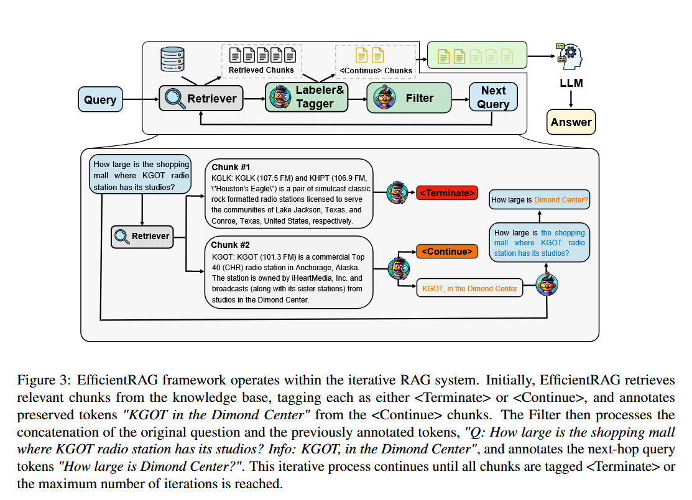
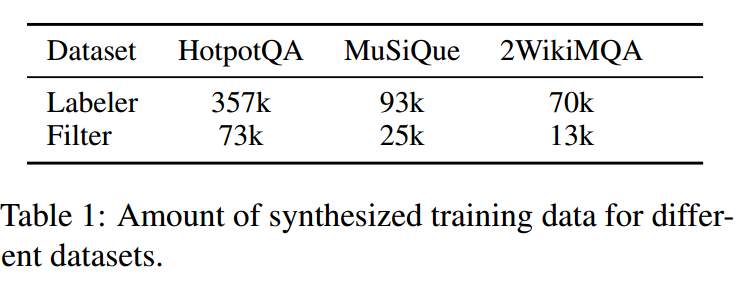
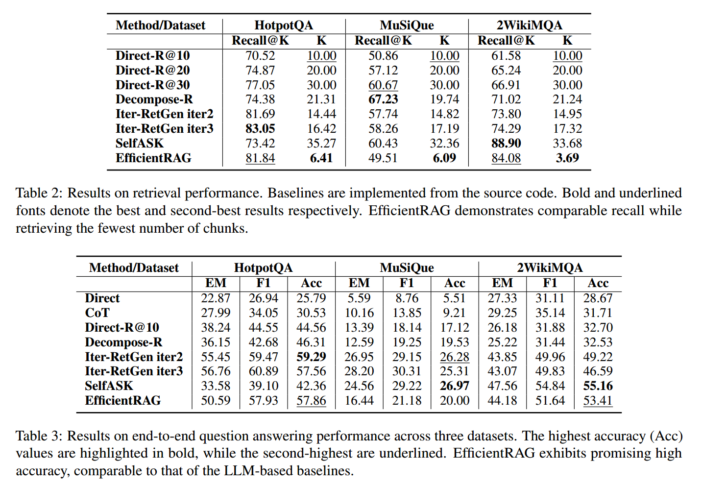
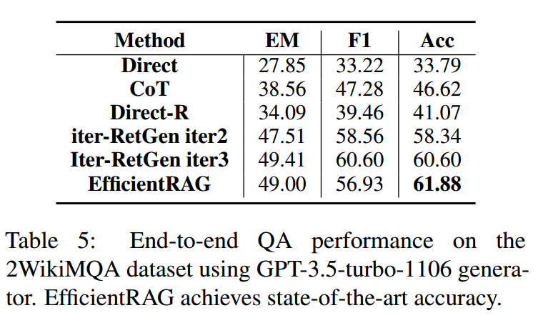
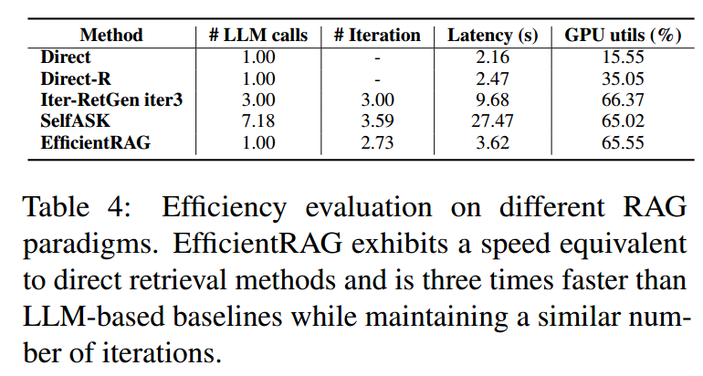
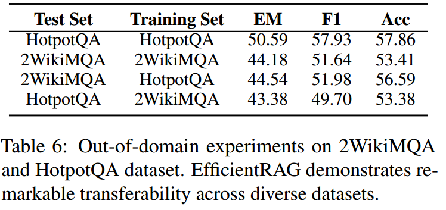

+++
title = '【笔记】EfficientRAG：多跳问题回答的高效检索器'
date = 2024-10-06T10:34:56+08:00
draft = false

tags=["研究","RAG","多跳问答","论文笔记"]

showSummary=true

Summary="介绍了一个大小模型协同的高效RAG方法，使用BERT量级的模型辅助RAG任务，节省了资源的开销。"

+++



原文题目：Zhuang 等 - 2024 - EfficientRAG Efficient Retriever for Multi-Hop Question Answering

原文链接：[EfficientRAG: Efficient Retriever for Multi-Hop Question Answering - ACL Anthology](https://aclanthology.org/2024.emnlp-main.199/)

项目地址：[NIL-zhuang/EfficientRAG-official: Code Repo for EfficientRAG: Efficient Retriever for Multi-Hop Question Answering](https://github.com/NIL-zhuang/EfficientRAG-official)

## 解决问题

之前解决多跳推理思路一般在于多轮检索重写或生成查询、交叉多个检索和推理步骤，让模型多次自我询问逐步提出问题。而上述方法普遍存在两个问题：

1)它们需要多次LLM调用，涉及为下一轮检索重写或生成新的查询，从而增加了延迟和成本。

2)针对不同的场景可能需要专门去设计prompt和few-shot例子。


## 基本思路

作者认为，多跳问题中的关系类型是有限的，或者与实体的数量相比要少得多。有论文证明小模型也具有一定的推理能力，那么可以通过小模型而不是LLM来有效地管理从检索信息中识别关系及其关联实体。（即，多跳问题的类型没有那么多，小模型也可完成相应的关系分解任务，没有必要上大模型，这样节省资源而且效率高）

因此，作者使用小模型训练了一个标签器和一个过滤器来迭代生成新的检索查询，同时保留最相关的检索信息，与其他RAG方法相比，提高了效率。


## 具体方法



EfficientRAG核心在于加了两个两个轻量级组件:标签器（Labeler & Tagger）以及过滤器。他们模型结构是一样的，Labeler 和 Tagger 通过同一模型的不同输出头生成结果，过滤器是另外训练的一个模型。Labeler和过滤器都作为token级别的二分类器，将token分类为真或假，Tagger是文档块级别的分类器。

在给定一个问题后，检索器在数据库中找到一些相关的文本块。然后Labeler在文档中标记一些token序列，表示这些token对回答问题有作用。

Tagger用于标记整个文本块对回答问题是有用还是没用，如果在这个文本块的基础上还需要更多的信息来回答问题，就标记为`<Continue>` 并把该块放到候选池中。如果文档被标记为无用或不相关，将停止搜索此查询的后续分支。

过滤器模块接受Labeler标记的token和当前查询，为下一轮检索构造一个新的查询。

以此循环，直到获得足够的信息来回答初始问题，它就会停止并将所有这些信息传递给最终生成器（LLM）以获得最终回答。除了最后一次调用外，其他的操作都是小模型完成的，提高了性能。


## 训练

### 数据准备

至于定制化训练的数据，当然还是使用LLM构建。作者利用 LLM 来合成Labeler和过滤器的训练数据。该过程包括多跳问题分解、标记标记、下一跳问题过滤和负采样。综合数据详见表1。

**多跳问题分解**：给定一个多跳问题和相关块，作者首先提示LLM将原始问题分解为几个单跳问题。每个单跳问题对应一个块。然后，要求LLM解析子问题的依赖关系。

**Labeler  token标记：**对于每个子问题和相应的块，作者提示LLM标记与子问题答案相关的块中的重要单词。使用一个二进制标签对数据块中的每个单词进行注释，以确定它是否重要，是否应该由EfficientRAG Labeler保留。

**过滤器的下一跳问题：**给定一个单跳问题及其相关问题的标记令牌，提示LLM生成一个下一跳问题，这是理想的下一个检索查询，提取下一跳问题的token即可。

**Tagger 负采样：**对于每个过滤后的下一跳问题，作者检索最相似但不相关的块作为硬负样例。这些否定的数据块将被标记为`<Terminate>`，而其他相关的数据块将被标记为`<Continue>`。




### 训练任务

作者训练了 EfficientRAG Labeler 用于两个任务：**token标注**和**块过滤**，因为它们使用相同的输入。训练使用自动编码器语言模型作为编码器，以获得连接的查询序列和块中每个词元的嵌入。随后，作者使用一个全连接层将词元嵌入投射到二维空间，用以区分“有用token”和“无用token”。另一个全连接层则用于将序列嵌入的平均池化投射到二维空间，表示块的tag `<Continue>` and` <Terminate>`。EfficientRAG 过滤器训练方式类似，其输入序列是查询和标注token的拼接。该过滤器提取单词并将其拼接，以形成下一跳查询。


## 实验

### 数据集

数据集使用 `HotpotQA`、`MuSiQue` 和 `2WikiMultihopQA`，具体数据集的介绍可以参考之前的文章。

### Baseline

1. 不用检索直接使用大模型自身回答，使用直接提示、思维链提示和问题分解等方法。
2. 使用采用前10相关的文档块的朴素RAG
3. 之前的一些方法，如 Iter-RetGen (Shao et al., 2023) 和 SelfAsk (Press et al., 2023)。

### 验证模型

作者基于 DeBERTa-v3-large (He et al., 2021，24层，参数量340M)微调 Labeler 和 Filter ，用Contriever-MSMARCO(Izacard et al.,2022)作为数据合成和推理阶段的检索器。采用lama-3- 8b - instruction回答问题和并作为其他所有基准。

实际训练方面，作者使用Llama-3-70B-Instruct构建了训练数据(附录B.2)。在4× Nvidia A100 gpu上分别训练了大约10个gpu小时，使用AdamW (Loshchilov和Hutter, 2019)优化器，学习率为5e-6。

### 结果

#### 检索与问答




首先表2对比了EfficientRAG与之前方法的检索性能，可以看到在HotpotQA与2WikiMQA上效果不错，但是在MuSiQue上表现一般，作者认为是可能归因于检索的块数量较少和数据集的复杂性增加。

在实际检索问答上，EfficientRAG在准确度上都能接近最佳效果，如果将问答模型换为GPT3.5，还可以进一步提高性能，在HotpotQA上达到了SOTA效果（表5）。




#### 推理效率

作者从MusiQue数据集中随机选择了200个样本进行研究，计算了四个指标:LLM调用次数、迭代次数、回答延迟和GPU利用率。可以看到EfficientRAG在回答延迟方面有较高优势，因为只需要调用一次大模型。




#### 域外泛化

作者提出了一个跨HotpotQA和2WikiMQA数据集的域外实验，在一个数据集上训练模型，并在另一个数据集上测试它。从表6可以看出，EfficientRAG对不同的数据集有很好的适应性，在某些情况下甚至超过了在原始数据上训练的模型。这表明，EfficientRAG不依赖于特定领域的知识，表现出一定程度的可移植性。



## 讨论

RAG本质上的两个方面：IR+RC

IR的实际上就是说我如何去将最准确、最相关的信息提供给大模型而过滤掉不相关的干扰信息 ，在保证包含关键文档的情况下，信息“纯度”越高，RAG性能越好。而IR现在结合大模型相较原来传统的研究也多了很多方法，很多RAG的研究本质上都是在卷IR（包括这一篇）。

RC就是让LLM在现在检索到的文本上自己去进行整合和理解，当然这个东西随着LLM自己的迭代与规模的扩大本来性能就会慢慢提升，这也导致了一个问题是你直接去调LLM提升其RC性能基本不太可能，计算资源不允许，现在我看论文能做的就是用一些提示的方法去引导大模型进行逻辑思考和推理，可能本文提到的外挂插件也可以是一种思路。

读完本篇文章，有以下感受：

1. 这个方法只算提升了回答速度，只要需要调用LLM，显存和GPU占用是下不来的。
2. 虽然本文主打的是高效率，但我还是想看一看在不考虑效率，将外部插件全部使用LLM的情况，准确率等是否会有进一步提升（话说为啥没有消融实验？）。但其实这样和self-rag没啥区别了。
3. 感觉大小模型协同的方式，工作量是上去了，因为Scaling law的问题，最终效果上可能很难说能做出碾压纯大模型的方法，最后只能在问答效率上做文章，这也是高校研究大模型缺少算力的无奈之举吧。


## 补充

### Recall@k

Recall@k 是信息检索和推荐系统中常用的评价指标，用于评估系统在前 k 个返回结果中检索到相关项的能力。具体来说，Recall@k 衡量的是在返回的前 k 个结果中有多少是相关的。

公式
Recall@k = (在前 k 个结果中相关项的数量) / (总相关项的数量)

举例

```txt
真实情况：
疾病A的治疗药物是：药物1，药物2，药物3，药物4.
疾病B的治疗药物是：药物5，药物6，药物7

模型预测情况：
疾病A的治疗药物是：药物2，药物5，药物1，药物6，药物3，药物7（按照推荐的可能性排序）
疾病 B的治疗药物是：药物7，药物8，药物5，药物6（按照推荐的可能性排序）

若K=3,则选取模型推测结果的前三个，即：
疾病A：药物2，药物5，药物1
疾病B：药物7，药物8，药物5
所以：
对于疾病A：药物2，药物1是相关项
对于疾病B：药物7，药物5是相关项

recall@k = (2/4 + 2/3) /2 = 0.583
```

参考：[分类模型、回归模型的常见评价指标_预测分类模型评价指标代码-CSDN博客](https://blog.csdn.net/LiuRuiaby35646/article/details/140229812)

