+++
title = '【组会】Generate-then-Ground：在检索增强多跳问答中的生成后再矫正策略'
date = 2024-10-11T19:07:39+08:00
draft = false

tags=["研究","RAG","多跳问答","论文笔记"]

showSummary=true

Summary="组会报告文字版，介绍一个基于生成后再矫正策略的RAG框架"

+++



原文题目：Shi 等 - 2024 - Generate-then-Ground in Retrieval-Augmented Generation for Multi-hop Question Answering

原文链接：[Generate-then-Ground in Retrieval-Augmented Generation for Multi-hop Question Answering - ACL Anthology](https://aclanthology.org/2024.acl-long.397/)


## 1. 多跳RAG

​	传统RAG大家都知道，把问题拿过来先用检索器找到最相关的一个或几个文本片段，把这些文本片段放到大模型上下文中，让大模型按照上下文提供的知识回答问题嘛。

​	但是呢，这种一次检索，一次回答的方法可能并不总是那么好用。

​	比如下面这个问题：

```text
周星驰的母亲和吴孟达谁更大？
```

​	你在任何资料里面（除了本文），都不会找到关于这个问题的直接回答（因为很少有人总结这么无聊的问题）。大模型的世界知识中，也基本不会有这么无聊的信息。

​	那抛开大模型，你如果想要通过搜索引擎回答这个问题，你要通过几步完成？

1. 首先，你得先**对问题有个整体的理解**，在一般的中文语境里面，两个人比较“谁更大”应该等同于“谁的年龄更大”。

2. 然后，你要**对问题进行分解**，对于上面这个问题，你可以分解成三个子问题

   ```text
   1. 周星驰的母亲是谁？获得一个人名，比如”凌宝儿“。
   
   2. ”凌宝儿今年多大？“但是由于年龄这种信息有时效性并不适合直接检索，我们可以转而检索“凌宝儿的出生日期？“
   
   3. 吴孟达的出生日期？
   
   ```

   可以看到，问题2和问题1是递进的两个问题，没有问题1的答案我们也没法对问题2进行提问。

3. 最后，在得到上述子问题的答案后，我们还需要一个简单的**推理判断**，比较周星驰母亲和吴孟达的出生日期，得到最终答案。


​	那么大模型处理上面问题的逻辑也是类似的，根据原问题分解为可以直接检索得到答案的子问题，再通过这些子问题检索文本块得出部分事实，以此迭代重复直到收集到的部分事实能够通过推理得出原问题的回答。


<center>
    <b>图1 Self-Ask论文中的例子</b>
</center>


​	那么在实际操作中如何对原问题进行分解呢？当然是直接扔给万能的大模型辣！相比大家都听说过思维链这东西，给大模型一定格式化的提示，就能激发大模型的问题分解与分段推理能力（如图1）。所以，借助**提示工程**的方法，让大模型自己借助现有资料对问题进行分解，也是解决多跳RAG问题早期研究的主要思路。


**推荐阅读：**

* **CoT**：[Chain-of-Thought Prompting Elicits Reasoning in Large Language Models (neurips.cc)](https://proceedings.neurips.cc/paper_files/paper/2022/hash/9d5609613524ecf4f15af0f7b31abca4-Abstract-Conference.html)
* **ReAct**：[[2210.03629\] ReAct: Synergizing Reasoning and Acting in Language Models (arxiv.org)](https://arxiv.org/abs/2210.03629)
* **Self-Ask**：[Measuring and Narrowing the Compositionality Gap in Language Models - ACL Anthology](https://aclanthology.org/2023.findings-emnlp.378/)
* **IRCoT**：[Interleaving Retrieval with Chain-of-Thought Reasoning for Knowledge-Intensive Multi-Step Questions - ACL Anthology](https://aclanthology.org/2023.acl-long.557/)


## 2. 现有问题

​	对于刚才提到的这种分解问题先检索再根据上下文回答的RAG范式，其实是存在一些问题的：

1. RAG的有效性其实是受到检索性能的约束的，这种范式完全是利用检索器返回的文档进行回答，而**LLM本身自有的世界知识是被忽略的**。而在多跳问答中这个问题会更加严重，因为只要在一个子问题的回答中检索器没有返回正确的文档，可能整个问题就会回答错误，导致该范式的性能下降。
2. **检索到的文档不可避免地包含不相关或看似合理的语句**，直接将它们纳入LLM的推理链可能会误导大模型产生不正确或不相关的响应。

<div align=center>
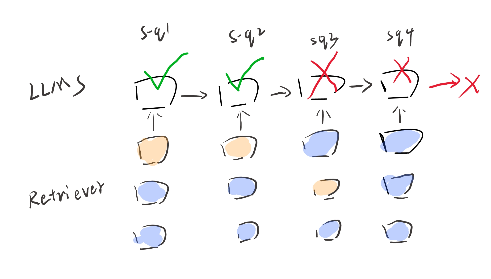
</div>

<center>
    <b>图2 检索性能很大程度上影响最后回答问题的能力</b>
</center>

## 3. 基本思路

​	那么本文就提出了一个基于生成后再矫正策略的检索框架，在这个框架中，LLM交替执行下面两个步骤：

1. **答案推导**：根据原问题和现有资料制定一个更简单的单跳问题，并直接生成答案;

2. **指令下知识验证**：在检索到的文档中建立问题-答案对，修正答案中的错误预测，并将本轮修正后的问答对整合到现有资料中。

<div align=center>
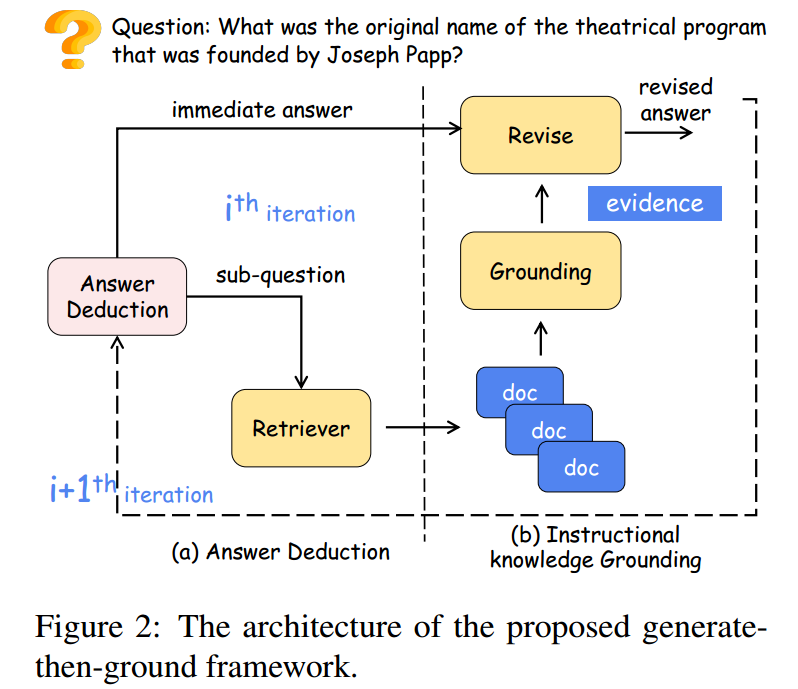
</div>


<center>
    <b>图3 GenGround基本思路</b>
</center>


## 4. 具体方法

### 4.1 答案推导


在这一步，GenGround 将构建好的提示、示例、需要分解的问题、之前分解出的所有子问题和答案塞给大模型，让大模型输出这次分解后的子问题和他根据自己世界知识回答的答案。公式化表示为：
$$
q_i,a_i=M_\theta(I_A,Q,H_i)
$$

其中，$q_i,a_i$分别表示生成的子问题和答案，$M_\theta$ 表示参数为 $\theta$ 的大模型，$I_A$表示构建的提示，$\mathcal{Q}$ 表示原问题，$\mathcal{H}_\mathcal{i}$ 表示之前之前积累的修改后的问答对。因为本论文没有开源代码，而且附录中也没有详细的示例，所以具体他们构建的提示可以参考图4。

<div align=center>
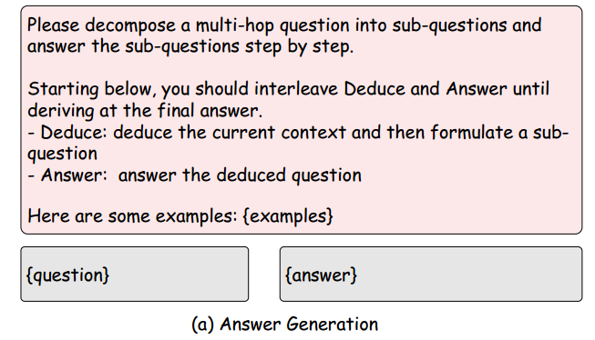
</div>


<center>
    <b>图4 答案推导部分的提示构建</b>
</center>


### 4.2 指令性知识验证

​	大模型直接生成的答案可能生成非事实性陈述或”**幻觉**“（不然我们也不会研究RAG），所以需要进一步根据现有资料对答案进行修正。具体来说，在第 $i$ 次迭代中，进行如下操作：

1. 使用检索器根据推导出的子问题 $q_i$ 检索相关文档集 $D$ 。
$$
   D = Retrieval(q_i)
$$
2. 通过引用从检索文档  $ D_i $ 中找到的最相关内容  $\tilde{d_i} $ ，指令大模型 $ M_{\theta} $ 将问答对 $ (q_i, a_i)$ **基于现有资料进行验证**，得到修正后的答案，公式化表示为：
$$
   \tilde{a_i} = M_{\theta}(\mathcal{I}_\mathcal{G},\mathcal{Q}, q_i, a_i)
$$
   其中 $\tilde{a_i} $ 表示修正路径，**包括引用的证据和修正后的答案**。其格式为$\{<ref>证据</ref>\},\{<revise>修改后的答案</revise>\}$。

   如果模型找不到可以修正问题的证据，则输出`\<ref\>Empty\<ref\>`，并不对回答进行修改。

   $\mathcal{I}_\mathcal{G}$ 表示在零样本环境下的验证指令，这部分内容可以参考图5。 其他输入还有原问题 $\mathcal{Q}$ 和答案推导环节生成的问答对 $ (q_i, a_i)$ 。


<div align=center>
   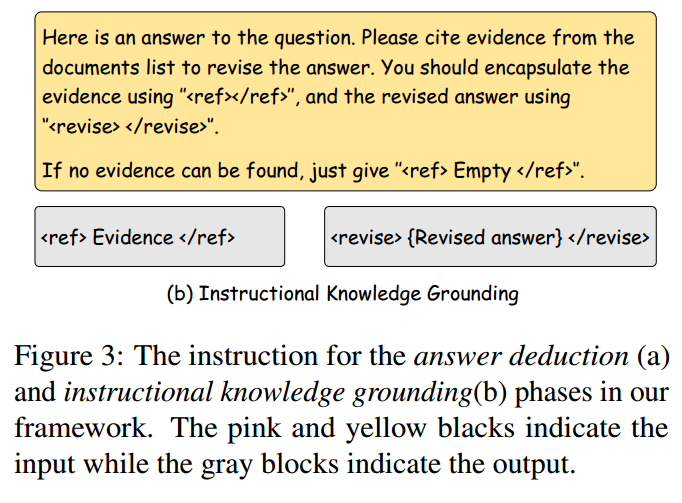
</div>


   <center>
       <b>图5 指令性知识验证的提示构建</b>
   </center>

   这里有一个问题，原文公式表示和上图中都没有展示相关文档块是怎么处理的，但是我们可以从上图的提示中可以推断他们应该是把相关文档作为上下文输入给大模型了的。

3. 最后，把本次迭代检索的子问题$q_i$、本轮修正路径  $\tilde{a_i} $  并入现有资料 $H_i$ ，供大模型在**下一次迭代中使用**，即
$$
   \mathcal{H}_{i+1} = \mathcal{H}_i \cup \{(q_i, \tilde{a_i})\}
$$
4. 文章中也没有给出明确的迭代终止条件，我们只能从下图给出的论文中的唯一示例中看到整个问答流程的输出信息（MD发论文不开源代码真恶心）。

   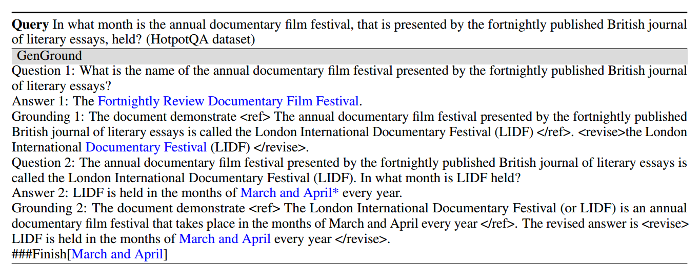

   <center>
       <b>图6 整体流程输出示例</b>
   </center>


### 4.3 批量验证策略

​	传统的先检索再生成的RAG方式有一个问题，就是不管这个检索出的文档块是不是真的包含能够回答问题的信息，当大模型生成答案时，能获得的额外知识输出就这一个了。这样很容易导致一个问题，就是**大模型很容易被检索出的无关信息误导导致回答错误**。（当然也有应对的办法，比如对文档有效性进行判断：[Self-RAG](https://arxiv.org/abs/2310.11511)、束搜索等：[End-to-End Beam Retrieval](https://aclanthology.org/2024.naacl-long.96/)）

<div align=center>
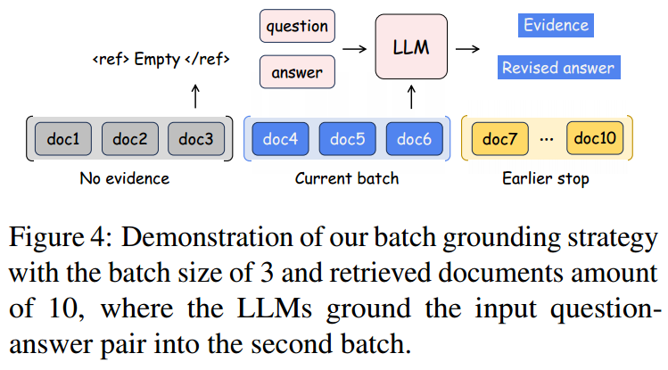
</div>

<center>
    <b>图7 批量验证策略示例</b>
</center>

​	本文先生成再检索的框架有个优势，就是可以**根据回答去批量比对文本**，直到找到可以对指定的答案进行修改的文档。系统规定一个批处理大小 $b$ ，按照相关性排序每次喂给大模型 $b$ 个相关文档，检查能否对已经生成的答案进行修改，如果可以，修改回答停止迭代。否则，继续送进去下一批 $b$ 个文档进行检查，直到能够**对答案进行修改，或者找不到相关文档，直接将生成的答案作为备用**，如图7所示。


## 5. 验证过程蒸馏的泛化推广

​	上述框架在ChatGPT之类的闭源大模型上表现出色，但是在参数量较小的开源模型上表现不佳，主要在于在**知识验证阶段”小“模型无法遵循指令去引用相关证据**。于是作者使用**知识蒸馏**的方法将ChatGPT输出的验证过程蒸馏到一个小参数的学生模型中去。

### 5.1 数据构建

​	作者找了个**单跳QA数据集**（Natural Questions数据集）抽了50000个问题，每个问题 $q$ 都与相应的真实文档 $\tilde{d}$以及噪声文档 $D$ 配对。用个小模型（如Mistral-7B）随便生成一个什么回答当作修正前的答案 $a$，**修正过程的就交给ChatGPT进行生成**，还采用大模型去过滤低质量输出，包括输出格式不对的、没找到证据的、没有修改回答的和修改回答错了的（原数据集也是有标准答案的）。最终获得了如表1所示的一个用于小模型训练的增强数据集。

<div align=center>
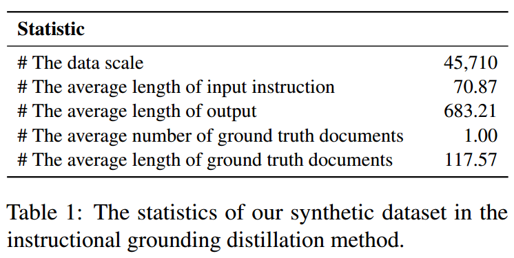
</div>

<center>
    <b>表1 增强数据集相关指标</b>
</center>

​	

### 5.2 模型训练

​	使用上一节获得的数据，作者用**极大似然损失函数**对Mistral-7B进行训练，使用3张A100训练了18小时。具体损失函数如下：

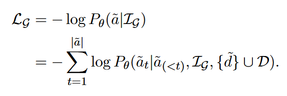


## 6. 实验

### 6.1 数据集选择与设置

实验在四个常用的多跳问答基准数据集上进行：

   - **HotpotQA**：需要复杂的推理链条来获取答案，主要涉及开放域问题。
   - **MuSiQue**：通过将多个单跳问题合成多跳问题来评估模型的推理能力。
   - **2WikiQA**：包含来自多个维基百科页面的问题，评估跨文档的推理能力。
   - **StrategyQA**：主要测试模型在策略性推理问题中的表现。

这些数据集覆盖了从事实推理到复杂的多跳推理，能全面验证模型的能力。


### 6.2 评估指标

   - **准确率 (Accuracy, Acc)**：检验生成的答案是否包含正确的目标答案。

   - **F1 值**：基于词汇重叠来评估模型输出与参考答案之间的相似度。

   - **语义准确率 (Acc†)**：通过 GPT-3.5 的自动评估来检验生成的答案与参考答案在语义上的一致性，具体提示如下。

     ```text
     In the following task, you are given a Question, a model Prediction for the Question, and a Ground-truth Answer to the Question. You should decide whether the model Prediction implies the Ground-truth Answer.
     
     Question {question} 
     
     Prediction {model output} 
     
     Ground-truth Answer {answer} 
     
     Does the Prediction imply the Ground-truth Answer? Output Yes or No
     ```

这三项指标能多角度衡量模型在生成答案中的性能，尤其是考虑了语义上的准确性，避免仅基于词汇相似度。


### 6.3 实验方法对比

作者利用**gpt-3.5-turbo**作为GenGround和所有Baseline的核心模型，解码温度设置为0以实现确定性生成，批处理策略中的批大小设置为3，使用**ColBERTv2**作为检索器，为每个问题检索前10个文档。通过比较生成-然后-校正框架与其他两类方法进行对比：

   - **不带检索的生成方法**：
     - **CoT（Chain of Thought）**：通过链式推理步骤来生成答案。
     - **CoT-SC（Self-Consistency）**：采样多种推理路径，并选择一致性最高的答案。
     - **GenRead**：模型通过阅读生成的上下文来生成答案。
   - **带检索的生成方法**：
     - **ReAct**：将问题生成、文档检索和知识整合相结合进行多跳推理。
     - **DSPy**：基于编程框架的多跳推理方法。
     - **RetGen**：通过迭代检索和生成的协同策略来回答多跳问题。


### 6.4 实验结果

实验结果表明，**GenGround 框架在所有数据集和指标上均优于现有方法**，尤其在 HotpotQA 和 MuSiQue 等复杂推理数据集上，其准确率提升了显著的百分点。具体表现为：

   - 在 **HotpotQA** 数据集上，GenGround 取得了 **47.27% 的准确率**，比基线方法高出 6 个百分点。
   - 在 **MuSiQue** 数据集上，F1 值达到了 **27.36%**，同样显著优于其他方法。

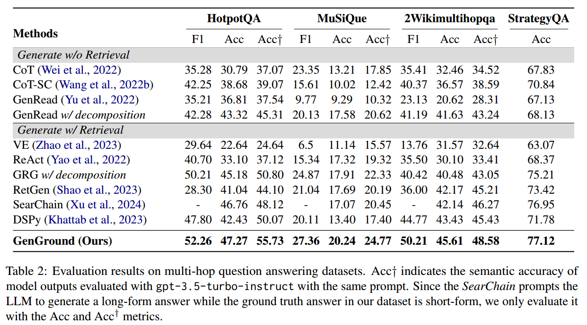

<center>
    <b>表2 主要实验结果</b>
</center>

#### 泛化实验

​	作者同时实验了**指令知识蒸馏**的有效性，将主干大语言模型替换为**开源模型（Mistral-7B）**，并在相同条件下重复实验，实验表明：

* 直接使用GenGround方法提示（Vanilla）的模型性能已经优于Baseline。

* **指令蒸馏（IDG）**后的模型进一步显著提升了整体性能。


<div align=center>
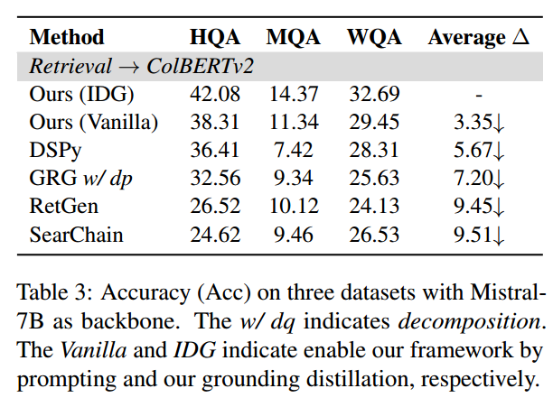
</div>


<center>
    <b>表3 小参数量模型在指令式知识蒸馏后的表现</b>
</center>


#### 更换检索器

​	作者将ColBERTv2替换为**BM25**和**Google搜索**，使用ChatGPT作为核心模型，实验显示无论使用何种检索器， GenGround方法均展现出最佳性能。表明其在低召回（BM25）和高召回（Google搜索）场景中的适应性。这可能得益于其中的答案推导阶段，该阶段**利用LLM的参数知识来补充检索到的知识**。此外，指导性知识基础阶段通过引用最相关的证据有效地整合了检索文档，从而减轻了嘈杂文档的负面影响。


<div align=center>
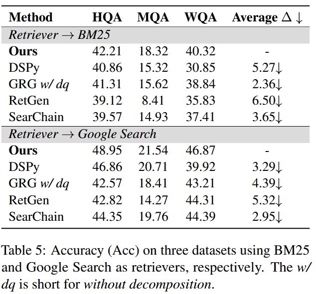
</div>


<center>
    <b>表4 更换检索器的泛化实验</b>
</center>

### 6.5 消融实验

为了验证框架中不同模块的有效性，实验还进行了消融实验，分别去除了答案推导阶段、知识校正阶段以及批量校正策略，结果表明：

   - 去掉**答案推导阶段**后，SQA上模型的准确率降低了 10 个百分点，表明这一阶段对复杂问题的推理至关重要。
   - 去掉**知识校正阶段**后，HQA上模型的表现下降，F1 值减少了 7%，这说明直接生成的答案可能包含幻觉或错误，必须通过校正提升准确性。
   - 去掉**批量验证阶段**后，性能也都有下降，说明当参考文档列表冗长且包含无关信息时，大模型在生成正确答案方面存在困难。


<div align=center>
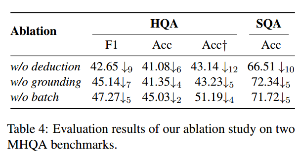
</div>


<center>
    <b>表5 消融实验</b>
</center>

### 6.6. 分析与讨论

作者在本节用独立重复实验证明了他们方法的稳定性、token的消耗量相较于没有问题分解的方法也有减少。

<div align=center>
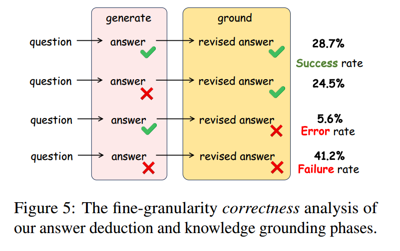
</div>


<center>
    <b>图8 协同整合实验</b>
</center>

作者还探索大模型自有知识和外部文档知识两种知识来源的协同整合。具体做法包括计算以下三个指标：

1. **成功率**：LLMs直接生成正确答案或准确修正错误答案的比例。
2. **失败率**：LLMs生成错误答案并未能修正的比例。
3. **错误率**：LLMs生成正确答案但错误修正的比例。

由于现有数据集缺乏即时解答轨迹的标准答案，研究邀请了三位标注者对Hotpot QA数据集中的100个随机样本进行评估。研究发现LLMs整体成功率为53.2%，其中28.7%的问题由LLMs直接正确回答，24.5%的问题则先生成错误答案，后通过外部文档修正。此外，误差率仅为5.6%，说明LLMs在使用外部文档进行修正时通常是有效的。


## 7. 局限性

​	文章最后分析了本框架的一些局限性，包括：

1. **初始答案生成的依赖性**：框架的第一步是生成初始答案，但其效果高度依赖于具体任务。在不同任务中，模型可能难以生成有意义或有用的初始答案，限制了其在多样问题领域的适用性。

2. **问题分解的挑战**：该方法假设复杂问题可以被分解为更简单的问题，但问题分解本身是一个具有挑战性的任务，尚未在当前框架中得到充分探索。

3. **外部文档的局限性**：该方法假设外部文档可以用于修正模型最初生成的非事实性陈述。然而，如果外部文档缺乏必要的修正信息或包含错误信息，框架的有效性可能会受到影响。


## 8. 总结

​	本文最主要的创新点还是在传统基于提示工程的RAG检索生成迭代的基础上添加了先让模型生成答案再进行修改的步骤，使得答案语义变成一种筛选候选文档的方法，知识蒸馏训练小模型的做法也是非常的典。

​	当然提示工程的活就这么多，22、23年整的也差不多了，后面纯提示工程的工作还能不能受到认可也是个问题。现在一个新的研究范式是去训练一个小参数模型作为外挂插件去协同大模型进行检索增强生成，类似多模块智能体的思路感觉还可能有点搞头，比如[SlimPLM](https://arxiv.org/abs/2408.04259)、[EfficientRAG](https://arxiv.org/abs/2408.04259)。

​	最后，不开源代码差评。

