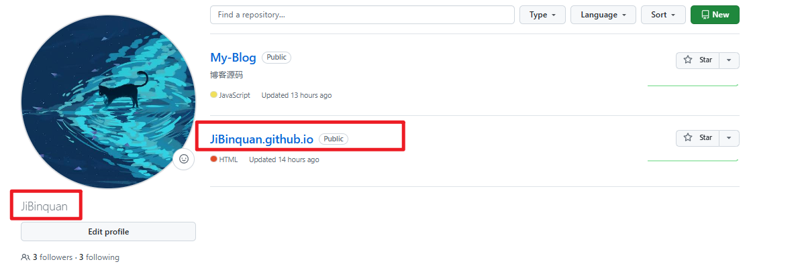
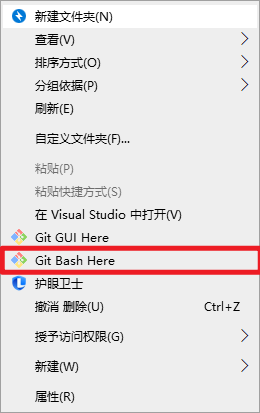
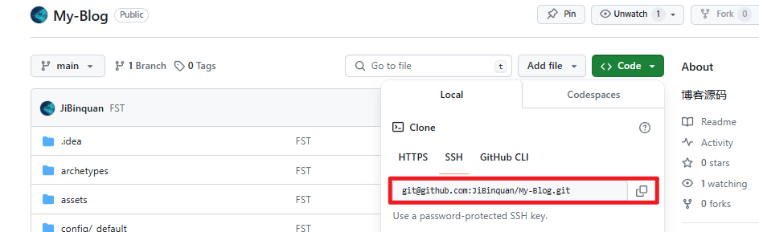

+++
title = 'Hugo博客搭建记录'
date = 2024-06-04T10:43:06+08:00

draft = false

tags=["技术","前端","建站"]

series = ["博客搭建"]
series_order=1

showSummary=true

Summary="本站搭建过程记录，也记录了一些踩过的坑。想要搭建一个hugo博客的朋友看这篇应该可以搭建出一个最基本的能部署的博客了。"

+++

# 博客搭建记录

## 〇、 环境安装

### 0. 注册github和安装Git

`Git`是目前世界上最先进的分布式版本控制系统，可以有效、高速的处理从很小到非常大的项目版本管理。`Git`的作用是将本地的网页文件传到`github`上。

- Git[下载地址](https://git-scm.com/download)
- Git[教程](https://www.liaoxuefeng.com/wiki/896043488029600)

**windows：** 到git官网上下载.exe文件,Download git,安装选项全部默认即可。


`github` 给学生提供免费的代码托管服务，并且提供[GitHub Pages](https:pages.github.com/) 让你的网站直接托管在 GitHub 的服务器上，通过 [http://xxx.github.io]() 来访问。更新维护网站内容也可以通过 `git commit`  和 `git push` 进行更新维护，因为 GitHub Pages 就是 GitHub 上的一个 Git 代码仓库。

GitHub注册这里不再赘述，如果网址无法访问，你可能需要科学上网。


### 1. 安装Hugo

**下载Hugo**

​	打开 Github 中的 Hugo 库，打开右侧的 Realeases，下载最新的版本。推荐下载extended版本，因为有些主题的需要利用进行 SCSS/SASS 构建，如果下普通版就可能会报错显示：` you need the extended version to build SCSS/SASS`


**安装Hugo**

​	将下载好的压缩包解压到你喜欢的目录下，记住这个目录。然后将该目录添加到系统环境变量的 Path 下。


**安装验证：**

在 `cmd` 或 `git bash` 中输入 `hugo version` ，如果输出版本信息，则说明安装成功。

```bash
$ hugo version
hugo v0.126.2-8f3d902ce51512931f5759e9279d93e346c9e649+extended windows/amd64 BuildDate=2024-05-30T15:19:22Z VendorInfo=gohugoio
```


## 一、新建Hugo网站

找个目录，用于存放网站文件，在目录下命令行执行

```bash
hugo new site blog
```

即可完成网站新建。


## 二、更换主题

对于一般主题更换，将对应主题的代码 `拉取/下载` 到博客目录下的 `theme` 目录即可。

之后运行

```bash
hugo server -t 主题名 --build
```

我本次使用的是 `Blowfish` 主题，其还提供了一种傻瓜式的安装方式，即首先安装

```bash
npm i -g blowfish-tools
```

然后在博客路径下执行

```bash
blowfish-tools
```

即可进行交互式的主题安装与设置


## 三、页面配置

 CLI 工具傻瓜是傻瓜，但是一个个配置挺慢的，我还是用文件配置吧…

### 3.1 基本信息配置

#### 个人信息配置

因为`blowfish ` 默认的是英文信息，首先在博客目录下的 `config\_default` 目录下，复制`languages.en.toml` 和 `menus.en.toml` ，并重命名为`languages.zh-cn.toml` 和 `menus.zh-cn.toml` 

`languages.zh-cn.toml`可以这么写

```toml
languageCode = "zh-cn"                                 # 网站使用的语言代码
languageName = "Simplified Chinese (China)"            # 网站使用的语言名称
weight = 1                                             # 当前语言页面的排序权重
title = "JiBinquan's blog"                             # 网页标题

# 参数配置
[params]
  displayName = "中文"                                  # 显示的语言名称
  isoCode = "zh-cn"                                    # 国际标准语言代码
  rtl = false                                          # 是否是从右到左的语言
  dateFormat = "2006年1月2日"                           # 日期格式
  logo = ""                                            # 网站标志图片路径
  # secondaryLogo = "img/secondary-logo.png"           # 第二标志图片路径
  description = "JiBinquan的博客"                       # 网站的描述
  copyright = ":copyright: { year } Ji Binquan"        # 版权信息，包含动态的年份占位符

# 作者信息
[author]
  name = "Ji Binquan"                                  # 作者姓名
  image = "/img/avatar.png"                            # 作者头像图片路径
  headline = "随便写写"                                 # 作者的口号或座右铭
  bio = "现在也没研究明白的研究僧"                         # 作者的简短传记
  # 作者的社交媒体链接列表，还可以添加更多
  links = [
    { github = "" },    # GitHub 链接
    { email = "" },     # 电子邮件链接
    { qq = "" },        # QQ 链接
    { zhihu = "" },     # 知乎链接
  ]

```

头像放在`assets\img` 路径下（若没有建立目录即可），如果你的`links`没有默认的图标，可以把同名图标放置在`assets\icons`路径下

#### 目录配置

`menus.zh-cn.toml`是目录配置，可以根据你的需要自己配置目录，可以参考如下编写。

```toml
[[main]]
name = "文章"
pageRef = "posts"
weight = 10

[[main]]
name = "研究"
parent = "文章"
pageRef = "tags/研究/"
weight = 21

[[main]]
name = "技术"
parent = "文章"
pageRef = "tags/技术/"
weight = 22

[[main]]
name = "友链"
pageRef = "friends"
weight = 30


[[footer]]
name = "关于"
pageRef = "about"
weight = 10

[[footer]]
name = "Tags"
pageRef = "tags"
weight = 30

```


#### BaseURL配置

如果你要部署到GithubPages上，请在 `config\_default\hugo.toml` 中设置为你自己的`.github.io`域名，或者你自己绑定的其他域名，如下例所示，否则一些页面跳转功能和搜索功能将失效。

```toml
# -- Site Configuration --
# Refer to the theme docs for more details about each of these parameters.
# https://blowfish.page/docs/getting-started/

theme = "blowfish" # UNCOMMENT THIS LINE
baseURL = "https://jibinquan.github.io/"
defaultContentLanguage = "zh-cn"
```


### 3.2 页面布局配置

主要都在`config\_default\params.toml`下，这里是主要的配置表：

这些设置是用于配置一个名为 Blowfish 的网站主题的。每个选项控制不同的功能和显示特性，使你可以根据需要自定义网站的外观和行为。以下是每个设置的简要说明：

#### 主题选项 (Theme Options)

- `colorScheme`: 设置网站的配色方案。例子中为 "blowfish"。
- `defaultAppearance`: 设置网站的默认外观，可以是 "light" 或 "dark"。
- `autoSwitchAppearance`: 自动切换外观，依据用户的系统设置。
- `enableSearch`: 启用或禁用搜索功能。
- `enableCodeCopy`: 启用或禁用代码复制功能。

#### 图像和文本设置

- `disableImageOptimization`: 禁用图像优化。
- `disableTextInHeader`: 禁用标题中的文本。
- `defaultBackgroundImage`: 设置默认背景图像。
- `defaultFeaturedImage`: 设置所有文章的默认特色图像。

#### 页眉和页脚 (Header and Footer)

- `[header] layout`: 设置页眉布局方式。
- `[footer] showMenu`, `showCopyright`, `showThemeAttribution`, `showAppearanceSwitcher`, `showScrollToTop`: 设置页脚显示的内容和功能。

#### 主页设置 (Homepage)

- `[homepage] layout`: 设置主页布局方式。
- `homepageImage`: 主页图像。
- `showRecent`, `showRecentItems`, `showMoreLink`, `showMoreLinkDest`, `cardView`, `cardViewScreenWidth`, `layoutBackgroundBlur`: 控制主页上显示的最近项目及其展示方式。

#### 文章设置 (Article)

- `[article]` 下的各个设置控制文章页面的各种显示选项，例如日期、浏览次数、作者信息、面包屑导航、分页等。

#### 列表页面设置 (List)

- `[list]` 下的各个设置控制列表页面的显示选项，如是否显示摘要、卡片视图、按年份分组等。

#### 网站地图 (Sitemap)

- `[sitemap] excludedKinds`: 排除的内容类型。

#### 分类和标签 (Taxonomy and Term)

- `[taxonomy]` 和 `[term]` 下的各个设置控制分类和标签页面的显示选项。

#### 分析和验证 (Analytics and Verification)

- `[firebase]`, `[fathomAnalytics]`, `[umamiAnalytics]`: 分析工具的配置选项。
- `[buymeacoffee]`: 支持 Buy Me a Coffee 功能的设置。
- `[verification]`: 用于搜索引擎验证的设置，如 Google、Bing、Pinterest 和 Yandex。

如果需要更多详细信息，可以参考主题文档：[配置 · Blowfish](https://blowfish.page/zh-cn/docs/configuration/)。


### 3.3 功能修改

#### 3.3.1 内联数学公式修改

​		Typora自带的内联公式语法是 `$ ... $` ，而`Blowfish`默认的`KaTeX`渲染语法是`\\( ... \\)` ，在这种模式下，你要不就放弃在Typora上预览内联公式，要不就放弃在网页上渲染内联公式…属实离谱。于是我们找到了以下解决方法：

[javascript - 如何使用 KaTeX 渲染 $..$ 中的所有内联公式？_Stack Overflow中文网](https://stackoverflow.org.cn/questions/27375252)

来到文件`\themes\blowfish\assets\lib\katex\auto-render.min.js`，找到其中代码

```js
n.delimiters=n.delimiters||[{left:"$$",right:"$$",display:!0},{left:"\\(",right:"\\)",display:!1},{left:"\\begin{equation}",right:"\\end{equation}",display:!0},{left:"\\begin{align}",right:"\\end{align}",display:!0},{left:"\\begin{alignat}",right:"\\end{alignat}",display:!0},{left:"\\begin{gather}",right:"\\end{gather}",display:!0},{left:"\\begin{CD}",right:"\\end{CD}",display:!0},{left:"\\[",right:"\\]",display:!0}]
```

改成

```js
n.delimiters=n.delimiters||[{left:"$$",right:"$$",display:!0},{left:"$",right:"$",display:!1},{left:"\\begin{equation}",right:"\\end{equation}",display:!0},{left:"\\begin{align}",right:"\\end{align}",display:!0},{left:"\\begin{alignat}",right:"\\end{alignat}",display:!0},{left:"\\begin{gather}",right:"\\end{gather}",display:!0},{left:"\\begin{CD}",right:"\\end{CD}",display:!0},{left:"\\[",right:"\\]",display:!0}],n.ignoredTags=n.ignoredTags||
```

那么，在你的文章需要使用公式的时候，只需在开头加上一行 ``即可。（我也不知道这样改会有什么问题，先这么着吧）

> 找着问题了…`\\`公式换行不能用了……


#### 3.3.2 字数统计

如果你发现页面统计的字数远远少于文章的字数，请在`hugo.toml`中加入下面一行：

```toml
hasCJKLanguage = true
```


## 四、部署到Github

### 4.1 创建仓库

在Github方面，需要新建两个仓库。一个是网页源代码仓库，便于进行版本管理。一个是 `Github Page` 仓库，用于网页部署。

新建仓库在 `Your Repositories` 下选 `New` 就行。

需要注意的是 **GitHub Pages** 仓库：

1. 必须使用特殊的命名格式`<username.github.io>`， `<username>` 是你的 GitHub 的用户名，如下图所示。



2.  需要勾选 **Public**，设置为公开仓库。
3.  勾选添加 **README** 文件，这会设置 `main` 分支为仓库的默认主分支。


### 4.2 生成静态网页

在 Hugo 网站文件夹的**根目录**下执行 `hugo` 命令构建静态 HTML 网页，生成的 HTML 文件默认存放在 `public` 文件夹中。

**示例：**

```bash
$ hugo
Start building sites …
hugo v0.126.2-8f3d902ce51512931f5759e9279d93e346c9e649+extended windows/amd64 Bu
ildDate=2024-05-30T15:19:22Z VendorInfo=gohugoio


                   | ZH-CN | EN
-------------------+-------+-----
  Pages            |    36 | 11
  Paginator pages  |     0 |  0
  Non-page files   |    28 |  0
  Static files     |     8 |  8
  Processed images |    86 |  0
  Aliases          |    10 |  0
  Cleaned          |     0 |  0

Total in 450 ms
```

注意在部署前一定是使用`hugo`进行网页构建，而不能使用`hugo server`否则会将`baseurl`编译为本地链接导致部署后搜索等部分功能失效。


### 4.3 git 初始化与部署

1. 首先在**根目录**下，新建一个`.gitignore` 文件， 写入如下内容：

   ```text
   public/
   ```

   因为`public`目录需要单独上传到`Github Page` 仓库，如果不进行忽略的话会造成嵌套无法进行初始化。

2. 完成后在**根目录**下，`git bash`运行（后续操作都在`git bash`下进行）

   

   ```bash
   git init -b main
   ```

3. 如果你是`Windows`系统，可能需要取消`Git`自动的换行替换

   即执行：

   ```bash
   git config core.autocrlf false
   ```

   具体详见[windows系统下github_pages部署hugo页面js与css无法使用或文档渲染出错问题](../windows系统下github_pages部署与hugo页面js与css无法使用或文档渲染出错问题/)

   

   

4. 如果你还没有申请SSH-Key，请先参考下面的文章，进行SSH-Key的申请，否则无法通过SSH进行`git`上传

   具体详见[为github设置ssh-key](../为github设置ssh-key/)

   

   

5. 将博客文件夹关联远程 GitHub Pages 仓库，使用 GitHub Pages 仓库的 SSH 链接。

   ​	首先获得SSH链接

   ​	

   ​	然后运行（注意把链接替换为你自己的）

   ```bash
   git remote add origin  git@github.com:JiBinquan/My_Blog.git
   ```

6. 之后就是先拉取，后推送

   ```bash
   git pull --rebase origin main  # 拉取远端仓库现有的文件
   git add .   # 添加修改过得文件， . 表示所有，也可以指定文件 
   git commit -m "FST" # 提交内容的说明信息
   git push origin main  # 推送到远端main分支
   ```

7. 之后就是进入`public`目录，对`Github Pages`进行相同的操作（`.gitignore` 文件可以不用了，注意这里远端SSH链接是`Github Pages`仓库中获取的）

   ```bash
   git init -b main
   git config core.autocrlf false
   git remote add origin git@github.com:Jibinquan/Jibinquan.github.io.git # 这里是Github Pages仓库的SSH链接，不要搞混
   git pull --rebase origin main
   git add .
   git commit -m "FST"
   git push origin main
   ```

8. 转到 GitHub 查看相关仓库中是否存在刚刚推送的文件，存在则代表推送成功。

如果没有问题的话，现在访问`Yourusername.github.io`应该就能看到你的博客啦


## 五、后续文章更新与部署

### 5.1 新建文章

1. 新建文件，在**根目录**下：

   ```bash
   hugo new posts/NewArticle/index.md 
   ```

2. 找到对应目录下找到`index.md`进行修改，图片可以新建一个`pic`目录放到里面，`blowfish`还支持特征图和背景图定制，只需要命名为`feature.jpg/png`和`background.jpg/png`即可 

3. 本地预览，**根目录**下：

   ```bash
   hugo server -D
   ```

4. 没问题后，构建静态网页

   ```bash
   hugo
   ```

5. 来到`public`目录下，进行推送

   ```bash
   git add .
   git commit -m "更新内容"
   git push origin main
   ```

   

### 5.2 删除文章

在`content`和`public`直接删除相关目录即可，然后进行构建推送

```bash
hugo
git add .
git commit -m "更新内容"
git push origin main
```


## 结语

第一次部署博客对于前端苦手的我还是太折磨了，各种bug整到崩溃，后续需要啥功能等有空了再说吧……


## 参考文献

[Github Pages + Hugo 搭建个人博客 - 渣渣的夏天 (zz2summer.github.io)](https://zz2summer.github.io/github-pages-hugo-搭建个人博客/#六部署到-github)

[如何用 GitHub Pages + Hugo 搭建个人博客 · 小绵尾巴 (cuttontail.blog)](https://cuttontail.blog/blog/create-a-wesite-using-github-pages-and-hugo/#8-本地调试和预览)

[Hugo主题blowfish搜索功能失效的解决办法之一 - 哔哩哔哩 (bilibili.com)](https://www.bilibili.com/read/cv33217513/)

