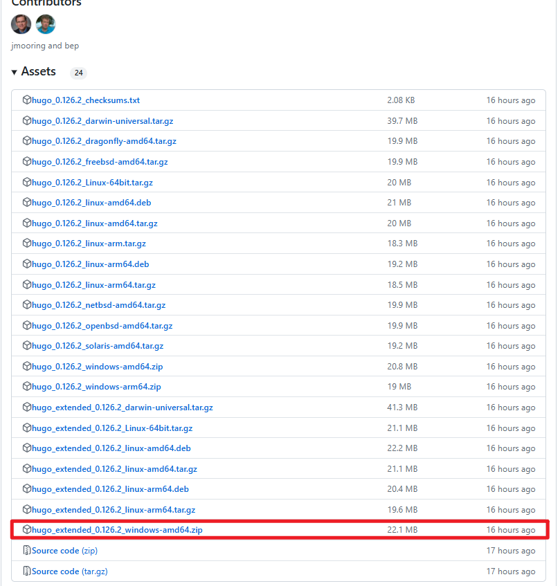

+++
title = 'Hugo博客搭建记录'
date = 2024-06-04T10:43:06+08:00

draft = false

tags=["技术","前端","建站"]

+++

# 博客搭建记录

## 〇、 环境安装

### 0. 注册github和安装Git

`Git`是目前世界上最先进的分布式版本控制系统，可以有效、高速的处理从很小到非常大的项目版本管理。`Git`的作用是将本地的网页文件传到`github`上。

- Git[下载地址](https://git-scm.com/download)
- Git[教程](https://www.liaoxuefeng.com/wiki/896043488029600)

**windows：** 到git官网上下载.exe文件,Download git,安装选项全部默认即可。


`github` 给学生提供免费的代码托管服务，并且提供[GitHub Pages](https:pages.github.com/) 让你的网站直接托管在 GitHub 的服务器上，通过 [http://xxx.github.io]() 来访问。更新维护网站内容也可以通过 `git commit`  和 `git push` 进行更新维护，因为 GitHub Pages 就是 GitHub 上的一个 Git 代码仓库。

GitHub注册这里不再赘述，如果网址无法访问，你可能需要科学上网。


### 1. 安装Hugo

**下载Hugo**

​	打开 Github 中的 Hugo 库，打开右侧的 Realeases，下载最新的版本。推荐下载extended版本，因为有些主题的需要利用进行 SCSS/SASS 构建，如果下普通版就可能会报错显示：` you need the extended version to build SCSS/SASS`



**安装Hugo**

​	将下载好的压缩包解压到你喜欢的目录下，记住这个目录。然后将该目录添加到系统环境变量的 Path 下。


**安装验证：**

在 `cmd` 或 `git bash` 中输入 `hugo version` ，如果输出版本信息，则说明安装成功。

```bash
$ hugo version
hugo v0.126.2-8f3d902ce51512931f5759e9279d93e346c9e649+extended windows/amd64 BuildDate=2024-05-30T15:19:22Z VendorInfo=gohugoio
```


## 一、新建Hugo网站

找个目录，用于存放网站文件，在目录下命令行执行

```bash
hugo new site blog
```

即可完成网站新建。


## 二、更换主题

对于一般主题更换，将对应主题的代码 `拉取/下载` 到博客目录下的 `theme` 目录即可。

之后运行

```bash
hugo server -t 主题名 --build
```

我本次使用的是 `Blowfish` 主题，其还提供了一种傻瓜式的安装方式，即首先安装

```bash
npm i -g blowfish-tools
```

然后在博客路径下执行

```bash
blowfish-tools
```

即可进行交互式的主题安装与设置


## 三、页面配置

 CLI 工具傻瓜是傻瓜，但是一个个配置挺慢的，我还是用文件配置吧…

### 3.1 基本信息配置

因为`blowfish ` 默认的是英文信息，首先在博客目录下的 `config\_default` 目录下，复制`languages.en.toml` 和 `menus.en.toml` ，并重命名为`languages.zh-cn.toml` 和 `menus.zh-cn.toml` 

`languages.zh-cn.toml`可以这么写

```toml
languageCode = "zh-cn"                                 # 网站使用的语言代码
languageName = "Simplified Chinese (China)"            # 网站使用的语言名称
weight = 1                                             # 当前语言页面的排序权重
title = "JiBinquan's blog"                             # 网页标题

# 参数配置
[params]
  displayName = "中文"                                  # 显示的语言名称
  isoCode = "zh-cn"                                    # 国际标准语言代码
  rtl = false                                          # 是否是从右到左的语言
  dateFormat = "2006年1月2日"                           # 日期格式
  logo = ""                                            # 网站标志图片路径
  # secondaryLogo = "img/secondary-logo.png"           # 第二标志图片路径
  description = "JiBinquan的博客"                       # 网站的描述
  copyright = ":copyright: { year } Ji Binquan"        # 版权信息，包含动态的年份占位符

# 作者信息
[author]
  name = "Ji Binquan"                                  # 作者姓名
  image = "/img/avatar.png"                            # 作者头像图片路径
  headline = "随便写写"                                 # 作者的口号或座右铭
  bio = "现在也没研究明白的研究僧"                         # 作者的简短传记
  # 作者的社交媒体链接列表，还可以添加更多
  links = [
    { github = "" },    # GitHub 链接
    { email = "" },     # 电子邮件链接
    { qq = "" },        # QQ 链接
    { zhihu = "" },     # 知乎链接
  ]

```

头像放在`assets\img` 路径下（若没有建立目录即可），如果你的`links`没有默认的图标，可以把同名图标放置在`assets\icons`路径下

`menus.zh-cn.toml`是目录配置，可以根据你的需要自己配置目录，注意在

```toml
[[main]]
 name = "文章"
 pageRef = "posts"
 weight = 10

[[main]]
 name = "归档"
 pageRef = "documents"
 weight = 20

[[main]]
 name = "更多"
 pageRef = "more"
 weight = 30

 [[main]]
 name = "友链"
 pageRef = "friends"
 weight = 40

[[footer]]
 name = "关于"
 pageRef = "about"
 weight = 10

[[footer]]
  name = "统计"
  pageRef = "statistics"
  weight = 20

[[footer]]
  name = "Tags"
  pageRef = "tags"
  weight = 30
```


### 3.2 页面布局配置

主要都在`config\_default\params.toml`下，这里是主要的配置表：

这些设置是用于配置一个名为 Blowfish 的网站主题的。每个选项控制不同的功能和显示特性，使你可以根据需要自定义网站的外观和行为。以下是每个设置的简要说明：

#### 主题选项 (Theme Options)

- `colorScheme`: 设置网站的配色方案。例子中为 "blowfish"。
- `defaultAppearance`: 设置网站的默认外观，可以是 "light" 或 "dark"。
- `autoSwitchAppearance`: 自动切换外观，依据用户的系统设置。
- `enableSearch`: 启用或禁用搜索功能。
- `enableCodeCopy`: 启用或禁用代码复制功能。

#### 图像和文本设置

- `disableImageOptimization`: 禁用图像优化。
- `disableTextInHeader`: 禁用标题中的文本。
- `defaultBackgroundImage`: 设置默认背景图像。
- `defaultFeaturedImage`: 设置所有文章的默认特色图像。

#### 页眉和页脚 (Header and Footer)

- `[header] layout`: 设置页眉布局方式。
- `[footer] showMenu`, `showCopyright`, `showThemeAttribution`, `showAppearanceSwitcher`, `showScrollToTop`: 设置页脚显示的内容和功能。

#### 主页设置 (Homepage)

- `[homepage] layout`: 设置主页布局方式。
- `homepageImage`: 主页图像。
- `showRecent`, `showRecentItems`, `showMoreLink`, `showMoreLinkDest`, `cardView`, `cardViewScreenWidth`, `layoutBackgroundBlur`: 控制主页上显示的最近项目及其展示方式。

#### 文章设置 (Article)

- `[article]` 下的各个设置控制文章页面的各种显示选项，例如日期、浏览次数、作者信息、面包屑导航、分页等。

#### 列表页面设置 (List)

- `[list]` 下的各个设置控制列表页面的显示选项，如是否显示摘要、卡片视图、按年份分组等。

#### 网站地图 (Sitemap)

- `[sitemap] excludedKinds`: 排除的内容类型。

#### 分类和标签 (Taxonomy and Term)

- `[taxonomy]` 和 `[term]` 下的各个设置控制分类和标签页面的显示选项。

#### 分析和验证 (Analytics and Verification)

- `[firebase]`, `[fathomAnalytics]`, `[umamiAnalytics]`: 分析工具的配置选项。
- `[buymeacoffee]`: 支持 Buy Me a Coffee 功能的设置。
- `[verification]`: 用于搜索引擎验证的设置，如 Google、Bing、Pinterest 和 Yandex。

如果需要更多详细信息，可以参考主题文档：[配置 · Blowfish](https://blowfish.page/zh-cn/docs/configuration/)。


### 3.3 功能修改

#### 3.3.1 内联数学公式修改

​		Typora自带的内联公式语法是 `$ ... $` ，而`Blowfish`默认的`KaTeX`渲染语法是`\\( ... \\)` ，在这种模式下，你要不就放弃在Typora上预览内联公式，要不就放弃在网页上渲染内联公式…属实离谱。于是我们找到了以下解决方法：

[javascript - 如何使用 KaTeX 渲染 $..$ 中的所有内联公式？_Stack Overflow中文网](https://stackoverflow.org.cn/questions/27375252)

来到文件`\themes\blowfish\assets\lib\katex\auto-render.min.js`，找到其中代码

```js
n.delimiters=n.delimiters||[{left:"$$",right:"$$",display:!0},{left:"\\(",right:"\\)",display:!1},{left:"\\begin{equation}",right:"\\end{equation}",display:!0},{left:"\\begin{align}",right:"\\end{align}",display:!0},{left:"\\begin{alignat}",right:"\\end{alignat}",display:!0},{left:"\\begin{gather}",right:"\\end{gather}",display:!0},{left:"\\begin{CD}",right:"\\end{CD}",display:!0},{left:"\\[",right:"\\]",display:!0}]
```

改成

```js
n.delimiters=n.delimiters||[{left:"$$",right:"$$",display:!0},{left:"$",right:"$",display:!1},{left:"\\begin{equation}",right:"\\end{equation}",display:!0},{left:"\\begin{align}",right:"\\end{align}",display:!0},{left:"\\begin{alignat}",right:"\\end{alignat}",display:!0},{left:"\\begin{gather}",right:"\\end{gather}",display:!0},{left:"\\begin{CD}",right:"\\end{CD}",display:!0},{left:"\\[",right:"\\]",display:!0}],n.ignoredTags=n.ignoredTags||
```

那么，在你的文章需要使用公式的时候，只需在开头加上一行 ``即可。（我也不知道这样改会有什么问题，先这么着吧）

> 找着问题了…`\\`公式换行不能用了……


#### 3.3.2 字数统计

如果你发现页面统计的字数远远少于文章的字数，请在`hugo.toml`中加入下面一行：

```toml
hasCJKLanguage = true
```


## 
