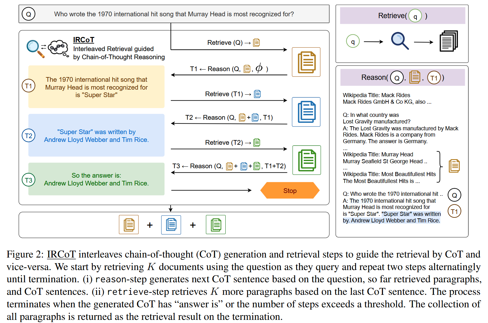
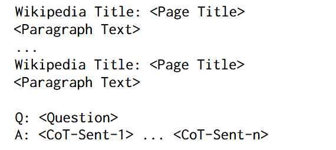
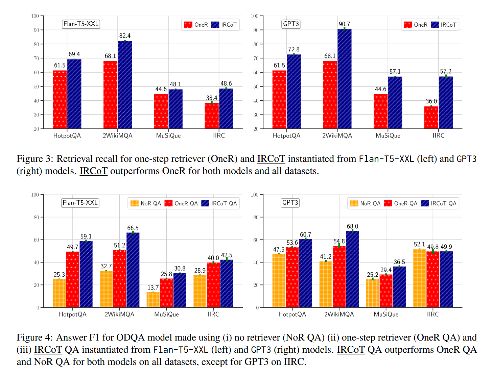
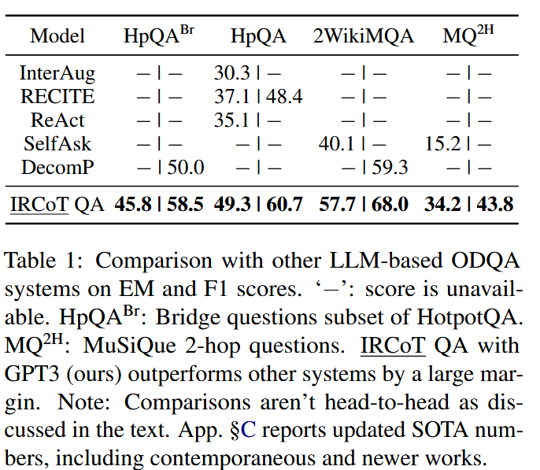
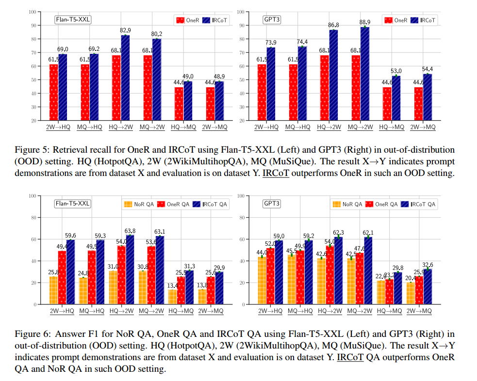
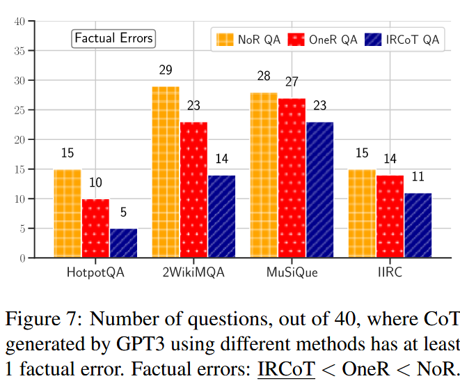
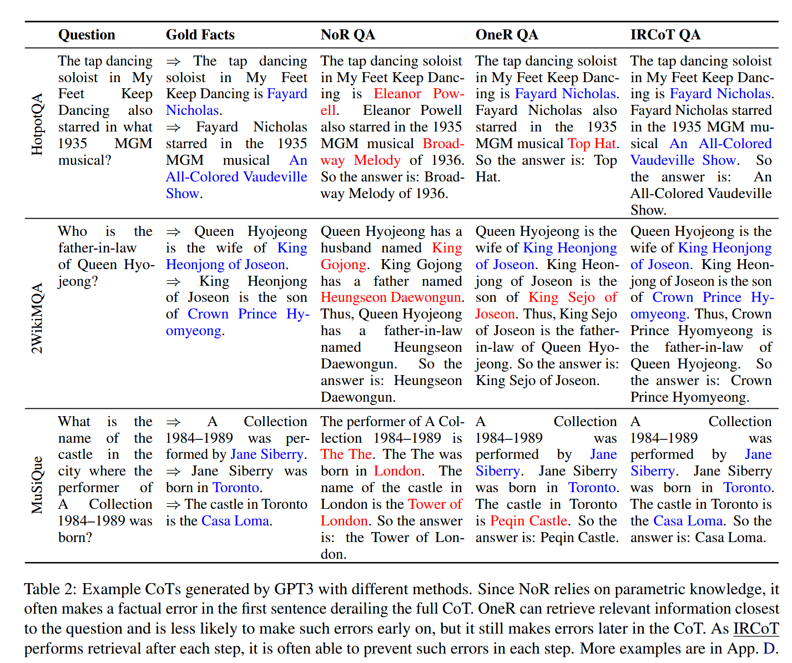
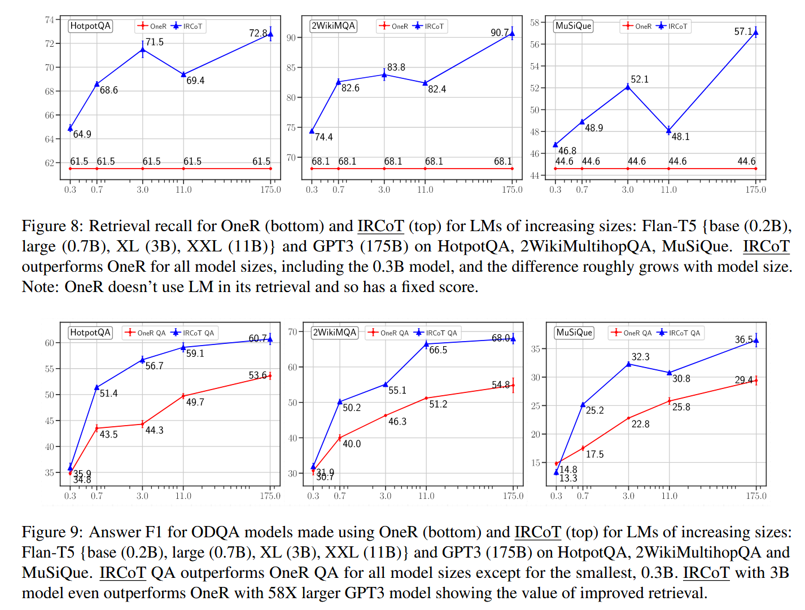

+++
title = '【笔记】IRCOT: 交错检索与链式思考推理在知识密集型多跳问答中的应用'
date = 2024-10-10T20:38:31+08:00

draft = false

tags=["研究","RAG","多跳问答","论文笔记"]

showSummary=true

Summary="使用思维链解决多跳问答的典型论文，提示工程还能整出多少活？"

+++

论文标题：Trivedi 等 - 2023 - Interleaving Retrieval with Chain-of-Thought Reasoning for Knowledge-Intensive Multi-Step Questions

论文链接：[Interleaving Retrieval with Chain-of-Thought Reasoning for Knowledge-Intensive Multi-Step Questions - ACL Anthology](https://aclanthology.org/2023.acl-long.557/)

## 解决问题

传统的一步式RAG难以满足多步问答需求，即提问一次需要多次进行查询才能得到最终答案，因为要进行检索的查询取决于已经得到的内容，而已经得到的内容是根据之前检索的内容生成的。如图一。

## 基本思路

基本思路即是使用检索来指导思维链，然后思维链来指导检索，两个步骤交错进行。

首先，**扩展COT**：使用问题、当前检索到的段落和之前的COT语句来生成下一个语句。

然后，**扩展检索信息**：使用上一步生成的COT语句进行查询，将检索到的段落进行收集。

以此重复，直到COT得到答案或者达到最大限制的推理步数。

上述步骤停止后，将所有收集到的段落作为检索结果，作为问题或思维链的提示上下文来回答问题。

## 具体方法

### 思维链推理的交叉检索

IRCoT检索器由三个要素构成：

1. 一个可以通过查询从语料库或知识源获得给定数量文本段落的基本检索器
2. 一个具有zero/few-shot思维链生成能力的语言模型
3. 少量带注释的问题，带有推理步骤，解释如何用自然语言（思维链）得出答案。以及来自知识源的，能够支持推理链和答案的一组文本片段。

检索器工作方法如图二所示，首先使用问题Q检索K个段落，收集起来作为一组基本段落。然后交错执行思维链推理和检索两个步骤，直到满足终止标准。

#### 检索指导的思维链推理

检索指导的思维链推理使用问题、到目前为止收集的段落以及到目前为止生成的 CoT 句子生成下一个 CoT 句子。该任务的提示模板如下所示：

在上下文能力的验证中，作者使用上述格式的完整CoT，在实际测试中，则只向模型展示到目前为止生成的 CoT 句子，然后让它完成其余部分。即使模型可能会输出多个句子，但对于每个推理步骤，只获取第一个生成的句子并丢弃其余的句子。

在上下文能力验证中，作者将事实段落和M个随机采样段落按照上图格式打乱并连接在一起。在实际测试中，使用之前收集的检索到的全部段落。如果生成的 CoT 句子具有“answer is:”字符串或已达到最大步骤数，则终止该过程并返回所有收集的段落作为检索结果。

使用在上一步中生成的CoT语句作为查询来检索更多的段落并收集起来。最多段落总数需要限制以免超出LLM的上下文长度限制。

### QA阅读器

本文通过两种提示策略实现基于上下文的文本问答。

1. **CoT提示**：使用之前相同的CoT模板，但是在实际测试中要求模型从头开始生成完整的 CoT。 CoT 的最终句子预计采用“答案是：...”的形式，以便可以通过编程方式提取答案。如果不是这种形式，则返回全部的生成内容作为答案。
2. **直接提示**：对于直接提示，作者使用与 CoT 提示相同的模板，但答案字段（“A：”）仅包含最终答案而不是 CoT。

## 实验

### 数据集

**HotpotQA**：

​	现有的问答（QA）数据集无法训练可执行复杂推理和提供答案解释的 QA 系统。HotpotQA创建了一个新型问答数据集 HotpotQA，该数据集包含 11.3 万个基于维基百科的问答对，具备以下四个特点：

1. 问题的答案必须要基于多个支持文档；

2. 问题多样化，不局限于任何已有的知识库或知识模式；

3. 提供句子级别的支持推理线索（supporting fact），允许 QA 系统用强大的监督进行推理，并对预测结果进行解释；

4. 提供了新型模拟比较型问题，来测试 QA 系统提取相关线索、执行必要对比的能力。

   论文展示了 HotpotQA 数据集对最新 QA 系统是有难度的，支持推理线索帮助模型提升性能、做出可解释的预测。

   [arxiv.org/pdf/1809.09600](https://arxiv.org/pdf/1809.09600)

**2WikiMultihopQA**：

​	多跳问答 （QA） 数据集旨在通过要求模型阅读多个段落来回答给定问题来测试推理和推理技能。然而，当前的数据集并没有为从问题到答案的推理过程提供完整的解释。此外，以前的研究表明，现有多跳数据集中的许多示例不需要多跳推理来回答问题。在这项研究中，我们提出了一个新的多跳QA数据集，称为2WikiMultiHopQA，它使用结构化和非结构化数据。在我们的数据集中，我们引入了包含多跳问题推理路径的证据信息。证据信息有两个好处：

（i） 为预测提供全面的解释。

（ii） 评估模型的推理技能。

​	在生成问答对时，我们精心设计了一个管道和一组模板，以保证多跳步骤和问题的质量。我们还利用了 Wikidata 中的结构化格式，并使用逻辑规则来创建自然但仍需要多跳推理的问题。通过实验，我们证明了我们的数据集对于多跳模型具有挑战性，并且它确保需要多跳推理。

[aclanthology.org/2020.coling-main.580.pdf](https://aclanthology.org/2020.coling-main.580.pdf)

**MuSiQue（可回答部分）**：

​	多跳推理仍然是一个难以实现的目标，因为现有的多跳基准测试在很大程度上可以通过捷径解决。我们能否创建一个从结构上要求进行正确多跳推理的问答（QA）数据集？为此，我们引入了一种自下而上的方法，系统地选择可以组合的单跳问题对，这些问题是相互关联的，即其中一个推理步骤严重依赖于另一个步骤的信息。这种自下而上的方法让我们能够探索大量的问题空间，并添加严格的筛选条件以及其他针对关联推理的机制。它提供了对构建过程和生成的k跳问题的特性进行细粒度控制的能力。我们使用这种方法创建了MuSiQue-Ans，一个包含25K个2到4跳问题的新多跳QA数据集。相较于现有数据集，MuSiQue-Ans整体上更难（人机差距增加了3倍），并且更难通过不相关的推理来作弊（例如，单跳模型的F1分数下降了30分）。我们还添加了无法回答的对比问题，以生成一个更严格的数据集MuSiQue-Full。我们希望我们的数据集能够帮助NLP社区开发能够进行真正多跳推理的模型。

[arxiv.org/pdf/2108.00573](https://arxiv.org/pdf/2108.00573)

**IIRC（可回答部分）**：

​	人类通常需要阅读多篇文档来满足他们的信息需求。然而，大多数现有的阅读理解（RC）任务仅关注于上下文中提供了回答问题所需的全部信息的情况，因此无法评估系统识别信息不足的潜在情况以及定位这些信息来源的能力。为填补这一空白，我们提出了一个名为IIRC的数据集，该数据集包含超过13,000个问题，问题来自英文维基百科的段落，这些段落只提供了部分解答所需的信息，缺失的信息存在于一个或多个链接文档中。这些问题是由不访问任何链接文档的众包工人编写的，这导致问题与答案所在上下文之间的词汇重叠极少。这个过程还生成了许多无答案的问题，以及那些需要离散推理的问题，增加了任务的难度。我们参考了最近在各种阅读理解数据集上的建模工作，构建了一个用于该数据集的基线模型，发现其在这一任务上的F1得分为31.1%，而人类的预估表现为88.4%。该数据集、基线系统的代码以及一个排行榜可以在https://allennlp.org/iirc找到。

[aclanthology.org/2020.emnlp-main.86.pdf](https://aclanthology.org/2020.emnlp-main.86.pdf)

**构建**

对于HotpotQA，使用其自带的维基百科语料库进行开放域设置。对于另外三个原本属于阅读理解或混合设置的数据集，作者使用相关上下文构建了其的开放域设置的语料库（附录A）。对于每个数据集，从原始开发集随机抽取100个问题用于调优超参数，并随机抽取另外500个问题作为测试集。

### 模型

使用BM25作为基础检索器，构建两种检索系统：

1. **一步检索器（OneR）**：直接使用问题检索K个段落。K选择在开发集上表现最好的 K ∈ {5, 7, 9, 11, 13, 15}。
2. **IRCoT检索器**：使用BM25作为检索器，结合GPT3、Flan-T5作为不同规模的CoT生成器进行实验。

在这些段落中，作者通过以下步骤构建示例和进行超参数搜索：

1. **构建示例**：
   - 作者为每个数据集创建了三个演示（“训练”）集，每个演示集包含15个从数据集中随机抽取的问题。
   - 这些演示集被用于在不同的实验中，向模型展示上下文示例。
   - 在测试时，作者在模型的上下文长度限制内打包尽可能多的演示。 GPT3的上下文限制是 8K tokens。 Flan-T5 的上下文限制为 6K tokens，这是 80G A100 GPU 内存所能容纳的最大值。

- 对于IRCoT的推理模块的训练示例，作者使用了黄金段落（即包含正确答案的段落）以及数量较少的干扰段落（M ∈ {1, 2, 3}），以生成训练示例。

2. **超参数搜索**：
   - 对于每个实验，作者首先使用第一个演示集对开发集（dev set）进行超参数搜索，以确定最佳的超参数设置。
   - 对于IRCoT Retriever，作者的关键超参数是K（即每个步骤检索的段落数，K ∈ {2, 4, 6, 8}）和干扰段落的数量M。
   - 在超参数搜索过程中，作者允许所有检索系统最多检索15个段落，并通过衡量这些段落中黄金段落的召回率来选择最佳的超参数。
   - 找到最佳的超参数后，作者使用这些超参数在测试集上进行评估，并报告了不同实验中三个演示集的结果的平均值和标准差。

通过这种方法，作者确保了在固定预算下每个系统的最优召回率，并将这些结果用于进一步的实验和分析。

在qa阅读器的选择上，Flan-T5在直接提示策略下表现更好，而GPT3在CoT提示策略下表现更好，于是后面就这么用的。

作者还构建了开放域的问答模型，将检索器和阅读器结合在一起。此外，作者还实验了没有检索器的问答阅读器 **NoR QA**，以评估语言模型能否仅凭其参数知识回答问题。为了选择最佳的 ODQA 模型超参数，作者搜索了能在开发集上最大化答案 F1 值的超参数 K 和 M。IIRC 的结构与其他数据集略有不同，其问题基于一个主要段落，并且其他支持段落来自该段落中提到的实体的维基百科页面。论文也稍微修改了检索器和阅读器以适应这种情况。

### 操作

#### 直接性能

图三展示了IRCoT检索器的的f1性能是优于一步检索器的，不论是在T5和GPT3的环境下。

图四展示了无检索器、一步检索器、和IRCoT的性能差异。值得关注的最后一个在GPT3下IIRC数据集中没有检索器直接问答反而是最好的，应该是拿这个训练过。

总的来说，IRCoT在少样本多步ODQA方面达到了当时的SOTA效果。如表1，展示了EM和F1的相关情况。

#### 泛化能力

作者实验了三种问答系统的泛化能力，使用一个数据集的提示示例来评估另一个数据集，图5图6说明IRCoT的性能还是高一些。

#### 事实错误 

作者使用三种问答系统为每个数据集随机抽取的40个问题生成CoT，如果生成的CoT中有一环是错误的，那就认为CoT存在事实错误。如图7，IRCoT事实错误最少。

表2展示了不同方法的CoT预测在质量上的差异。由于NoR完全依赖于参数知识，它经常在第一句话就犯事实性错误，从而导致整个CoT出错。OneR能够检索到最接近问题的相关信息，因此较少在初期犯错，但在CoT后期仍然会犯错。另一方面，IRCoT通常能够在每一步中防止这种错误。

#### 对于小型化的作用

图8图9分别展示了在不同模型规模下，一步检索和IRCoT召回率和F1的变化情况。可以看到大多数情况下，小规模LM的IRCoT表现比更大规模LM的一步检索效果还要好。

## 当前的限制

1. **依赖基础语言模型的能力**：
   - IRCoT 依赖于基础语言模型具备零样本或少量样本的链式思考（CoT）生成能力。
   - 大型语言模型（超过100B参数）通常具备这种能力，但较小的模型（低于20B参数）较少具备，这限制了IRCoT的广泛应用。

   - 随着对小型语言模型的关注增加，它们将逐步具备链式思考生成能力，使IRCoT能兼容更多的模型。

2. **对长输入的要求**：

   - IRCoT 依赖于基础语言模型支持长输入，因为需要将多个检索到的段落与问答示例一起输入模型。

- 未来研究可以探索重新排序和选择检索段落的策略，以减少对长输入支持的需求。

4. **计算成本**：

- IRCoT 相比基线方法（OneR 和 ZeroR）在检索和问答上有性能提升，但也增加了计算成本，因为它对链式思考的每个句子都需要单独调用语言模型。

5. **实验重现性**：
   - 部分实验使用了OpenAI的商用API（code-davinci-002），但由于该模型已被弃用，实验的重现性受到影响。
   - 使用 Flan-T5-* 的实验结果仍可重现，因为其模型权重是公开的。

