+++
title = '【笔记】RAPTOR: 用于树形组织检索的递归摘要处理'
date = 2024-10-07T19:44:10+08:00
draft = false

tags=["研究","RAG","全局问答","论文笔记"]

showSummary=true

Summary="使用树形结构存储不同级别的摘要信息以应对不同粒度的RAG查询，思路新颖有趣"

+++



原文题目：Sarthi 等 - 2024 - RAPTOR Recursive Abstractive Processing for Tree-Organized Retrieval

原文链接：[[2401.18059\] RAPTOR: Recursive Abstractive Processing for Tree-Organized Retrieval (arxiv.org)](https://arxiv.org/abs/2401.18059)

## 基础思路

使用递归嵌入、聚类和总结文本块的新方法，从下到上构建了一棵具有不同摘要级别的树。在推理时，RAPTOR 模型从这棵树中检索，在不同抽象级别的冗长文档中集成信息。

## 具体方法

思路基础：一个长文本一般都会分章节，或者至少有个分层的逻辑（什么总分总之类的）。

首先，将文本按照100的长度切片，并保证没有句子会被中间截断（如果一个句子超过 100  Token的限制，将整个句子移动到下一个块，而不是在句子中间切掉它。这保留了每个块中文本的上下文和语义连贯性。）。并使用SBERT进行文本嵌入，构成树的叶节点。

然后使用聚类算法对刚才切出的文本块进行分组，**每次分组后，使用LLM对分组后的文档进行一次摘要**，然后对摘要进行一次嵌入。以此循环不断进行聚类、摘要和嵌入，直到无法再进行聚类。以此产生原始文档的结构化、多层树状表示。这种方式有一个很大的优势是计算复杂度是线性的，适合大文本处理。

### 聚类算法

特点：软聚类，一个节点可以属于多个组，也不需要规定分组的数量。作者认为单个文本段通常包含与多个主题相关的信息，所以需要保证将它们可以包含在多个摘要中。

聚类算法基于[高斯混合模型 (GMM)](#1. 高斯混合模型（GMM）)，这种方法既提供了灵活性，又提供了概率框架。GMM 假设数据点是由几种高斯分布的混合生成的。

给定一组 $N$ 个文本片段，每个文本片段都表示为一个 $d$ 维稠密向量嵌入，假设文本向量 $x$ 属于第 $k$ 个高斯分布的概率表示为$P(x|k)=\mathcal{N}(x;u_k,\Sigma_k)$   整体概率分布是加权和$P(x) = \sum_{k = 1}^{K}\pi_k\mathcal{N}(x;u_k,\Sigma_k)$，其中 $\pi_k$ 表示第k个高斯分布的混合权重。

但是由于距离度量在计算高维空间中向量相似性时可能表现不佳，高维向量嵌入对传统的GMMs产生了挑战。作者引入[均匀流形近似和投影(UMAP)](#2. 均匀流形近似和投影（UMAP）)，并通过最近邻参数`n_neighbors`调整局部结构和全局结构之间的平衡。作者的算法通过变化`n_neighbors`来创建层次聚类结构：首先识别全局聚类，然后在这些全局聚类中执行局部聚类。这种两步聚类过程捕捉了文本数据之间的广泛关系，从广泛主题到具体细节。

如果局部聚类的组合上下文超过了总结模型的token限制，作者的算法会在该聚类内递归应用聚类，确保上下文保持在token限制内。

作者使用[贝叶斯信息准则(BIC)](#3. 贝叶斯信息准则（BIC）)来确定最佳聚类数。BIC不仅惩罚模型复杂性，还奖励拟合优度。对于给定的GMM，$\text{BIC} = k \cdot \ln(N) -2 \cdot \ln(\hat{L})$，其中 $N$ 为文本片段(或数据点)的数量，$k$ 为模型参数的数量，$\hat{L}$ 为模型似然函数的最大化值。在GMM的情境中，参数数量 $k$ 是输入向量的维度和聚类数量的函数。

得到由BIC确定的最佳聚类数量后，使用[EM算法](#关键概念)来估计GMM参数，即均值、协方差和混合权重。虽然GMM中的高斯假设可能与文本数据的性质不完全符合，后者通常表现出稀疏和偏斜的分布，但实证观察表明，它是一种有效的模型。

### 模型摘要

在每次使用高斯混合模型进行聚类后，每个组的节点使用GPT3.5-Turbo模型生成摘要。

所有数据集的摘要长度与子节点长度之和的平均比率为 0.28，表明压缩率为 72%。平均而言，摘要长度为 131 个token，平均子节点长度为 86 个token。

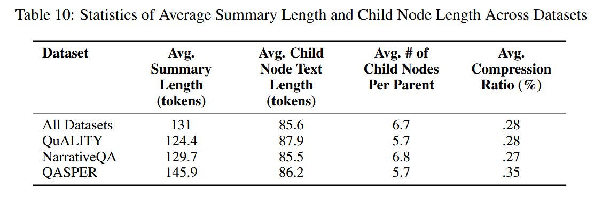

使用的prompt：

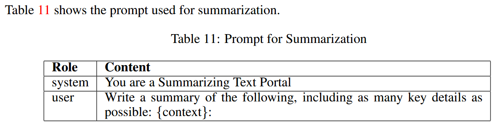

### 查询

RAPTOR使用两种查询机制：树遍历（tree traversal）和折叠树（ collapsed tree）。所有的向量嵌入都是通过SBERT完成的。

#### 树遍历

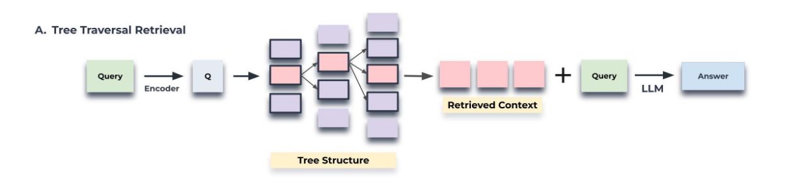

树遍历先根据查询嵌入的余弦相似度找出TopK个最相关根节点。然后在这些节点的所有子节点中再选出TopK个最相关节点。重复这个步骤直到选到叶节点。最后所有被选出的节点（不止最后的叶节点，包括之前经过的所有节点）连接起来作为最后检索出的文本。

即：

1. 在RAPTOR树的根层开始。计算查询嵌入与该初始层中所有节点的嵌入之间的余弦相似度。
2. 基于最高余弦相似度得分选择前k个节点，形成集合$S_1$
3. 继续处理集合$S_1$ 中元素的子节点。计算查询向量与这些子节点的向量嵌入之间的余弦相度。
4. 在这些子节点中选择余弦相似度最高的TopK个，构成集合$S_2$
5. 对树的d层递归的进行此操作，形成集合$S_1,S_2,..,S_d$
6. 把集合$S_1,S_2,..,S_d$连起来，作为最后检索出的文本进行上下文回答。

这个方法通过调整检索深度 $d$ 和每层检索TOP $K$ 控制检索的精度和广度（层数越深越精细，每层越多越广泛嘛）。这是一种自上而下的，从广泛到具体的检索方法（从最概括的根节点向文本片段的叶节点进行逐级检索）。

#### 折叠树

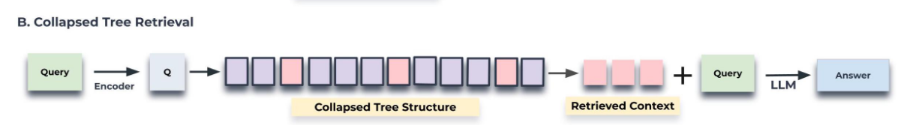

折叠树的方法就比较简单粗暴，直接把之前构建的所有结点（根节点、叶节点和中间节点）看作相同的等级，全部计算与查询的余弦相似度，选取 TopK 构成检索出的文本。

即：

1. 把构建的RAPTOR树看成一层（折叠？拍扁？），表示为 $C$ ，包含之前树中的所有节点。
2. 计算查询向量和 $C$ 中所有节点嵌入向量的余弦相似度
3. 选择余弦相似度最高的TopK节点。==（一直放的话TopK有啥意义？）==往检索结果中放节点，知道达到预定的最大Token数，，确保不超过模型的输入限制。

####  效果

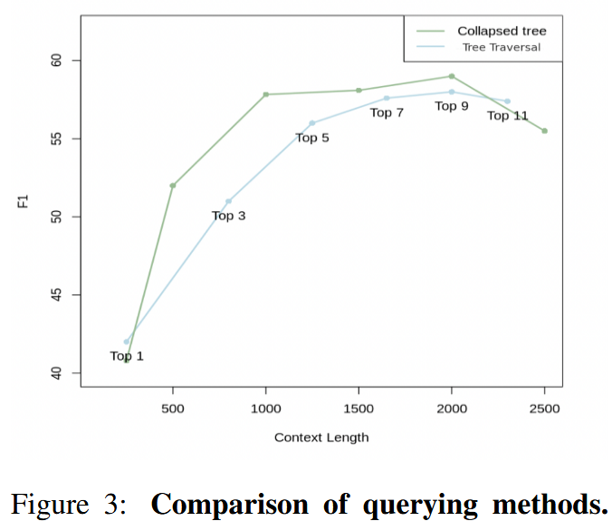

作者在QASPER数据集上的20篇文章中测试上面两种方法，图3展示了不同TopK下的树遍历和不同最大token数限制下的树折叠方法的性能曲线。可以看到在相同的最大token数限制下，树折叠性能多数更好。其实不难理解，原因有二：

1. 树折叠相当于直接对全树的所有节点进行了相似度计算，而树遍历只对树的某一部分进行了计算。
2. 树折叠没有对概括性信息（靠近根节点）和精确性信息（靠近叶节点）的比率进行限制，而在树遍历方法中，当遍历层数 $d$ 与 Top $K$ 被设定好后，概括性信息和精确性信息的比例也被固定死了。

所以总体来看，树折叠更加的全面灵活，但是计算消耗肯定相对更大，作者提到使用快速 k 最近邻库可以提高效率，如 FAISS（Johnson et al., 2019）。

定性来看，相较于稠密段落检索（DPR），RAPTOR的优势在于其可以根据问题的深入度匹配不同精确程度的文本片段，这种方法通常为下游任务提供更相关、更全面的信息。

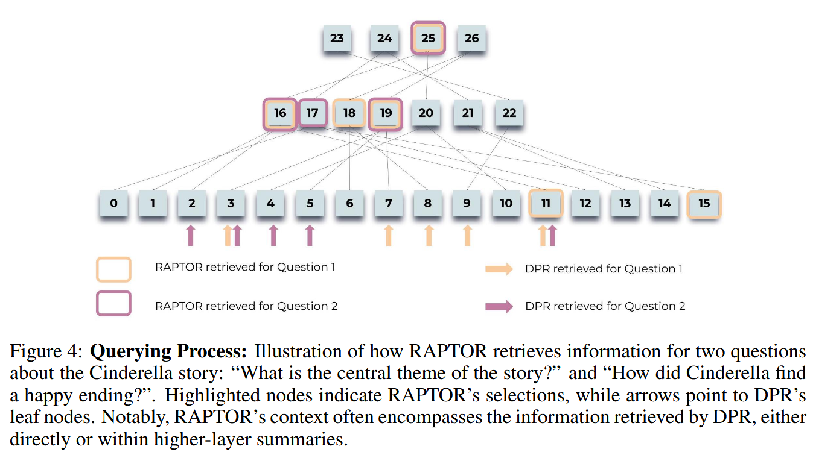

## 实验

### 数据集

**NarrativeQA**：

基于书籍和电影记录全文的问答对组成，共计 1,572 个文档。

NarrativeQA-Story 任务需要对整个文章有全面的理解，以便准确回答其问题，从而测试模型在文学领域中理解较长文本的能力。作者使用标准 BLEU （B-1， B-4）、ROUGE （R-L） 和 METEOR （M） 指标来衡量此数据集的性能。

**QASPER**：

包括 1,585 篇 NLP 论文中的 5,049 个问题，每个问题都基于全文的信息。

QASPER 中的答案类型分为可回答/无法回答、是/否、摘要和提取。精度使用标准 F1 测量。

**QuALITY**：

由多项选择题组成，每个选择题都附有平均长度约为5,000个tokens的上下文段落。该数据集要求对整个文档进行推理以执行 QA 任务，使我们能够衡量检索系统在中等长度文档上的性能。该数据集包括一个具有挑战性的子集 QuALITY-HARD，其中包含大多数人类标注者在快速回答中回答错误的问题。文章同时对整个测试集和 HARD 子集测试准确性。

### 具体操作

作者先使用UnifiedQA 3B作为阅读器，SBERT、BM25和DPR作为嵌入模型在三个数据集生进行受控对比，结果表明，当RAPTOR与任何检索器结合时，在所有数据集上均表现出优于各自检索器的一致性（论文中表1表2）。同时RAPTOR与SBERT结合具有最佳性能，后续实验也将使用这个组合。

然后，作者使用三种不同的LLM：GPT-3、GPT-4 和 UnifiedQA，在三个数据集上将将 RAPTOR 与 BM25 和 DPR 进行比较。

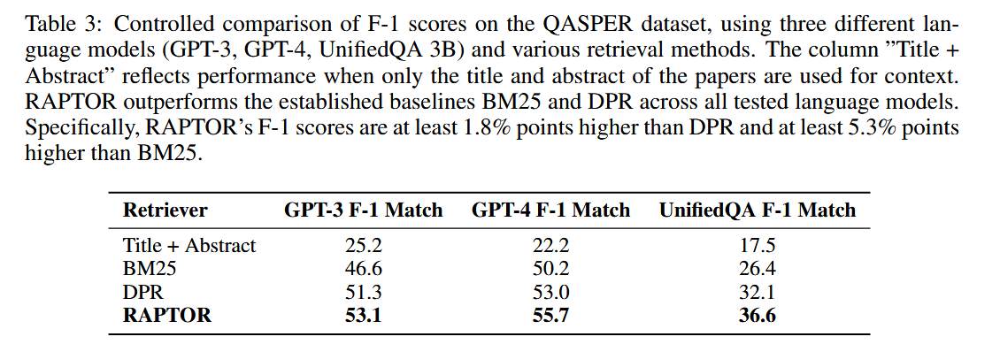

在QASPER数据集中RAPTOR表现尤其出色 ，三种LLM上都超过了BM25和DPR（表3），而且结合GPT-4超过当时SOTA结果（CoLT5 XL，表5）。看来RAPTOR的分级别摘要节点是十分适合该数据集的全文信息提问的。

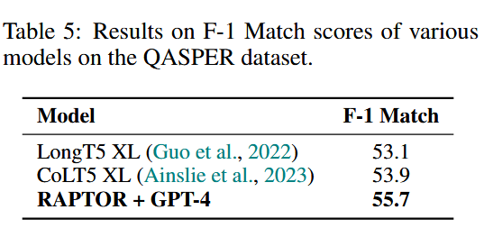

在QuALITY数据集中，如表4所示，RAPTOR的准确率达到62.4%，比DPR和BM25分别提高了2%和5.1%。当使用UnifiedQA时也观察到类似的趋势。与GPT-4的结合大幅领先于当时的SOTA结果（CoLISA，表7）

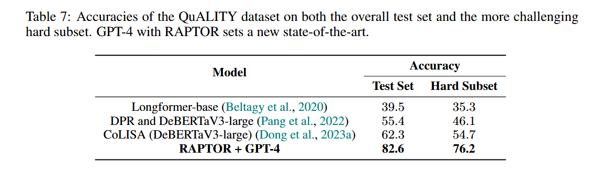

在 NarrativeQA 数据集上，RAPTOR + UnifiedQA 在 METEOR 分数上超过了其他模型。（？）

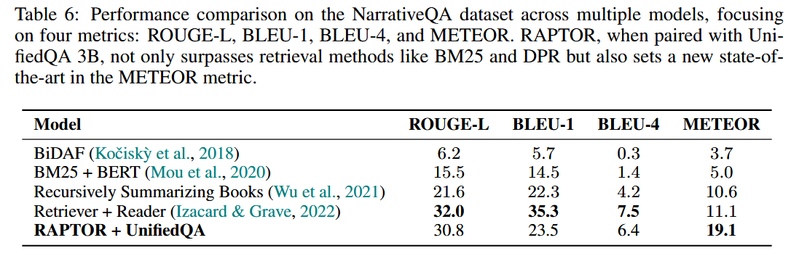

### 树结构贡献的探究

#### 定性分析

作者使用关于1500字童话灰姑娘故事的，关于主题的和多跳的问题，将RAPTOR检索的上下文与稠密段落检索(DPR)检索的上下文进行了比较。如图4，RAPTOP检索的段落加框，DRP检索段落为箭头指示。可以看到，RAPTOR根据手头问题所需的粒度级别从不同层中选择节点。此外，由DPR检索的信息通常包含在RAPTOR检索的上下文中，或者直接作为叶节点，或者间接作为来自更高层的摘要的一部分。

文章给出两个具体例子，第一个是“灰姑娘如何找到一个幸福的结局?”，这是一个多跳问题，需要通过综合各种文本片段的信息来回答。第二个问题是“故事的中心主题是什么?”，这是一个主题问题，需要对全文进行整体理解。表13展示了两种模型返回的检索相关文档，其实结果很明显，在这种需要结合多段文本的问题上，限制RAPTOP的是摘要的质量，而DPR很可能返回一个片面的片段用于回答问题。

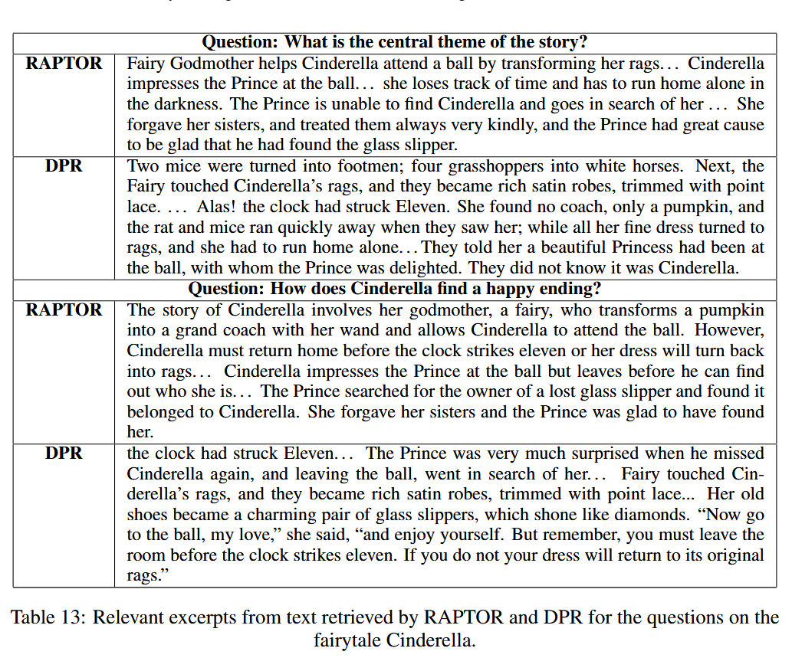

#### 定量分析：

作者对所有三个数据集和三种不同的检索器进行了消融研究，使用RAPTOR和折叠树检索来检查检索到的节点对应的层，观察到18.5%到57%的检索节点来自非叶节点。

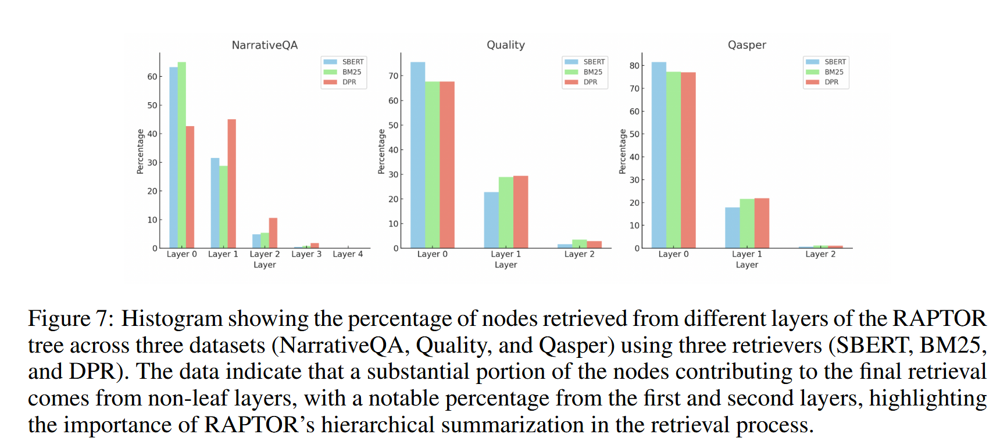

如图7所示，跨层的检索模式揭示了RAPTOR多层树结构的重要性。值得注意的是，RAPTOR使用DPR检索器为NarrativeQA数据集检索的节点中有很大一部分来自树的第一层和第二层，而不是叶子节点。这种模式在其他数据集和检索器中是一致的，尽管百分比不同。

### 聚类机制的消融实验

对于RAPTOR，采用了典型的聚类和摘要过程。相比之下，另一种设置涉及通过递归编码和总结相邻文本块来创建平衡树。选择了7个节点的窗口大小，折叠树方法应用于两种模型的检索。消融研究的结果见表9。该消融研究的结果明确显示在利用RAPTOR的聚类机制时，准确性有所提高。

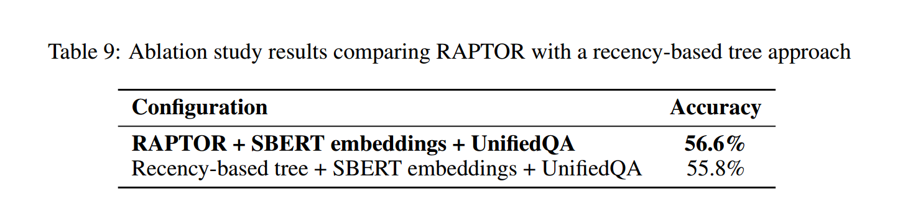

### 幻觉分析

作者主要分析了在摘要生成时产生幻觉的概率，并判断这种幻觉是否会对QA任务产生影响。

通过随机抽样和人工比对的方式，得出幻觉产生比例约为4%（6/150），而且据作者观察，幻觉不会传播到更高层的摘要中。所以作者得出结论：一般来说，幻觉是轻微的，不会改变文本的主题解释，幻觉对QA任务的表现也没有明显的影响，幻觉并不是RAPTOR架构中总结组件的主要关注点。

## 总结

本文主要提出了一种基于树结构的检索系统——RAPTOR，其亮点在于通过递归聚类和摘要模型构建了一个分层次总结文本的查询树，可以满足多种细粒度的查询需要，在根据全文整体内容进行提问的问题中表现突出。（就是实验除了与SOTA比较的部分外主要比较的都是直接检索某一精确文本的方法，要是能更多比较针对全文问题的方法就更好了）

## 补充信息

### 1. 高斯混合模型（GMM）

高斯混合模型（Gaussian Mixture Model，GMM）是一种基于概率统计的聚类模型。它假设数据是由多个高斯分布（正态分布）混合而成，每个高斯分布代表数据的一个聚类。GMM 可以用于对数据进行聚类分析，也常用于概率密度估计。

#### 关键概念

1. **高斯分布**: 高斯分布是一个连续概率分布，通常呈钟形曲线（正态分布）。它由两个参数控制：
   - **均值**: 决定分布的中心位置。
   - **方差**: 控制分布的宽度。

2. **混合模型**: GMM 是多个高斯分布的加权组合，每个分布对应一个潜在类别。每个分布有不同的均值和方差，并且被赋予一个权重（表示该分布在总体中的比例）。

3. **软分类**: 与传统的聚类算法（如 K-means）不同，GMM 进行的是软分类。每个数据点属于每个簇的概率不同，而不是硬分配给某个单一簇。

4. **EM 算法**: GMM 通常使用期望最大化（Expectation-Maximization，EM）算法进行参数估计。EM 算法迭代进行以下步骤：
   - **E 步骤**: 计算每个数据点属于每个高斯分布的概率（即后验概率）。
   - **M 步骤**: 根据 E 步骤的结果，更新每个高斯分布的参数（均值、方差、权重）。

#### GMM 的应用

- **聚类**: 通过识别数据中的不同高斯分布，GMM 可以进行聚类分析。
- **密度估计**: GMM 可以用于建模复杂的概率密度函数，从而进行异常检测或生成新数据。
- **语音识别、图像处理**: GMM 广泛用于这些领域进行建模和特征提取。

由于 GMM 能够捕捉不同形状、大小和方向的簇，它比 K-means 更灵活，适用于更复杂的数据分布。

#### 向量嵌入的高维度的挑战

##### 1. **维度灾难（Curse of Dimensionality）**

高维数据往往会导致维度灾难问题。GMM 假设数据的每个聚类都服从多元高斯分布，而在高维空间中，多元高斯分布的参数（如均值向量和协方差矩阵）需要估计的数量随着维度的增加急剧增长。这种情况会导致以下问题：

- **参数估计困难**: 在高维空间中，需要估计的协方差矩阵的参数数量是维度的平方，容易出现过拟合或不稳定的估计。
- **数据稀疏性**: 高维空间中，数据点之间的距离趋于均匀，导致难以区分不同的聚类。

##### 2. **协方差矩阵的计算复杂性**

在高维度下，GMM 的每个分布都包含一个协方差矩阵。对于 n 维数据，协方差矩阵是一个 \(n \times n\) 的矩阵，需要估计 \(n(n + 1)/2\) 个参数。计算协方差矩阵的逆矩阵的复杂度是 \(O(n^3)\)，这在高维情况下会导致计算效率显著降低。此外，协方差矩阵在高维度下也容易出现数值不稳定性，影响模型的准确性。

##### 3. **数据量与维度的比例问题**

在高维空间中，为了准确估计 GMM 的参数，通常需要大量的数据。然而，在实际应用中，数据量往往不足以支撑高维度下精确的参数估计，这可能导致模型泛化能力差、过拟合或收敛到局部最优解。

##### 4. **高维数据的可分性和聚类效果**

GMM 在高维数据中可能难以识别实际存在的复杂结构，因为高维数据的可分性变差。GMM 假设数据符合多元高斯分布，但在高维嵌入空间中，数据的分布通常不符合这一假设，导致聚类效果较差。此外，高维嵌入向量可能具有非线性结构，而 GMM 作为线性模型难以捕捉这种结构。

##### 5. **计算时间和内存开销**

高维度增加了 GMM 的训练时间和内存需求。对于大规模高维数据集，模型训练和预测的计算复杂度显著上升，这可能使 GMM 不适用于实时或大规模数据处理任务。

##### 解决方案和改进

为了应对高维度带来的挑战，可以考虑以下方法：

- **降维**: 在应用 GMM 之前，使用降维技术（如 PCA 或 UMAP）将高维嵌入向量映射到较低维度的空间。
- **稀疏或对角协方差矩阵**: 通过简化协方差矩阵（如对角协方差或稀疏协方差）来降低计算复杂度和参数数量。
- **贝叶斯 GMM**: 通过引入先验分布，贝叶斯 GMM 可以减少过拟合，并更稳健地估计参数。

高维向量嵌入在传统 GMM 中确实构成了显著挑战，通常需要结合其他技术进行优化和改进。

#### 相关资料

[高斯混合模型（GMM） - 知乎 (zhihu.com)](https://zhuanlan.zhihu.com/p/30483076?s_r=0)

[使用高斯混合模型，让聚类更好更精确（附数据&代码&学习资源） | 机器之心 (jiqizhixin.com)](https://www.jiqizhixin.com/articles/2019-11-15-17)

### 2. 均匀流形近似和投影（UMAP）

Uniform Manifold Approximation and Projection（UMAP）是一种用于降维和可视化的非线性技术。它能将高维数据投影到低维空间，同时尽量保留数据的局部和全局结构关系，常用于数据探索和可视化任务。

#### UMAP 的关键概念

1. **流形学习（Manifold Learning）**: UMAP 基于流形假设，即高维数据实际上存在于一个低维的流形结构中。UMAP 尝试将数据的这种低维流形嵌入揭示出来，并在降维过程中保留这些结构特征。

2. **邻域图（Neighborhood Graph）**: UMAP 首先构建一个邻域图，表示数据点在高维空间中的邻居关系。它使用 k 最近邻（k-NN）方法来确定每个数据点的邻居，并计算邻居之间的距离权重。

3. **非线性投影**: 在降维过程中，UMAP 通过优化一个目标函数来保持邻域图在低维空间中的结构，即保留原始高维空间中的相似性和局部结构。

4. **均匀化和拓扑学方法**: UMAP 使用拓扑学中的概念（如单纯复形、1-skeleton）进行数据建模，同时通过均匀化调整来控制投影的形状和分布。

#### UMAP 的主要特点

- **保留局部和全局结构**: UMAP 不仅关注局部邻居关系，还能保留全局数据结构，因此在高维数据映射到低维空间时表现良好。
- **高效性和可扩展性**: UMAP 在大数据集上的表现优异，能够处理数百万个数据点。
- **可调节性**: UMAP 允许用户通过调整超参数（如邻域大小、最小距离）来控制降维的效果和数据在低维空间中的分布密度。

在 UMAP (Uniform Manifold Approximation and Projection) 中，`n_neighbors` 是一个关键参数，它决定了在构建邻域图时，每个数据点要考虑的最近邻数据点的数量。这个参数对 UMAP 的性能和降维效果有重要影响。

#### n_neighbors参数作用

1. **局部 vs. 全局结构**: `n_neighbors` 控制 UMAP 在降维过程中是更关注局部结构还是全局结构。较小的 `n_neighbors` 值让 UMAP 更加关注数据的局部邻域，保留局部的细节结构；较大的 `n_neighbors` 值则让 UMAP 更加关注全局结构，将数据更均匀地分布在低维空间。

2. **流形假设的范围**: `n_neighbors` 还决定了 UMAP 在数据中假设流形结构的局部性。流形假设认为数据嵌入在一个低维的流形中，这个假设在一定的局部范围内更容易成立。`n_neighbors` 的大小直接影响 UMAP 如何定义这个“局部”的范围。

##### 参数选择的影响

- **较小的 `n_neighbors`（如 5-15）**: UMAP 会保留数据的局部结构，适合用于揭示数据中的小尺度模式或局部簇结构。这种设置适合有较多小簇的数据，但可能会丢失全局结构。
- **较大的 `n_neighbors`（如 50-200）**: UMAP 会更关注全局结构，适合用于展现数据的整体分布模式，适合探索更大的群体或全局趋势。但过大的 `n_neighbors` 可能会使得局部细节被平滑，影响局部簇的分辨能力。

#### UMAP 与 t-SNE 的比较

UMAP 和 t-SNE 都是常用于可视化高维数据的降维算法，但有一些关键区别：

- UMAP 通常在处理大数据集时速度更快，并且能够保留更多的全局结构信息。
- t-SNE 在展示局部结构方面表现出色，但可能导致聚类间隔不均匀，难以解释全局关系。

#### UMAP 的应用

UMAP 被广泛应用于各类高维数据的分析和可视化，例如：

- **生物信息学**: 分析基因表达数据、细胞数据等。
- **图像和文本处理**: 可视化嵌入向量。
- **聚类分析**: 降维后进行聚类或探索数据中的潜在模式。

UMAP 在保持数据结构、处理大规模数据集以及灵活性方面具有显著优势，因此在数据科学和机器学习领域得到了广泛应用。

#### 相关资料

[[1802.03426\] UMAP: Uniform Manifold Approximation and Projection for Dimension Reduction (arxiv.org)](https://arxiv.org/abs/1802.03426)

[UMAP:均匀流形逼近和投影的降维方法 - 朱晓旭的博客 (zhuxiaoxuhit.github.io)](https://zhuxiaoxuhit.github.io/2020/01/13/UMAP-均匀流形逼近和映射的降维方法/)

### 3. 贝叶斯信息准则（BIC）

贝叶斯信息准则（Bayesian Information Criterion, BIC）是一种用于模型选择的准则，广泛应用于统计建模和机器学习中。BIC 平衡了模型的拟合程度和复杂度，用来选择在给定数据集上表现最优的模型。

#### BIC 的定义

BIC 的计算公式为：
$$
\text{BIC} = -2 \cdot \ln(L) + k \cdot \ln(n)
$$
其中：

- $L$  是模型的最大似然估计，对应模型在给定数据下的拟合优度。
- $k$ 是模型中的参数数量，反映模型的复杂度。
- $n$ 是样本的数量。

#### BIC 的含义

- **第一项：拟合度** \( $-2 \cdot \ln(L)$ \): 这一项反映模型对数据的拟合程度，拟合越好，BIC 值越小。
- **第二项：惩罚项** \( $k \cdot \ln(n)$ \): 这一项是对模型复杂度的惩罚，参数越多，BIC 值越大。通过引入这一项，BIC 可以避免过拟合。

#### BIC 的使用

BIC 在模型选择时遵循“越小越好”的原则。在多个候选模型中，BIC 值最小的模型通常被认为是最优的，因为它在平衡模型拟合和复杂度方面表现最好。

#### BIC 的优点和局限性

**优点**:

- BIC 考虑了模型复杂度，能够在模型拟合和过拟合之间取得平衡。
- 在大样本情况下，BIC 的表现通常优于其他信息准则（如 AIC，Akaike Information Criterion），因为 BIC 中的惩罚项随样本量增加。

**局限性**:

- BIC 假设数据独立同分布，且模型中使用的似然估计是准确的。
- BIC 更倾向于选择简单的模型，尤其是在样本量较大时，可能会忽略更复杂但更准确的模型。

#### 应用场景

BIC 广泛应用于以下场景：

- **模型选择**: 在回归分析、聚类分析（如 GMM 中选择最佳簇数）等任务中，用于评估不同模型。
- **特征选择**: 在选择变量时，BIC 可以帮助确定最佳特征组合。

BIC 是一个强有力的模型选择工具，能够在不同模型之间进行有效的权衡，并且在统计建模和机器学习中的广泛应用表明其在实践中的价值。