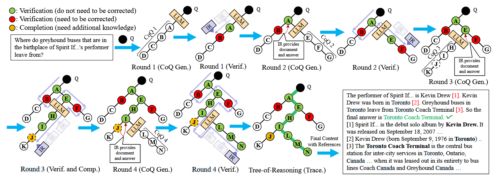
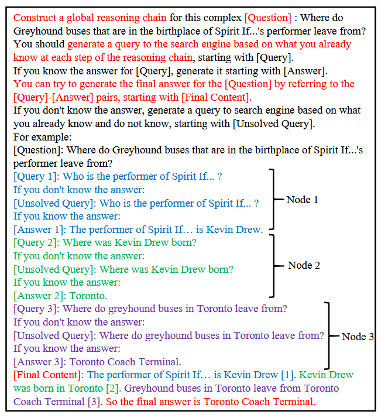
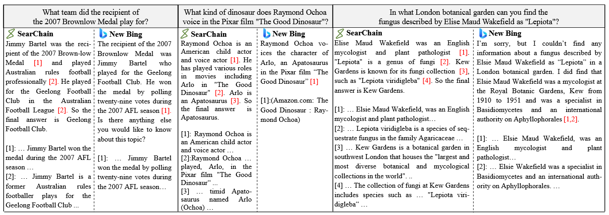
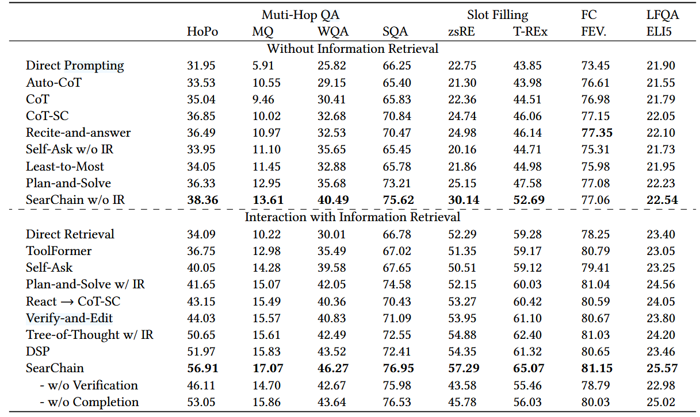

+++
title = '【速览】Search-in-the-Chain：通过搜索知识密集型任务来互动增强大型语言模型'
date = 2025-03-03T15:38:07+08:00
draft = false

tags=["研究","RAG","多跳问答","论文笔记"]

showSummary=true

Summary="介绍了一个动态推理链的方法，感觉方法比较灵活，算是很好的思路"

+++


原文题目：Xu 等 - 2024 - Search-in-the-Chain Interactively Enhancing Large Language Models with Search for Knowledge-intensive Tasks

原文链接：[Search-in-the-Chain: Interactively Enhancing Large Language Models with Search for Knowledge-intensive Tasks | Proceedings of the ACM Web Conference 2024](https://dl.acm.org/doi/abs/10.1145/3589334.3645363)

项目地址：[xsc1234/Search-in-the-Chain: Code for Search-in-the-Chain: Towards Accurate, Credible and Traceable Large Language Models for Knowledge-intensive Tasks](https://github.com/xsc1234/Search-in-the-Chain)

## 动机

面对需要多步推理和实时知识的复杂任务（如多跳问答、事实核查、长文本生成等），LLMs 存在以下短板：  

1. **知识准确性不足**：模型可能依赖记忆中的错误知识或产生与现实矛盾的“幻觉”；  
2. **推理链易断裂**：传统检索增强方法（如分步检索）会打断模型的连贯推理；  
3. **可追溯性差**：生成内容缺乏支持性证据，用户难以验证信息的可信度。  

现有的检索增强方法虽能引入外部知识，却面临两难：  
- **检索错误可能误导模型**：若检索到错误信息，LLM 可能被“带偏”；  
- **静态推理路径**：传统方法无法动态调整推理方向，导致错误积累。  

## 方法

    <b>图1 SearChain流程示意，此过程是在称为循环树的树上的节点识别深度优先搜索（正确的推理路径是绿色的）。最终内容包括推理过程和支持文档的引用。</b>

为突破上述瓶颈，作者提出 **SearChain**，一种结合大模型与信息检索的动态交互框架，核心设计包括以下三部分：  

##### **1. 全局推理链（Chain-of-Query, CoQ）**  
- LLM 将复杂问题分解为一系列子问题（查询-答案对），形成一条完整的推理链。  
- **与传统分步推理的区别**：CoQ 要求模型预先规划全局推理路径，而非逐次解决局部子问题，避免检索打断推理逻辑。  

##### **2. 检索系统的验证与补全**  
- **验证机制**：针对每个子问题的答案，检索系统通过外部知识库验证一致性。若检索结果置信度高且与模型答案冲突，则反馈修正建议。  
- **补全机制**：若模型标记某子问题为“未知”，检索系统直接提供缺失知识，帮助模型完善推理链。  

##### **3. 树状动态推理路径（Tree-of-Reasoning）**  
- 通过多轮交互，SearChain 将线性推理链扩展为树状结构，支持深度优先搜索（DFS）。  
- **动态纠错与探索**：当某节点需修正或补充时，模型可回溯至该节点生成新分支，灵活调整推理方向，避免“一条路走到黑”。 

### 具体流程

本流程来自于对SearChain原仓库代码的理解，其中的多轮迭代是采用LLMs多轮对话的方式进行的。

#### 第一步：生成CoQ

先让大模型根据当前用户问题，生成数个子问题。

* 如果模型（认为自己）知道子问题答案，在子问题后直接生成相对应的答案。
* 如果模型不知道问题答案，则在对应子问题前生成`[Unsolved  Query]`标签。

    <b>图2 CoQ生成Prompt</b>

以上的子问题应该可以构成一个解决用户问题的完整推理链。

#### 第二步：遍历CoQ

针对目前生成的CoQ，遍历其中的子问题：

* 如果这个子问题之前处理过，则跳过之（因为处理过代表已经检索校正过了）。
* 找到CoQ中第一个没有处理过的子问题：
  * 如果这个子问题为`[Unsolved  Query]`，则利用检索器找到 Top1 的相关文档，使用一个阅读器生成答案（这里用的是DPR，而不是LLM），返回`（问题，答案，证据）`三元组。
  * 如果这个子问题有直接生成的答案，则利用检索器找到 Top1 的相关文档，使用一个阅读器生成答案与其置信度，如果自信度高于预先规定的阈值，返回`（问题，答案，证据）`三元组。否则保留之前直接生成的答案不作修改。
* 将刚才处理过的问题记录为已处理。

### 第三步：修正CoQ

在获得刚才子问题的处理结果后，提示LLM重新生成一个新的CoQ。

这里使用的LLM的多轮对话方式完成，LLM可以看到之前历史的CoQ与框架给出的子问题修正证据。

以此迭代循环，直到有一条CoQ的所有问题都被校正或达到最大迭代次数（代码中设置为5）

## 创新点

1. **全局规划 vs 局部优化**  
   SearChain 强调从全局视角规划推理链，而非逐次解决子问题。实验表明，面对困难子问题时，SearChain 能通过改写或进一步分解问题继续推理（平均推理步骤比基线多 30%），而传统方法容易“卡壳”。  

2. **知识解耦与精准干预**  
   - 模型自身知识占主导（75%以上），检索系统仅在必要时介入：修正高置信错误（约 20%）或补全缺失知识（约 5%）。  
   - 这种“按需检索”机制减少了对模型的干扰，检索误导率比基线降低 50%以上。  

3. **可追溯的内容生成**  
   SearChain 为推理链中的每个步骤标记支持性文档引用。例如在回答“吉米·巴特尔效力的球队”时，生成内容会标注球员获奖信息、所属球队等来源。实验显示，其引用覆盖度（SKC）和位置准确性（AMP）显著优于 New Bing 等工具。  

    <b>图3 SearChain和New Bing标记支持文档引用的案例研究</b>

## 实验结果

    <b>表1 SearChain 与基线模型在复杂知识密集型任务上的表现。加粗表示在不同设置下的最佳结果。FC：事实核查，LFQA：长篇问答。LFQA 的评估指标：ROUGE-L。其他任务的评估指标：cover-EM。</b>

在 8 个知识密集型任务（多跳问答、槽填充、事实核查等）的测试中，SearChain 表现优异：  

- **准确率提升**：在 HotpotQA、Musique 等数据集上，比最优基线（如 DSP、Tree-of-Thought）平均高 5-10%；  
- **效率平衡**：尽管引入多轮交互，整体耗时与基线相当，未显著增加计算负担；  
- **开源可复现**：代码已公开，支持 Vicuna-13B 等开源模型。  

## 讨论

这篇文章的方法好处很多，逻辑一致的推理路径、对参考文档的精确引用、动态修改的推理链等。就是看代码的时候感觉在RAG的部分，采用Top1文档的检索方案以及使用性能不如LLM的DPR作为阅读器有点拖了整体框架的后腿，感觉如果换成更好的RAG策略这个方法还能获得更好的性能。