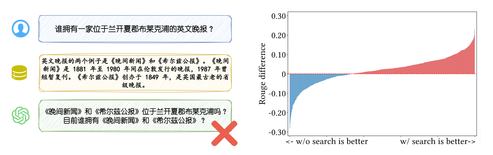
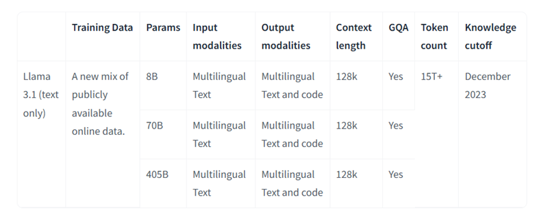
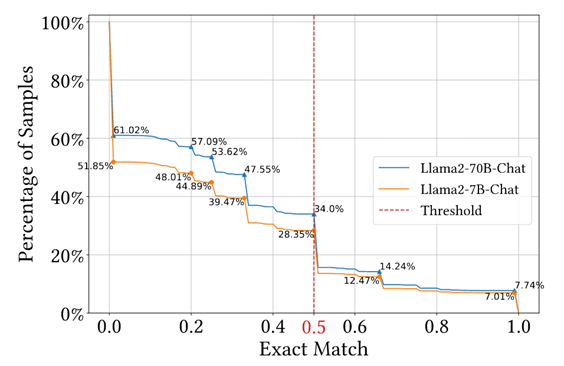
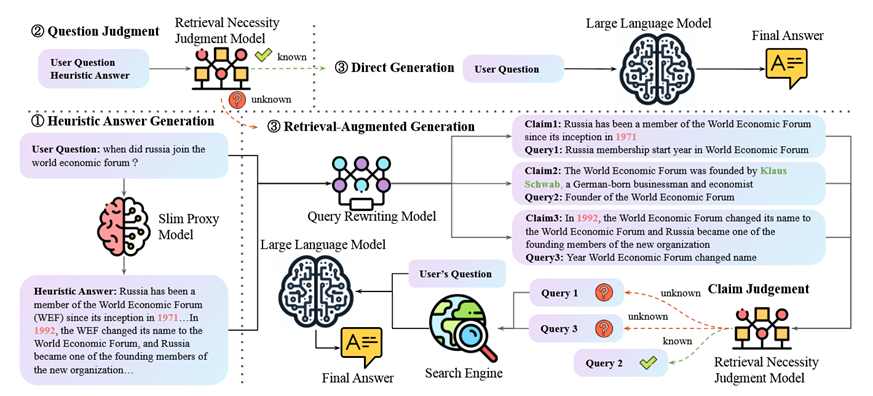
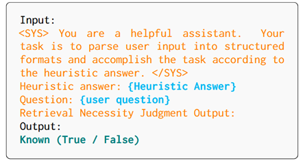
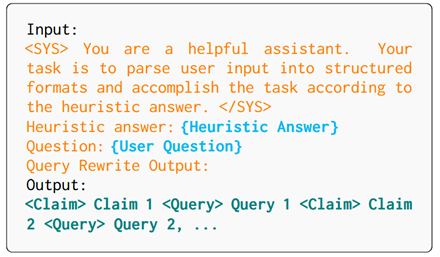
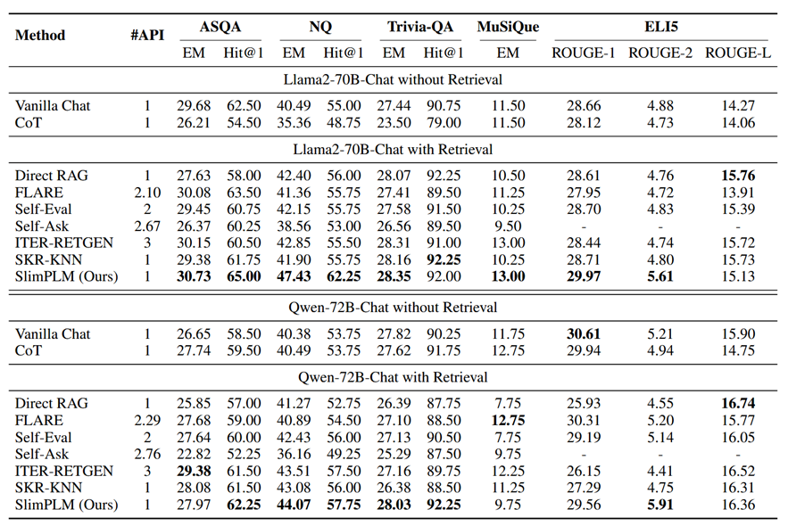
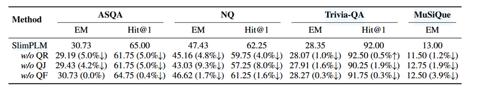
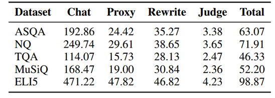

+++
title = '【组会】SlimPLM：利用小型代理模型来决定大语言模型检索的时间和内容'
date = 2025-02-26T10:34:56+08:00
draft = false

tags=["研究","RAG","多跳问答","论文笔记"]

showSummary=true

Summary="241218组会报告文字版补档，使用小型LLM辅助进行检索判断的RAG框架"

+++



原文题目：Tan 等 - 2024 - Small Models, Big Insights Leveraging Slim Proxy Models To Decide When and What to Retrieve for LLM

原文链接：[Small Models, Big Insights: Leveraging Slim Proxy Models To Decide When and What to Retrieve for LLMs - ACL Anthology](https://aclanthology.org/2024.acl-long.242/)

## 1. 背景与当前问题

在当前开放域问答场景下，虽然大语言模型（LLM）具备强大的生成能力，但在某些情况下直接调用模型回答可能会存在两个问题：

- **干扰信息的引入**  
  当LLM能够独立回答问题时，额外的检索步骤可能会引入无关信息，从而降低最终答案的质量。

- **检索时机和内容的选择**  
  如何在合适的时机、针对性地进行检索，是目前亟待解决的挑战。现有的解决方案多依赖：
  - **微调方法**（如Self-RAG）：需要大量计算资源，并可能引发灾难性遗忘；
  - **多次推理策略**（如SKR）：在评估生成内容质量的过程中增加了推理成本和响应延迟。

通过对ELI5数据集的分析，论文展示了在不同场景下检索对回答质量的影响，从而揭示了问题的实际复杂性。

    <b>图1 失败检索影响推理的例子与统计数据</b>

## 2. 解决思路与理论依据

论文的核心创新在于提出利用参数较小的代理模型辅助大参数LLM进行检索决策。

### 理论依据

众所周知，大模型因为庞大的参数量，推理需要的计算成本还是挺高的，并且参数量越大的LLM，在达到更好性能的同时其推理成本也随之增高，一个大模型系列往往会推出不同参数量级的模型以满足不同计算资源条件下的推理需要。而现有的解码器类型语言模型通常**共享相似的** **Transformer** **结构**，并且在**共同的文本语料上进行预训练**，如Common Crawl、书籍和维基百科。理论上这些模型在不同知识领域的掌握程度和检索需求上能够**达成一定程度的共识**。

    <b>表1 Llama 3.1系列不同量级模型的训练数据对比</b>

以此，作者提出猜想：**能否使用参数较小的LLM来辅助大参数LLM进行检索？**如果小参数LLM的**代理模型**能够正确回答某个问题，那么大参数LLM很有可能也能正确回答该问题，代理模型生成的**启发式答案**可以为 LLMs 提供关于其知识能力的线索。

### 实验验证

作者通过代理模型与LLM的一致性实验验证了上面的猜想。

    <b>图2 EM分数高于特定值的样本在总体中的比例</b>

* 在ASQA数据集上，70B与7B语言模型在EM得分大于0.5的样本上**差异微小**，差异主要体现在EM得分小于0.5的样本上。

* 7B模型和70B模型在EM得分大于0.5的样本中重叠超过82.19%。这表明，**代理模型可以正确回答的问题，LLM也很可能能够正确回答。**

## 3. 具体方法

本节详细介绍论文提出的多模块协同检索生成框架，阐述如何利用小模型（代理模型）生成启发式答案，再通过一系列判断和重写步骤确定检索需求，最后辅以大模型生成高质量答案。其具体流程如下图：

    <b>图3 SlimPLM的具体流程</b>

### 3.1 启发式答案生成

- **流程**： 
  直接输入用户问题 *x*，通过低参数量的**代理模型** **PM**（Proxy Model）生成一个初步的“启发式答案” **$\hat{a}$** ̂,即：
  $$
  \hat{a} = 𝑃𝑀(𝑥)
  $$
  
- **目的**：  
  
  - 判断该问题是否需要进一步检索；
  - 为后续查询重写提供线索。

### 3.2 检索必要性判断

- **使用模型**：  预训练的**检索必要性判断模型（RJ）**。

- **输入与输出**：  输入为用户问题 $x$ 与启发式答案 $\hat{a}$，输出为二分类结果：  
  
  - 若答案质量高，则认为LLM可直接回答；
  - 若质量低，则需要触发检索流程。

- **训练策略**： 

  -  利用现有问答数据集的**简短答案样本**，使用**启发式答案与真实答案之间的匹配比例**作为指标，即对于启发式答案 $\hat{a}$ 和真实答案候选集合 $Y=\{y_1,y_2,…y_n \}$，计算:

  $$
r = \frac{|\{y|y\in\hat{a}∧ y\in Y\}|}{|Y|}
  $$

  - 当 $r$ 大于规定的阈值 $\theta$ 时，标记为正 （Known (True)），反之，标签为负（Known (False)）。

  - 为了确保数据的平衡性，对标签为负的样本进行**欠采样**，使其与标签为正的**样本数量大致相等**、
  

  

    <b>图4 RJ训练数据构造使用的Prompt</b>

### 3.3 启发式查询重写与查询过滤

当检索必要性判断模型认为启发式答案质量不足时，需要触发后续的检索流程。为确保检索的精准性，系统采用**查询重写模型（QR）**对原始问题和启发式答案进行进一步处理。具体操作如下：

- 将3.1中PM生成的启发式答案分解为 **n** **个“陈述”**$ \{c_1,c_2,…,c_n\}$
- 根据这 n 个陈述，通过QR模型改写生成 **n** **个相对应的查询** $\{q_{(c_1)},q_{(c_2)},…,q_{(c_n)}\}$
- 用户问题 x 直接派生**n** **个查询**$ \{q_{(x_1)},q_{(x_2)},…,q_{(x_n)}\}$ （这一部分在文章后续就没出现过了？）

在获取n个陈述与其对应的n个查询后， 再次利用上一步的检索必要性判断模型（RJ），来评估每个重写查询是否需要检索，过滤掉不需要检索的查询。作者希望通过这样的方法，对LLM针对用户问题掌握的知识进行更精细化的区分与鉴别。

##### 模型训练

这里QR模型的训练是通过GPT4进行数据生成然后进行指令微调完成的。

    <b>图5 QR训练数据构造使用的Prompt</b>

### 3.4 问题检索与最终答案生成

- **针对性知识检索**：
  
  将上一步筛选出的需要检索的查询**交由检索模型** **R** **进行检索**，确定LLM缺失知识的**文档集合** **$D_{ref}$**。
  
- **整合检索结果**： 
  将从检索模块获得的文档集合 $D_{ref}$ 作为上下文，连同原始用户问题一起输入大参数LLM，生成最终答案。

这种方法实现了通过小模型先行判断，再针对性地调用检索，最终由大模型生成高质量答案的目标，既降低了推理成本，又提高了回答的准确性。

---

## 4. 实验设计与结果

### 数据集与评价指标

论文在多个数据集上进行了实验，包括：

* **数据集（随机抽取 400 个问题）：**
  * **Natural Questions (NQ)**：由谷歌创建的**单跳开放域QA数据集**，答案分为长答案和短答案两种形式。
  * **Trivia-QA**：斯坦福大学开发的单跳开放域QA数据集，**包含多个候选答案**。
  * **ASQA**：专注于模糊事实性问题的长篇问答数据集。每个问题都标注了**长篇答案和可从生成文本中提取的问题-答案对**，需要整合来自不同来源的事实信息的答案
  * **MuSiQue**：**通过将多个单跳问题合成多跳问题**来评估模型的推理能力的多跳QA数据集
  * **ELI5**：**源自 Reddit 论坛的长格式问答**数据集

* **评价指标：**
  * **精确匹配(Exact Match，EM)：**测试生成的答案包含正确的目标答案的**比例**。
  * **Hit@1**：如果模型生成答案包含**至少一个正确答案**，则Hit@1为 1，否则为 0。
  * **Rouge-N** ：用于衡量模型生成摘要文本的质量。统计了预测值和标准值两个字符串的n-gram重叠单元的数量，并计算了**重叠单元在标准字符串中的占比**，作为召回率。

### 实验设置

- **生成器**：  
  使用 Llama2-70B-Chat 和 Qwen-72B-Chat  
- **检索器**：  
  采用 BM25 检索和 E5base 重排  
- **代理模型**：  
  使用 Llama2-7B-Chat 作为代理和插件模型

### 实验结果

    <b>表2 主实验结果</b>

- 检索增强生成方法相比于不使用检索的方法具有明显优势。
- 与其他RAG方法相比，SlimPLM在准确性和检索参考文献的相关性上更具优势。
- 更为显著的是，该方法仅需一次大模型的推理调用，从而大大降低了计算成本。

---

## 5. 消融实验

    <b>表3 消融实验结果</b>

为验证各模块的重要性，论文进行了详细的消融实验，主要结论如下：

- **去除查询重写**（w/o QR）：  
  检索必要性判断仅在普通对话和直接RAG间切换，查询重写能增强检索参考文献的**全面性和相关性**。
  
- **去除检索必要性判断**（w/o RJ）：  
  所有问题均触发检索，导致在LLM本可**直接回答的问题上出现偏差**。
  
- **去除基于声明的查询过滤**（w/o QF）：  
  不过滤不需要检索的内容会使得**检索结果的质量下降**。

以上实验结果充分证明了各个模块在整体框架中的必要性与有效性，这性能差距的计算方法充分体现了数字统计的艺术。

---

## 6. 推理成本与局限性

### 推理成本计算

    <b>表4 针对每种数据集SlimPLM不同组件消耗的Token数量统计</b>

论文通过对比小模型与大模型的计算资源消耗（假设7B模型每个 token 的开销约为70B模型的1/10），得出附加成本仅为单次大模型推理成本的1/4至1/3，从而实现了经济高效的推理过程。

### 局限性

尽管方法表现出色，但也存在一定的局限性：

- **适用场景限制**：  
  当用户问题超出LLM预训练语料范围或几乎不需要外部知识时，SlimPLM的方法优势不明显。
  
- **知识能力差异**：  
  代理模型与大模型之间的知识水平存在差距，启发式答案可能不能完全反映大模型的真实知识能力，进而影响检索判断的准确性。
  
- **方法复杂性**：  
  多模型的集成流程较为复杂，实际部署和维护时可能面临一定挑战，未来的研究可尝试将功能集成至单一生成框架中。

---

## 7. 总结与讨论

论文的主要创新点在于：

- 提出使用**小参数LLM输出模拟大参数LLM输出**进行评估的方法，以一种低成本方法确定检索的时间和方式来辅助判断模型输出时是否需要检索；
- 设计基于**启发式答案的检索必要性判断模型**，有效降低了大模型的调用次数；
- 提出**基于陈述分解的查询重构策略**，有针对性地过滤出缺失知识的部分。

其实读完整篇论文，不难发现，这篇论文的讨论基础即不能把7B、8B之类的LLM当作大模型来看。当接受这个前提背景设置后，本文确实提出了一个合理的假设与一个逻辑通顺的解决方法，结合高质量的图表和文本，确实符合ACL的调性。

另外我们也可以发现，在大小模型协同的RAG模型框架论文里，**效率与成本**往往是作者关注的性能优势。其实反过来一想，现在主流的LLM都是“通才模型“，也就是说，你提示词设置好，基本上很多方法的子模型对应的子任务都能让LLM直接解决。那如何与之前的那种单纯的提示工程方法做出差异与性能优势，是大小模型协同的RAG模型框架需要考虑的问题 。