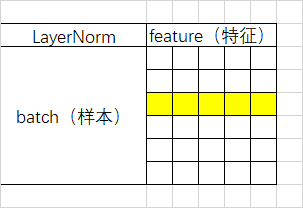

+++
title = '（补档）Transformer阅读笔记'
date = 2023-03-29T15:31:21+08:00
draft = false

tags=["补档","研究","机器学习","自然语言基础"]

+++





**Transformer：Attention Is All You Need**

## -1.笔记

### -1.1 作者研究的主要问题

一种在RNN和CNN之外的，完全无需循环和卷积的序列传导模型的构建及其在机器翻译乃至更多方面的应用。

### -1.2 研究工作的动机

在解决序列建模和转换问题时，当前主流的模型为RNN及其变体（LSTM、GRU）。之后人们一直在推动循环语言模型和编码器-解码器之间的结合。

但是由于RNN每一步的隐藏状态都基于前一步的隐藏状态推出的顺序特性（RNN相关算法只能从左向右依次计算或者从右向左依次计算）这种机制带来了两个问题：

- 时间片t的计算依赖t-1时刻的计算结果，这样限制了模型的并行能力；
- 顺序计算的过程中信息会丢失，尽管LSTM等门机制的结构一定程度上缓解了长期依赖的问题，但是对于特别长期的依赖现象,LSTM依旧无能为力。

另外的避免循环顺序限制的思路是使用卷积神经网络。但是这种模型由于卷积窗口大小限制，这使得学习远程位置之间的依赖性变得更加困难（间隔很大的话要叠很多层卷积）。

### -1.3 解决思路

attention机制可以建模依赖关系而不考虑其在输入或输出序列中的距离，已经成为序列建模和传导模型不可或缺的部分，但是在这之前还大多与循环网络一起使用。

而Transformer的提出，避免了循环，只依赖于Attention机制，解决了上面两个问题，突破了序列化模型的限制。

卷积神经网络的优点在于可以进行多通道的学习和输出，在transformer中，采用多头注意力机制来达到类似的效果。

### -1.4 解决方法

以编码器-解码器架构为基础构建整体模型。在词向量嵌入时加入位置编码来弥补attention机制对整体序列顺序关系关注不足的问题。解码器通过多头注意力机制和前馈网络两个子层加之残差连接和正则化进行处理，提取序列整体信息。解码器先通过有遮蔽的多头注意力机制，防止第 i 个单词知道 i+1 个单词之后的信息，使之符合顺序翻译的处理过程。然后再结合解码器提取的信息进行多头注意力和前馈网络进行处理。

### -1.5 实验效果

又快又好

【attention存在的缺陷】attention在并行性和信息糅合性上表现优越，但是由于attention对整个模型的假设做的更少，所以相较于RNN和CNN需要更多的数据和更大的模型才能训练出来。

### -1.6 数据集

在WMT2014数据集上进行训练（使用BPE：仅使用词根进行学习，忽略时态语态的变化，缩小字典大小，且双语共用一个字典，编码解码embedding共享权重）【英语-德语，英语-法语两个任务】

### -1.7 相关工作对比


### -1.8 思考

1. 本片文章由于篇幅限制，所以“干货满满”，并没有用很多的文笔来去“讲故事”，但是自己写文章还是要写一写自己的研究动机、工作价值、设计理念和进一步思考等内容，让自己的文章显得有深度一些。

2. Transformer 是AI领域继RNN、CNN之后又一框架性的模型，可以在各个领域都能取得比较好的成绩（尤其在NLP领域）。

3. 最新的研究表明，也不是只要Attention就能All Right了，它的只要作用就是吧整个序列的信息进行整合，残差链接和MLP也是必不可少的。

4. Attention能比较好的处理序列信息的原因还是采用了归纳偏置，但是由于这样假设的更加一般，其对数据信息的抓取能力变差了，所以要使用更多的数据、使用更大的模型才能训练出比较好的效果。

5. 更好的框架，还会出现。

   

## -2.名词解释


### **前馈网络**：

前馈神经网络（feedforward neural network，FNN），简称[前馈](https://baike.baidu.com/item/前馈/141922?fromModule=lemma_inlink)网络，是[人工神经网络](https://baike.baidu.com/item/人工神经网络/382460?fromModule=lemma_inlink)的一种。前馈神经网络采用一种单向多层结构。其中每一层包含若干个神经元。在此种神经网络中，各神经元可以接收前一层神经元的信号，并产生输出到下一层。第0层叫**输入层**，最后一层叫**输出层**，其他中间层叫做隐含层（或隐藏层、隐层）。隐层可以是一层。也可以是多层 。

整个网络中无反馈，信号从输入层向输出层**单向传播**，可用一个有向无环图表示。


### **激活函数**：

**ReLU函数**
ReLU（rectified linear unit）函数提供了⼀个很简单的⾮线性变换。给定元素 $x$ ，该函数定义为：
$$
ReLU(x) = max(x,0)
$$
可以看出，ReLU函数**只保留正数元素**，并将负数元素清零。


导数：


**sigmoid函数**

sigmoid函数可以将元素的值变换到0和1之间：
$$
sigmod(x)=\frac{1}{1+exp(-x)}
$$


依据链式法则，sigmoid函数的导数：$sigmoid(x) = sigmoid(x)(1-sigmoid(x))$

当输⼊为0时，sigmoid函数的导数达到最⼤值0.25；当输⼊越偏离0时，sigmoid函数的导数越接近0。


**tanh函数**

tanh（双曲正切）函数可以将元素的值变换到-1和1之间：
$$
tanh(x) = \frac{1-exp(-2x)}{1+exp(-2x)}
$$


当输⼊接近0时，tanh函数接近线性变换。虽然该函数的形状和sigmoid函数的形状很像，但tanh函数在坐标系的原点上对称。


依据链式法则，tanh函数的导数：$tanh'(x) = 1-tanh^2(x)$
当输⼊为0时，tanh函数的导数达到最⼤值1；当输⼊越偏离0时，tanh函数的导数越接近0。


### **多层感知机（MLP）**：


多层感知机就是含有⾄少⼀个隐藏层的由全连接层组成的神经⽹络，且每个隐藏层的输出通过**激活函数**进⾏变换。多层感知机的层数和各隐藏层中隐藏单元个数都是**超参数**。多层感知机按以下方式计算输出：
$$
H=\phi(XW_h+b_h) \\
O=HW_o+b_o
$$
其中 $\phi$ 表⽰激活函数。


### **残差连接**：

随着[深度](https://so.csdn.net/so/search?q=深度&spm=1001.2101.3001.7020)网络层数的加深，带来了一系列问题，如梯度消失，梯度爆炸，模型容易过拟合，计算资源的消耗等问题。随着网络层数的增加发生了网络退化现象，loss先是下降并趋于饱和，然后loss增加。

针对这些问题，在模型中将输入和输入的非线性变化进行叠加。
$$
x_{l+1}=x_l+F(x_l，W_l)
$$


残差块分为两部分，直接映射部分和残差部分。为weight代表卷积，addition代表单位加操作。

如果对函数求导，可以看出x的导数为1，另外的$F(x,w)$导数不可能一直为-1，所以不会出现梯度消失问题。

在卷积网络中$x_l$和$x_{l+1}$可能存在维度不一样的问题，所以为了便于预算，一般对x加一个1*1卷积运算，


### 损失函数

[来自：损失函数（Loss Function）—杰奏-知乎](https://zhuanlan.zhihu.com/p/261059231)

损失函数是用来评估模型对于数据集的拟合程度，即预测结果与真实标签的偏差。如果模型预测的结果是正确的，则其损失函数的值会很小；如果模型预测的结果是错误的，则其损失函数的值会很大。一言以蔽之，损失函数（loss function）就是用来度量模型的预测值f(x)与真实值Y的差异程度的运算函数，它是一个非负实值函数，通常使用L(Y, f(x))来表示，损失函数越小，模型的鲁棒性就越好。

损失函数使用主要是在模型的训练阶段，每个批次的训练数据送入模型后，通过前向传播输出预测值，然后损失函数会计算出预测值和真实值之间的差异值，也就是损失值。得到损失值之后，模型通过反向传播去更新各个参数，来降低真实值与预测值之间的损失，使得模型生成的预测值往真实值方向靠拢，从而达到学习的目的。即通过计算损失获得模型权重的梯度，然后通过反向传播相应地更新这些权重。

常见损失函数

1. 基于距离度量的损失函数
   1. 均方误差损失函数（MSE）
   2. L2损失函数
   3. L1损失函数
   4. Smooth L1损失函数
   5. huber损失函数
2. 基于概率分布度量的损失函数
   1. KL散度函数（相对熵）
   2. 交叉熵损失
   3. softmax loss 损失函数（包含softmax激活函数的损失计算）
   4. Focal loss


### 交叉熵

[来自：“交叉熵”如何做损失函数？打包理解“信息量”、“比特”、“熵”、“KL散度”、“交叉熵”——王木头学科学-知乎](https://zhuanlan.zhihu.com/p/467294700)

**熵**

信息量是对于单个事件来说的，但是实际情况一件事有很多种发生的可能，比如掷骰子有可能出现6种情况，明天的天气可能晴、多云或者下雨等等。**熵是表示随机变量不确定的度量，是对所有可能发生的事件产生的信息量的期望**。即有定义：

H(S)表示S系统的熵，E是求期望，I(x)是求信息量，P(xi)表示xi事件的概率。


$$
H(X) = -\sum^{n}_{i=1}p(x_i)log(p(x_i))
$$


至于为什么信息量要定义为log形式，因为信息量在以概率作为变量描述时，应该满足对于独立事件A、B，必须有$I(P(AB)) = I(P(A)) + I(P(B))$

又$P(AB) = P(A) * P(B)$，即对于信息量的运算，自变量的乘法等于函数值的加法，对数运算就可以很好的满足这个条件。此外，概率越小，不确定性越强，信息量越大，所以信息量应该取负对数以变为单调减小。


**KL散度**

假如说，下面这个图表示的是两个系统的概率分布，其中系统S代表的是真实的规律，系统O代表的是机器学习模型里面猜测的那个规律。那么比较每一个事件 $x_i$ 对应的信息量。如果每一个事件的信息量都是相同的，那么两个概率分布肯定就是相同的了。


相对熵又称KL散度，用于衡量对于同一个随机变量x的两个分布p(x)和q(x)之间的差异。在机器学习中，p(x)常用于描述样本的真实分布，例如[1,0,0,0]表示样本属于第一类，而q(x)则常常用于表示预测的分布，例如[0.7,0.1,0.1,0.1]。显然使用q(x)来描述样本不如p(x)准确，q(x)需要不断地学习来拟合准确的分布p(x)。

则KL散度的定义式就有：


即：
$$
D_{KL}(p||q) = \sum^{n}_{i=1}p(x_i)log(\frac{p(x_i)}{q(x_i)})
$$
n表示事件可能发生的情况总数，KL散度的值越小表示两个分布越接近。

可以注意到，这个定义本质上也是一个加权求和，求和的是两个系统中同一个事件的信息量的差值，加的那个权重是其中一个系统里这个事件的概率值。从这里也能看出来，这里的系统S和系统O，它们并不是平等的，把S和O交换之后并不能保证得到相同的值。也就是说，KL散度它相当于会在两个系统中挑选了一个作为基准（我这里用的是S系统作为基准），拿另一个系统与这个基准进行比较。因为这是用S系统的熵作为基准，去衡量另一个系统O的熵，所以KL散度也叫相对熵。

**交叉熵**

对KL散度进行变形，，发现KL散度可以被分成两个部分，其中后面的那个部分计算出来就是系统S的熵，这部分算出来是多少是与系统O无关的。所以，真正决定KL散度的其实是前面那部分，它的大小决定着KL散度的大小。


于是这部分就可以被单独拿出来讨论，所以**它就被定义成为了交叉熵**。想知道系统S和系统O是否一样，不需要去计算它们的KL散度，只需要去看它们的交叉熵，交叉熵的值与系统S的熵最接近时，目标达成。从数学上可以证明，交叉熵的值一定是会大于等于系统S的熵的。所以，只需要考虑如何对交叉熵求最小值就行了。一个系统与系统S的交叉熵最小值，那么这个系统与S最接近。

### softmax

[来自：softmax是为了解决归一问题凑出来的吗？和最大熵是什么关系？——王木头学科学-BiliBili](https://www.bilibili.com/video/BV1cP4y1t7cP/?spm_id_from=333.788&vd_source=17d58f993e877707240d49d310b15287)

**对于二分类问题**

sigmoid函数针对两点分布提出。神经网络的输出经过它的转换，可以将数值压缩到(0,1)之间，得到的结果可以理解成“分类成目标类别的概率P”。而不分类到该类别的概率，就是(1 - P)，这也是典型的两点分布的形式。所以，对于二分类问题，sigmoid函数是很好的连续激活函数。

**对于多分类问题**

激活函数处理的数据就应该是以向量形式出现，对于真实数据 $y^{(k)}_i$ ，其在相应类别位置概率为1，其余概率为零。

而对于预测结果，则要求对于任何输入，激活函数的输出值应该恒大于零（指数函数就可以很好的将值域映射到正数域），且不同类别加起来的总概率应该为1，（那就直接算总和权重就行）。


故有


### Norm

https://zhuanlan.zhihu.com/p/91125751

**一、定义**

数据标准化（Normalization），也称为归一化，归一化就是将你需要处理的数据在通过某种算法经过处理后，限制将其限定在你需要的一定的范围内。

数据标准化处理是数据挖掘的一项基础工作，不同评价指标往往具有不同的量纲和量纲单位，这样的情况会影响到数据分析的结果，为了消除指标之间的量纲影响，需要对数据进行归一化处理，解决数据指标之间的可比性问题。

**二、优点**

从定义中我们可以得知，数据归一化的目的就是为了把不同来源的数据统一到同一数量级（或者是一个参考坐标系）下，这样使得比较起来有意义。归一化使得后面数据的处理更为方便，它有两大优点：

**（1）归一化提高梯度下降发求解最优解的速度**

如下图，蓝色的圈圈表示特征的等高线。其中左图的两个特征x1和x2区间相差较大，x1~[0,2000],x2~[1,5],期所形成的等高线在一些区域相距非常远，当使用梯度下降法求解最优解的时候，很可能垂直等高线走“之字型”路线（左图红色路径），从而导致需要迭代很多次才能收敛，也可能不收敛。而右图对两个原始特征进行了归一化处理，其对应的等高线显得很圆，在梯度下降的时候就能很快收敛。因此，如果机器学习使用梯度下降法求解最优解时，归一化往往是非常有必要的。


**（2）归一化有可能提高精度**

一些分类器（如KNN）需要计算样本之间的距离（如欧式距离）。如果一个特征值域范围非常大，那么距离计算就要取决于这个特征，如果这时实际情况是值域范围小的特征更重要，那么归一化就要起作用了。

**三、归一化方法**

（1）**线性归一化**，也称min-max标准化、离差标准化；是对原始数据的线性变换，使得结果值映射到[0,1]之间。转换函数如下：
$$
x'=\frac{x-min(x)}{max(x)-min(x)}
$$


这种归一化比较适用在数值较集中的情况。但是这种方法有一个缺陷，就是如果max和min不稳定的时候，很容易使得归一化的结果不稳定，易受极值影响，影响后续使用效果。所以在实际应用中，我们一般用经验常量来替代max和min。

（2）**标准差归一化**，也叫Z-score标准化，这种方法给予原始数据的均值（mean，μ）和标准差（standard deviation，σ）进行数据的标准化。经过处理后的数据符合标准正态分布，即均值为0，标准差为1，转化函数为：
$$
x^*=\frac{x-μ}{σ}
$$


（3）**非线性归一化**，这种方法一般使用在数据分析比较大的场景，有些数值很大，有些很小，通过一些数学函数，将原始值进行映射。一般使用的函数包括log、指数、正切等，需要根据数据分布的具体情况来决定非线性函数的曲线。


### LayerNorm




对于三维输入


BatchNorm是对一个batch-size样本内的每个特征做归一化，LayerNorm是对每个样本的所有特征做归一化。

形象点来说，假设有一个二维矩阵。行为batch-size，列为样本特征。那么BN就是竖着归一化，LN就是横着归一化。

它们的出发点都是让该层参数稳定下来，避免梯度消失或者梯度爆炸，方便后续的学习。但是也有侧重点。

一般来说，如果你的特征依赖于不同样本间的统计参数，那BN更有效。因为它抹杀了不同特征之间的大小关系，但是保留了不同样本间的大小关系。（CV领域）

而在NLP领域，LN就更加合适。因为它抹杀了不同样本间的大小关系，但是保留了一个样本内不同特征之间的大小关系。对于NLP或者序列任务来说，一条样本的不同特征，其实就是时序上字符取值的变化，样本内的特征关系是非常紧密的。


### Dropout

https://zhuanlan.zhihu.com/p/38200980

#### **1. Dropout出现的原因**

在机器学习的模型中，如果模型的参数太多，而训练样本又太少，训练出来的模型很容易产生过拟合的现象。在训练神经网络的时候经常会遇到过拟合的问题，过拟合具体表现在：模型在训练数据上损失函数较小，预测准确率较高；但是在测试数据上损失函数比较大，预测准确率较低。

过拟合是很多机器学习的通病。如果模型过拟合，那么得到的模型几乎不能用。为了解决过拟合问题，一般会采用模型集成的方法，即训练多个模型进行组合。此时，训练模型费时就成为一个很大的问题，不仅训练多个模型费时，测试多个模型也是很费时。

综上所述，训练深度神经网络的时候，总是会遇到两大缺点：

（1）容易过拟合

（2）费时

Dropout可以比较有效的缓解过拟合的发生，在一定程度上达到正则化的效果。

#### **2. 什么是Dropout**

Dropout可以作为训练深度神经网络的一种trick供选择。在每个训练批次中，通过忽略一半的特征检测器（让一半的隐层节点值为0），可以明显地减少过拟合现象。这种方式可以减少特征检测器（隐层节点）间的相互作用，检测器相互作用是指某些检测器依赖其他检测器才能发挥作用。

Dropout说的简单一点就是：我们在前向传播的时候，让某个神经元的激活值以一定的概率p停止工作，这样可以使模型泛化性更强，因为它不会太依赖某些局部的特征，如图1所示。


#### **3. Dropout具体工作流程**

假设我们要训练这样一个神经网络，如图2所示。


图2：标准的神经网络

输入是x输出是y，正常的流程是：我们首先把x通过网络前向传播，然后把误差反向传播以决定如何更新参数让网络进行学习。使用Dropout之后，过程变成如下：

（1）首先随机（临时）删掉网络中一半的隐藏神经元，输入输出神经元保持不变（图3中虚线为部分临时被删除的神经元）


图3：部分临时被删除的神经元

（2） 然后把输入x通过修改后的网络前向传播，然后把得到的损失结果通过修改的网络反向传播。一小批训练样本执行完这个过程后，在没有被删除的神经元上按照随机梯度下降法更新对应的参数（w，b）。

（3）然后继续重复这一过程：

- 恢复被删掉的神经元（此时被删除的神经元保持原样，而没有被删除的神经元已经有所更新）
- 从隐藏层神经元中随机选择一个一半大小的子集临时删除掉（备份被删除神经元的参数）。
- 对一小批训练样本，先前向传播然后反向传播损失并根据随机梯度下降法更新参数（w，b） （没有被删除的那一部分参数得到更新，删除的神经元参数保持被删除前的结果）。

不断重复这一过程。


#### **3. Dropout在神经网络中的使用**

Dropout的具体工作流程上面已经详细的介绍过了，但是具体怎么让某些神经元以一定的概率停止工作（就是被删除掉）？代码层面如何实现呢？

下面，我们具体讲解一下Dropout代码层面的一些公式推导及代码实现思路。

（1）在训练模型阶段

无可避免的，在训练网络的每个单元都要添加一道概率流程。


图4：标准网络和带有Dropout网络的比较

对应的公式变化如下：

- 没有Dropout的网络计算公式：


- 采用Dropout的网络计算公式：


上面公式中Bernoulli函数是为了生成概率r向量，也就是随机生成一个0、1的向量。

代码层面实现让某个神经元以概率p停止工作，其实就是让它的激活函数值以概率p变为0。比如我们某一层网络神经元的个数为1000个，其激活函数输出值为y1、y2、y3、......、y1000，我们dropout比率选择0.4，那么这一层神经元经过dropout后，1000个神经元中会有大约400个的值被置为0。

***注意：\*** 经过上面屏蔽掉某些神经元，使其激活值为0以后，我们还需要对向量y1……y1000进行缩放，也就是乘以1/(1-p)。如果你在训练的时候，经过置0后，没有对y1……y1000进行缩放（rescale），那么在测试的时候，就需要对权重进行缩放，操作如下。

（2）在测试模型阶段

预测模型的时候，每一个神经单元的权重参数要乘以概率p。


图5：预测模型时Dropout的操作

测试阶段Dropout公式：

wtest(l)=pW(l)

#### **4. 为什么说Dropout可以解决过拟合？**

**（1）取平均的作用：** 先回到标准的模型即没有dropout，我们用相同的训练数据去训练5个不同的神经网络，一般会得到5个不同的结果，此时我们可以采用 “5个结果取均值”或者“多数取胜的投票策略”去决定最终结果。例如3个网络判断结果为数字9,那么很有可能真正的结果就是数字9，其它两个网络给出了错误结果。这种“综合起来取平均”的策略通常可以有效防止过拟合问题。因为不同的网络可能产生不同的过拟合，取平均则有可能让一些“相反的”拟合互相抵消。dropout掉不同的隐藏神经元就类似在训练不同的网络，随机删掉一半隐藏神经元导致网络结构已经不同，整个dropout过程就相当于对很多个不同的神经网络取平均。而不同的网络产生不同的过拟合，一些互为“反向”的拟合相互抵消就可以达到整体上减少过拟合。

**（2）减少神经元之间复杂的共适应关系：** 因为dropout程序导致两个神经元不一定每次都在一个dropout网络中出现。这样权值的更新不再依赖于有固定关系的隐含节点的共同作用，阻止了某些特征仅仅在其它特定特征下才有效果的情况 。迫使网络去学习更加鲁棒的特征 ，这些特征在其它的神经元的随机子集中也存在。换句话说假如我们的神经网络是在做出某种预测，它不应该对一些特定的线索片段太过敏感，即使丢失特定的线索，它也应该可以从众多其它线索中学习一些共同的特征。从这个角度看dropout就有点像L1，L2正则，减少权重使得网络对丢失特定神经元连接的鲁棒性提高。

（3）**Dropout类似于性别在生物进化中的角色：**物种为了生存往往会倾向于适应这种环境，环境突变则会导致物种难以做出及时反应，性别的出现可以繁衍出适应新环境的变种，有效的阻止过拟合，即避免环境改变时物种可能面临的灭绝。


### Lable Smoothing

标签平滑是一种正则化技术，它扰动目标变量，使模型对其预测的确定性降低。它被视为一种正则化技术，因为它限制了softmax 函数的最大概率使最大概率不会比其他标签大得多（过度自信）。

在本文中，我们将解释标签平滑的原理，实现了一个使用这种技术的交叉熵损失函数，并评估了它的性能。

**标签平滑**

我们有一个多类分类问题。 在此类问题中，目标变量通常是一个one-hot向量，其中正确类别的位置为1，其他位置为0。 这是与二元分类不同的任务因为在二分类中只有两个可能的类，但是在多标签分类中，一个数据点中可以有多个正确的类。 因此，多标签分类问题的需要检测图像中存在的每个对象。

标签平滑将目标向量改变少量 ε。 因此，我们不是要求我们的模型为正确的类别预测 1，而是要求它为正确的类别预测 1-ε，并将所有其他类别预测为 ε。

带有标签平滑的交叉熵损失函数转化为下面的公式。


$$
{cross-entropy} loss = (1-ε)ce(i)+ε\sum\frac{ce(j)}{N}
$$


在这个公式中，ce(x) 表示 x 的标准交叉熵损失（例如 -log(p(x))），ε 是一个小的正数，i 是正确的类，N 是类的数量。

直观地说，标签平滑将正确类的概率值限制为更接近其他类的概率值。 通过这种方式，它被用作正则化技术和对抗模型过度自信的方法。


## -3.背景知识

### -3.1 序列数据处理模型

在RNN出现之前，卷积神经网络CNN和普通的算法大部分都是输入和输出的一一对应，也就是一个输入得到一个输出。不同的输入之间是没有联系的，但是对于处理序列数据，比如机器翻译等，前面的输入对后面应该是有影响的，因此提出RNN，用来处理「序列数据 – 一串相互依赖的数据流」的场景。

 **RNN：循环神经网络**

RNN（Recurrent Neural Network）循环神经网络是一类用于处理序列数据的神经网络，传统神经网络的结构为：输入层 – 隐藏层 – 输出层，如图1。相比于之前的神经网络RNN最大的区别在于每次都会将前一次的输出结果，带到下一次的隐藏层中，一起训练。


但是同时也可以看出RNN也存在一定的缺陷，短期的记忆影响较大（如图2中的橙色区域），但是长期的记忆影响就很小（如图2中黑色和绿色区域），这就是 RNN 存在的短期记忆问题，不适合处理长序列问题。同时在训练时会出现梯度消失或者梯度爆炸的问题。


**LSTM：长短期记忆网络**

为了解决RNN中存在的梯度消失和梯度爆炸的问题，因为这个问题的存在，RNN没办法回忆起久远的记忆，因此在RNN基础上提出了LSTM，相比于普通的RNN，LSTM多出了三个控制器，分别是输入控制，输出控制和忘记控制，能更好的提取长期信息。

**GRU：门控循环网络**

Gated Recurrent Unit (GRU)就是lstm的一个变体，它将忘记门和输入门合成了一个单一的更新门。同样还混合了细胞状态和隐藏状态，和其他一些改动。最终的模型比标准的 LSTM 模型要简单，是非常流行的LSTM的变体。


## 0. 摘要

**transformer**：相较于传统的基于循环神经网络或卷积神经网络的的主流的序列传导模型，Transformer基于Attention机制完全避免了循环和卷积。具有**结构简单**、**训练更快**和**效果更好**（机器翻译方面）以及**普适性更强**的特点。


## 1. 简介

在解决序列建模和转换问题时，当前主流的模型为RNN及其变体（LSTM、GRU）。之后人们一直在推动循环语言模型和编码器-解码器之间的结合。

但是由于RNN每一步的隐藏状态都基于前一步的隐藏状态推出的顺序特性（RNN相关算法只能从左向右依次计算或者从右向左依次计算）这种机制带来了两个问题：

- 时间片t的计算依赖t-1时刻的计算结果，这样限制了模型的并行能力；
- 顺序计算的过程中信息会丢失，尽管LSTM等门机制的结构一定程度上缓解了长期依赖的问题，但是对于特别长期的依赖现象,LSTM依旧无能为力。

attention机制可以建模依赖关系而不考虑其在输入或输出序列中的距离，已经成为序列建模和传导模型不可或缺的部分，但是在这之前还大多与循环网络一起使用。

而Transformer的提出，避免了循环，只依赖于Attention机制，解决了上面两个问题，突破了序列化模型的限制。

## 2. 背景

另外的避免循环顺序限制的思路是使用卷积神经网络。但是这种模型由于卷积窗口大小限制，这使得学习远程位置之间的依赖性变得更加困难（间隔很大的话要叠很多层卷积）。

卷积神经网络的优点在于可以进行多通道的学习和输出，在transformer中，采用多头注意力机制来达到类似的效果。

## 3. 模型架构


### 主要框架

1. **输入数据：**

通过Word2Vec等词嵌入方法将输入语料转化成特征向量，论文中使用的词嵌入的维度为512。

2. **基本结构：**

Transformer的本质上是一个Encoder-Decoder的结构：


如论文中所设置的，编码器由6个编码block组成，同样解码器是6个解码block组成。与所有的生成模型相同的是，编码器的输出会作为解码器的输入：


### 详细分析

#### 编码器：

以“我有一只猫”为例，整体的Encoder由6个下面基础的encoder模块构成：


##### （1）输入


- 词嵌入方法得到的“我有一只猫”中每一个词的特征向量，维度为$d_{model}=512$.
- Position encoding：在self-attention中使用的是全局信息，没有考虑位置顺序信息，但在翻译中位置顺序信息十分重要（句子单词顺序打乱，语义大概率会发生变化）。因此考虑加入Position encoding来加入这个序列的位置信息，生成的向量维度和词的特征向量维度相同，在本文中为512。具体方法如下：

$$
PE_{(ois,2i) = sin(pos/10000^{2i/d_{model}})}\\
PE_{(ois,2i+1) = cos(pos/10000^{2i/d_{model}})}
$$

其中，pos 表示单词在句子中的位置， PE 的维度d与词 Embedding 一样，也是512，i 是每个维度，2i 表示偶数的维度，2i+1 表示奇数维度 (即 2i≤d, 2i+1≤d)。记住 “奇数位：cos，偶数位：sin”。

举个例子：我 有 一只 猫

其中“一只”的pos=3，并且 $d_{model}=512$ ，因此得到的位置的向量为：


最后，将通过词嵌入方法得到的特征向量和Position encoding得到的向量求和得到最终的**输入X**。


##### （2）注意力模块


在Transformer的encoder中，输入数据首先会经过一个叫做“multi-head attention”的模块，它是由多个‘self-attention’的模块所构成的，因此先来研究‘self-attention’.

**self-attention**

自注意力模块：Query、Key和Value向量都来自自己本来的词嵌入向量，所以是“自”注意力。


在self-attention中，每个单词有3个不同的向量，它们分别是Query向量 Q ，Key向量 K 和Value向量 V ，长度均是64。它们是通过嵌入向量 X 乘以三个不同的权值矩阵$ W^Q,W^K,W^V $得到，其中三个矩阵的尺寸也是相同的。均是 512×64 ,注意 X, Q, K, V 的每一行都表示一个单词下图为计算过程的示意图:


在得到Q,K,V后，‘self-attention’经过计算最终得到一个特征向量Z，这个Z就是论文中公式1中的Attention(Q,K,V)：
$$
Attention(Q,K,V)=softmax(\frac{QK^T}{\sqrt{d_k}})V
$$
下面介绍一下具体的计算过程：

论文中的图：


第一步：Q 乘以 K 的转置后，得到的这个矩阵可以表示单词之间的 **attention 强度**。下图为 Q 乘以 K 的转置，1234 表示的是句子中的单词。


第二步：得到 $QK^T $之后，使用 Softmax 计算每一个单词对于其他单词的 attention 系数，公式中的 Softmax 是对矩阵的**每一行**进行 Softmax，即每一行的和都变为 1


第三步： Softmax 矩阵之后可以和 V 相乘，得到最终的编码信息输出 Z。


第四步：上图中 Softmax 矩阵的第 1 行表示单词 1 与其他所有单词的 attention 系数，最终单词 1 的输出$ Z_1 $等于所有单词值$ V_i $根据 attention 系数的比例加在一起得到，如下图所示：


这里要注意：

* Attention的作用

  

  attention输出的是Value的加权和，权重来自于Query与Key的相似性计算。

- Q,K,V的含义：

Query，Key，Value的概念取自于信息检索系统，举个简单的搜索的例子来说。当你在某电商平台搜索某件商品（年轻女士冬季穿的红色薄款羽绒服）时，你在搜索引擎上输入的内容便是Query，然后搜索引擎根据Query为你匹配Key（例如商品的种类，颜色，描述等），然后根据Query和Key的相似度得到匹配的内容（Value)。在机器翻译中value和key是一个。

self-attention中的Q，K，V也是起着类似的作用，在矩阵计算中，内积是计算两个矩阵相似度的方法之一，因此式1中使用了$ QK^T$ 进行相似度的计算。接着便是根据相似度进行输出的匹配，这里使用了加权匹配的方式，而权值就是query与key的相似度。

- 键向量，查询向量，值向量维度:

键向量，查询向量，值向量维度一般比Embedding词向量低，在原论文中是输入单词Embedding维度的 1/8，（思考：为什么维度要变成Embedding词向量1/ 8，因为论文刚好建立了 8 个 自注意力机制，每个自注意力机制的 Q, K, V 维度就是（512 / 8), 最后再拼接这 8 个自注意了机制的结果，维度也能回到 512，然后再输入到下一个encoder模块中，保证每次输入的维度都是512).

**multi-head attention**


在论文中用到的是Multi-Head Attention，它相当于 h 个不同的self-attention的集成（ensemble），在这里我们以 $ h=8$ 举例说明。Multi-Head Attention的输出分成3步：

​	a) 将数据 X 分别输入到上图所示的8个self-attention中，得到8个加权后的特征矩阵$ Z_i,i=1…8$ 。

​	b) 将8个 $Z_i$ 按列拼成一个大的特征矩阵；

​	c) 特征矩阵经过一层全连接后得到输出 Z 。


可以看到 Multi-Head Attention 输出的矩阵 Z 与其输入的矩阵 X 的维度是一样的，这也是键向量，查询向量，值向量维度设置为64的原因。

其中 $Z_i$ 拼接的方式为:


##### （3）Add&Norm


在Multi-Head Attention之后的Add&Norm计算公式为：


$$
LayerNorm(X+MultiHeadAttention(x))
$$


在Feed Forward之后的Add&Norm计算公式为：
$$
LayerNorm(X+FeedForward(x))
$$


Add就是残差连接，残差连接简单说就是：计算几层输出之后再把x加进来。残差网络可以有效的解决梯度消失的问题。

而norm是对向量进行层归一化，具体计算方法为：


##### （4）Feed Forward


这个全连接有两层，第一层的激活函数是ReLU，第二层是一个线性激活函数，可以表示为:
$$
FFN(x) = max(0,xW_1+b_1)W_2+b_2
$$


Feed Forward 最终得到的输出矩阵的维度与 X 一致，都是(m×512)。

##### （5）Encoder部分的最终结果：

在encoder部分要经过6次上述的encoder模块，最终的输出结果为：维度为(m×512)的矩阵。

#### 解码器


##### （1）输入

输入分为两部分，第一部分为Masked Multi-Head Attention之前，“I have a cat”通过词嵌入方法得到的向量与位置向量的和X作为输入。第二部分为Multi-Head Attention前输入的encoder的结果。

（解码器第一子层的Masked Multi-Head Attention 结构当作Query，Value 和 Key来自编码器：利用上一层的训练来提取编码层的有效信息）


##### （2）Masked Multi-Head Attention:

和Multi-Head Attention的过程基本相同，但是采用了Masked 操作，因为在翻译的过程中是顺序翻译的，即翻译完第 i 个单词，才可以翻译第 i+1 个单词。通过 Masked 操作可以防止第 i 个单词知道 i+1 个单词之后的信息，这样符合翻译的过程。

下面以 “我有一只猫” 翻译成 “I have a cat” 为例，了解一下 Masked 操作。具体的操作步骤如下：

用 0 1 2 3 4 5 分别表示 “< Begin > I have a cat < end >”。

第一步：Decoder 的输入矩阵和 Mask 矩阵，输入矩阵包含 “< Begin > I have a cat” (0, 1, 2, 3, 4) 五个单词的表示向量，Mask 是一个 5×5 的矩阵。在 Mask 可以发现单词 0 只能使用单词 0 的信息，而单词 1 可以使用单词 0, 1 的信息，即只能使用之前的信息。


第二步：接下来的操作和之前的 Self-Attention 一样，通过输入矩阵 X 计算得到 $Q, K, V$ 矩阵。然后计算 $Q 和K^T 的乘积 QK^T$ 。


第三步：在得到 $QK^T$ 之后需要进行 Softmax，计算 attention score, 但我们在 Softmax 之前需要使用 Mask 矩阵遮挡住每一个单词之后的信息，遮挡操作如下：


得到 $Mask QK^T$ 之后在 $Mask QK^T$ 上进行 Softmax，每一行的和都为 1。但是单词 0 在单词 1, 2, 3, 4 上的 attention score 都为 0, 因为它们被遮盖住了，不需要关注。

第四步：使用 $Mask QK^T$ 与矩阵 V 相乘，得到输出 Z，则单词 1 的输出向量 $z_1$ 包含单词 0和单词1的信息。


第五步：通过上述步骤就可以得到一个 Mask Self-Attention 的输出矩阵 $Z_i$ ，然后和Encoder 类似，通过拼接多个输出 $Z_i$ ,然后计算得到第一个 Multi-Head Attention 的输出 Z，Z与输入 X 维度一样。

##### （3）Add&Norm

添加残差连接，并进行归一化，同encoder中的公式一样。

##### （4）Multi-Head Attention

计算方法和encoder中的一致，但是输入数据有差别，因此Q,K,V的计算也有差别，具体如下：输入的数据分为两部分，一部分是从Masked Multi-Head Attention经过归一化后的结果，一部分是encoder输出的结果Z，其中K, V 矩阵使用 Encoder 的编码信息矩阵 Z 进行计算(Encoder是使用输入X或前一个encoder的输出)，而 Q 使用Masked Multi-Head Attention经过归一化后的矩阵进行计算。

##### （5） Feed Forward

同encoder中的公式一样。

##### （6）Linear和Softmax


经过6层的decoder后，结果进入Linear和Softmax，线性层将前面decorder模块输出的向量映射成词典维数的向量，然后经过Softmax层：
$$
f(z_j)=\frac{e^{z_j}}{\sum^{n}_{i=1}e^{z_j}}
$$


## 4. 为什么选择Self-Attention机制

对于一个序列传导模型中编码器或解码器的隐藏层，Self-Attention可以在以下三个方面表现良好：

1. 每层计算的总复杂度
2. 可并行的计算量（以所需的最小顺序操作的数量来衡量）
3. 网络中长距离依赖之间的路径长度（影响学习这种依赖性能力的一个关键因素是前向和后向信号必须在网络中传播的路径长度。 输入和输出序列中任意位置组合之间的这些路径越短，学习远距离依赖性就越容易）


 不同图层类型的最大路径长度、每层复杂度和最少顺序操作数。 *n* 为序列的长度，*d* 为表示的维度，*k* 为卷积的核的大小，*r* 为受限self-attention中邻域的大小。

可以看出在计算复杂性上，Self-Attention与卷积和循环神经网络的区别在于序列长度和向量维度的大小关系。在并行性和信息集合性上表现优越。

将self-attention限制在仅考虑大小为*r* 的邻域。 这会将最大路径长度增加到*O*(*n ∕ r*)，但是可以提高长序列任务的计算性能，这方面还有待继续研究，


【attention存在的缺陷】attention在并行性和信息糅合性上表现优越，但是由于attention对整个模型的假设做的更少，所以相较于RNN和CNN需要更多的数据和更大的模型才能训练出来。


## 5.训练

在WMT2014数据集上进行训练（使用BPE：仅使用词根进行学习，忽略时态语态的变化，缩小字典大小，且双语共用一个字典，编码解码embedding共享权重），使用8台NIVIDA P100 GPU，基础模型训练了12小时（10万步），大型模型训练了3.5天（30万步）。

使用adam训练器

使用三个正则化方法：

**dropout** 输出层和每个隐藏层之间都使用dropout方法，$P_{dropout} = 0.1$

**label soomthing** 只要softmax输出的概率在 0.1 以上，就认为输出正确。（作者不太关心置信度）这让模型不易理解，因为模型学得更加不确定，但提高了准确性和BLEU得分。

## 6. 结果

（2018年）又快又好

**模型变形**


改变attention head的数量和attention key和value的维度，保持计算量不变， 虽然只有一个head attention比最佳设置差0.9 BLEU，但质量也随着head太多而下降。

减小key的大小*$d_k$会有损模型质量。 这表明确定兼容性并不容易，并且比点积更复杂的兼容性函数可能更有用。 我们在行（C）和（D）中进一步观察到，如预期的那样，更大的模型更好，并且丢弃对避免过度拟合非常有帮助。 在行（E）中，我们用学习到的位置嵌入来替换我们的正弦位置编码，并观察到与基本模型几乎相同的结果。


在英语成分句法分析方面做的也不错。

## 7. 总结

本文中，我们提出了Transformer，第一个完全基于注意力的序列转导模型，用多头注意力取代了编码器-解码器架构中最常用的循环层。

对于翻译任务，Transformer可以比基于循环或卷积层的体系结构训练更快。 在WMT 2014英-德和WMT 2014英-法翻译任务中，我们取得了最好的结果。 在前面的任务中，我们最好的模型甚至超过以前报道过的所有的集成模型。

我们对基于注意力的模型的未来感到兴奋。我们计划将Transformer扩展到除文本之外的涉及输入和输出模式的问题，并研究局部的、受限的注意力机制以有效处理大规模的输入和输出，如图像、音频和视频。 让生成具有更少的顺序性是我们的另一个研究目标。


## 8.代码

编码器与解码器的应用：

1. 编码器解码器都使用：机器翻译
2. 只使用编码器：文本分类（如BERT）
3. 只使用解码器：文本生成

### 8.1 输入

```python
    ## 句子的输入部分，
    sentences = ['ich mochte ein bier P', 'S i want a beer', 'i want a beer E']
```

1. 这三个句子分别是啥？在模型里如何处理的？

   

   1. 我爱你：编码端的输入

   2. S I LOVE YOU ：（训练时）解码端的输入（训练时翻译的结果是知道的，所以直接将真实的翻译结果拿过来进行输入，再进行mask处理模拟真实应用按从左到右的序列自回归输入。真实应用的时候，解码端是按序列从左到右一个词一个词的翻译出来再放回解码器这样自回归的进行输入的）

      (teacher forcing：正常应用的时候decoder训练是不能并行的【必须按序列顺序来】，但是直接将真实的翻译结果拿过来，加上mask操作，就可以“假装”按序列处理的每一种中间状态，就可以直接扔到一个矩阵里统一处理了)

   3. I LOVE YOU E：（训练时）真实的翻译结果，解码器最后得到的结果与本句子进行误差损失的计算。

      

2. ‘P’、‘S’、‘E’分别都是啥？有啥用？

   1. S：“start”，表示开始
   2. E：“END”，表示结束
   3. P：“PAD”，填充字符，在多个Batch长度不一致的时候，使用字符"P"进行占位，将句子的长短变得相同。（为了能够使用矩阵进行批量的运算，P字符在运算中不应该产生效果）


规定句子长度 max_len ，句子长的部分截去，短的部分用PAD补齐

### 8.2 词表参数设置

```python
    # Transformer Parameters
    # Padding Should be Zero
    ## 构建词表：设置自然语言字符与数字数据的转换（字典）
    src_vocab = {'P': 0, 'ich': 1, 'mochte': 2, 'ein': 3, 'bier': 4}
    src_vocab_size = len(src_vocab)

    tgt_vocab = {'P': 0, 'i': 1, 'want': 2, 'a': 3, 'beer': 4, 'S': 5, 'E': 6}
    tgt_vocab_size = len(tgt_vocab)

    src_len = 5 # length of source 编码端输入长度
    tgt_len = 5 # length of target 解码端输入长度

    ## 模型参数
    d_model = 512  # Embedding Size                                  每个字符转换为embedding的大小
    d_ff = 2048  # FeedForward dimension                             前馈神经网络线性层的维度大小
    d_k = d_v = 64  # dimension of K(=Q), V
    n_layers = 6  # number of Encoder of Decoder Layer               叠几个编码器/解码器
    n_heads = 8  # number of heads in Multi-Head Attention           分几个头

```


### 8.3 模型整体架构


写模型的建议规则：

1. 从整体到局部（由整体到细节）
2. 搞清楚数据的流动形状

```python
## 1. 从整体网路结构来看，分为三个部分：编码层，解码层，输出层
class Transformer(nn.Module):
    def __init__(self):
        super(Transformer, self).__init__()
        self.encoder = Encoder()  ## 编码层
        self.decoder = Decoder()  ## 解码层
        self.projection = nn.Linear(d_model, tgt_vocab_size, bias=False)
        ## 输出部分，用于最后和标准结果计算损失
        ## 输出层 d_model 是我们解码层每个token输出的维度大小，之后会做一个 tgt_vocab_size 大小的softmax
        ## 把d_model 的512个维度映射到解码端的词表大小，再做 softmax 进行概率比较（找最大的那个）
   


## 整体的架构函数（把encoder、decoder和输出部分串起来的函数）
        
    def forward(self, enc_inputs, dec_inputs):
        ## 这里有两个数据进行输入，一个是enc_inputs 形状为[batch_size, src_len]，主要是作为编码段的输入，一个dec_inputs，形状为[batch_size, tgt_len]，主要是作为解码端的输入
        ##[m,n] = m * n

        ## enc_inputs作为输入 形状为[batch_size, src_len]，输出由自己的函数内部指定，想要什么指定输出什么，可以是全部tokens的输出，可以是特定每一层的输出；也可以是中间某些参数的输出；
        ## enc_outputs就是主要的输出，enc_self_attns这里没记错的是QK转置相乘之后softmax之后的矩阵值，代表的是每个单词和其他单词相关性；
        enc_outputs, enc_self_attns = self.encoder(enc_inputs)

        ## dec_outputs 是decoder主要输出，用于后续的linear映射； dec_self_attns类比于enc_self_attns 是查看每个单词对decoder中输入的其余单词的相关性；dec_enc_attns是decoder中每个单词对encoder中每个单词的相关性；
        dec_outputs, dec_self_attns, dec_enc_attns = self.decoder(dec_inputs, enc_inputs, enc_outputs)

        ## dec_outputs做映射到词表大小
        dec_logits = self.projection(dec_outputs) # dec_logits : [batch_size x src_vocab_size x tgt_vocab_size]
        return dec_logits.view(-1, dec_logits.size(-1)), enc_self_attns, dec_self_attns, dec_enc_attns
```


### 8.4 编码器


```python
## 2. Encoder 部分包含三个部分：词向量embedding，位置编码部分，注意力层及后续的前馈神经网络(layer)

class Encoder(nn.Module):
    def __init__(self):
        super(Encoder, self).__init__()
        ##一样，先列整体框架，有几个部分 
        self.src_emb = nn.Embedding(src_vocab_size, d_model)  ## 这个其实就是去定义生成一个矩阵，大小是 src_vocab_size * d_model
        self.pos_emb = PositionalEncoding(d_model) ## 位置编码情况，这里是固定的正余弦函数，也可以使用类似词向量的nn.Embedding获得一个可以更新学习的位置编码
        self.layers = nn.ModuleList([EncoderLayer() for _ in range(n_layers)])
        ## 使用ModuleList对多个encoder进行堆叠，因为后续的encoder并没有使用词向量和位置编码，所以抽离出来；

## 实现函数
        
    def forward(self, enc_inputs):
        ## 这里我们的 enc_inputs 形状是： [batch_size x source_len]
        ##（有几个句子 * 句子长度）

        ## 下面这个代码通过src_emb，进行索引定位，enc_outputs输出形状是[batch_size, src_len, d_model]
        ##（形成一个三维矩阵，把这些字符索引（词表映射的那种），转换为一个个向量，合成一个矩阵）
        ##（句子个数*句子长度*向量维数）
        enc_outputs = self.src_emb(enc_inputs)

        ## 这里就是位置编码，把两者相加放入到了这个函数里面，从这里可以去看一下位置编码函数的实现；3.
        enc_outputs = self.pos_emb(enc_outputs.transpose(0, 1)).transpose(0, 1)
		## transpose：转置（维度1，维度2）
        
        ##get_attn_pad_mask是为了得到句子中pad的位置信息，给到模型后面，在计算自注意力和交互注意力的时候去掉pad符号的影响，去看一下这个函数 4.
        enc_self_attn_mask = get_attn_pad_mask(enc_inputs, enc_inputs)
        enc_self_attns = []
        for layer in self.layers:
            ## 去看EncoderLayer 层函数 5.
            enc_outputs, enc_self_attn = layer(enc_outputs, enc_self_attn_mask)
            enc_self_attns.append(enc_self_attn)
        return enc_outputs, enc_self_attns
```


##### 位置编码

```python
## 3. PositionalEncoding 代码实现
class PositionalEncoding(nn.Module):
    def __init__(self, d_model, dropout=0.1, max_len=5000):
        super(PositionalEncoding, self).__init__()

        ## 位置编码的实现其实很简单，直接对照着公式去敲代码就可以，下面这个代码只是其中一种实现方式；
        ## 从理解来讲，需要注意的就是偶数和奇数在公式上有一个共同部分，我们使用log函数把次方拿下来，方便计算；
        ## pos代表的是单词在句子中的索引，这点需要注意；比如max_len是128个，那么索引就是从0，1，2，...,127
        ##假设我的demodel是512，2i那个符号中i从0取到了255，那么2i对应取值就是0,2,4...510
        self.dropout = nn.Dropout(p=dropout)

        pe = torch.zeros(max_len, d_model)
        position = torch.arange(0, max_len, dtype=torch.float).unsqueeze(1)
        div_term = torch.exp(torch.arange(0, d_model, 2).float() * (-math.log(10000.0) / d_model))
        pe[:, 0::2] = torch.sin(position * div_term)## 这里需要注意的是pe[:, 0::2]这个用法，就是从0开始到最后面，步长为2，其实代表的就是偶数位置，注意这里是按照对应位置元素乘起来，放到对应位置
        pe[:, 1::2] = torch.cos(position * div_term)##这里需要注意的是pe[:, 1::2]这个用法，就是从1开始到最后面，步长为2，其实代表的就是奇数位置
        ## 上面代码获取之后得到的pe:[max_len*d_model]

        ## 下面这个代码之后，我们得到的pe形状是：[max_len*1*d_model]
        pe = pe.unsqueeze(0).transpose(0, 1)

        self.register_buffer('pe', pe)  ## 定义一个缓冲区，其实简单理解为这个参数不更新就可以

    def forward(self, x):
        """
        x: [seq_len, batch_size, d_model]
        """
        x = x + self.pe[:x.size(0), :]
        return self.dropout(x)
    
    ## 词向量+位置编码 形成输入
```


共有部分算出来就是代码里的 div_term

transpose（0，1）二维转置


#### 消除PAD影响


符号矩阵，告诉后面这个地方影响要消除


```python
## 4. get_attn_pad_mask

## 比如说，我现在的句子长度是5，在后面注意力机制的部分，我们在计算出来QK转置除以根号之后，softmax之前，我们得到的形状
## len_input * len*input  代表每个单词对其余包含自己的单词的影响力

## 所以这里我需要有一个同等大小形状的矩阵，告诉我哪个位置是PAD部分，之后在计算计算softmax之前会把这里置为无穷大；

## 一定需要注意的是这里得到的矩阵形状是batch_size x len_q x len_k，我们是对k中的pad符号进行标识，并没有对k中的做标识，因为没必要

## seq_q 和 seq_k 不一定一致，在交互注意力，q来自解码端，k来自编码端，所以告诉模型编码这边pad符号信息就可以，解码端的pad信息在交互注意力层是没有用到的；

def get_attn_pad_mask(seq_q, seq_k):
    batch_size, len_q = seq_q.size()
    batch_size, len_k = seq_k.size()
    # eq(zero) is PAD token
    pad_attn_mask = seq_k.data.eq(0).unsqueeze(1)  # batch_size x 1 x len_k, one is masking
    return pad_attn_mask.expand(batch_size, len_q, len_k)  # batch_size x len_q x len_k
```


unsqueeze()

expand()：拓展维度

 有两点需要注意，无论是 expand() 还是 expand_as()：

1. 只能在第0维扩展一个维数，比如原来是是（1,3,4）==》（2,1,3,4），而在其他维度扩展不可以（1,3,4）==》（1,2,3,4）【错误】
2. 如果不增加维数，只是增加维度，要增加的原维度必须是1才可以在该维度增加维度，其他值均不可以
3. expand()函数括号中的输入参数为指定经过维度尺寸扩展后的张量的size。
4. expand（）函数只能将size=1的维度扩展到更大的尺寸，如果扩展其他size（）的维度会报错。

本例子中

将【1，1，5】expend为【1，5，5】，即把第二个维度扩大5倍（把原来的那个第二维包含的第三维的元素复制5份）

```python
import torch

a = torch.Tensor([[1], [2], [3],[4]])
# 未使用expand（）函数前的a
print('a.size: ', a.size())
print('a: ', a)

b = a.expand(4, 2)
# 使用expand（）函数后的输出
print('a.size: ', a.size())
print('a: ', a)
print('b.size: ', b.size())
print('b: ', b)

```

输出：

**a.size:** torch([4, 1])
**a:**
1
2
3
4
[torch.FloatTensor of size 4x1]

**b.size:** torch.Size([4, 2])
**b:**
1 1
2 2
3 3
4 4
[torch.FloatTensor of size 4x2]


