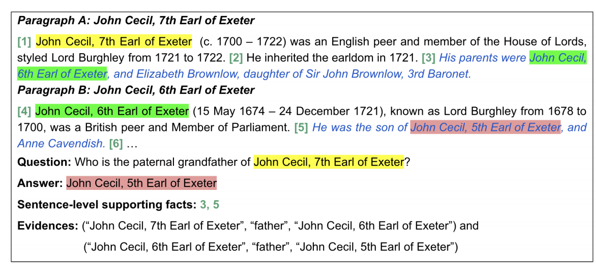
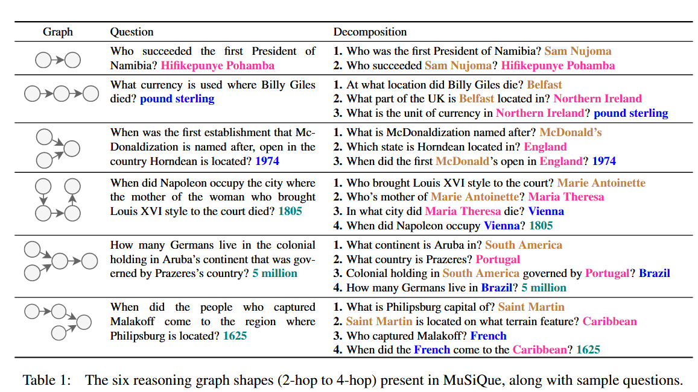

+++
title = '【速览】三个经典多跳QA数据集'
date = 2024-12-04T19:14:15+08:00

draft = false

tags=["研究","RAG","多跳问答"]

showSummary=true

Summary="简单介绍HotPotQA、2WikiMultihopQA和MuSiQue数据集的数据形式和构建理念"

+++


看多跳RAG论文少不了这三个数据集的身影，基本上是多跳RAG必测的三个数据集，由于不同方法的测试标准也不一样，直接了解这三个数据集本来的设计思路和数据格式还是很必要的，便于后面的数据处理和评估设计。

## 训练集、验证集和测试集

在机器学习和深度学习中，数据集通常分为三种类型：训练集（train）、验证集（dev）和测试集（test）。它们各自的作用和特点如下：

1. **训练集（Train Dataset）**：
   - **用途**：用于训练模型，帮助模型学习数据的特征。
   - **特征**：包含大量的样本，通常是整个数据集中最大的部分。
   - **目标**：通过调整模型参数，使得模型在该数据集上的表现达到最佳。

2. **验证集（Dev Dataset）**：
   - **用途**：用于调整模型的超参数和进行模型选择，帮助评估模型的泛化能力。
   - **特征**：一般较小于训练集，但在模型训练过程中多次使用。
   - **目标**：提供模型在未见数据上的表现，以防止过拟合，并帮助选择最佳模型结构或超参数。

3. **测试集（Test Dataset）**：
   - **用途**：用于评估最终模型的性能，给出对新数据的真实表现。
   - **特征**：通常与训练集和验证集完全独立，且仅在模型训练结束后使用。
   - **目标**：评估模型在真实应用场景中的表现，提供模型的泛化能力和有效性指标。

### 总结
- **训练集**：用来训练模型。
- **验证集**：用来调优模型。
- **测试集**：用来最终评估模型性能。

这种划分有助于确保模型的学习和评估是公正和有效的，减少对模型性能的偏见。


## HotPotQA： 用于多样化、可解释的多跳问题解答的数据集

论文题目：Yang 等 - 2018 - HotpotQA A Dataset for Diverse, Explainable Multi-hop Question Answering

论文链接：[[1809.09600\] HotpotQA: A Dataset for Diverse, Explainable Multi-hop Question Answering (arxiv.org)](https://arxiv.org/abs/1809.09600)

项目地址：[HotpotQA Homepage](https://hotpotqa.github.io/)


### 构建思路

HotPotQA是2018年由卡内基梅隆大学发布的用于多样化、可解释的多跳问题解答的数据集。

### 数据格式

#### **训练集格式**

`hotpot_train_v1.1.json`

```json
{
    "supporting_facts": [
        ["str(title)", "int(sent_id)"]        // 支持文档的标题和对应句子的序号（第几句）
        // ...
    ],
    "level": [ // 以下三种之一作为值。
        "easy",
        "hard",
        "medium"
    ],
    "question": "str", // 问题内容
    "context": [
        [
            "str(Title)", // 文档标题
            [
                "str(Sent)", // 句子内容
                "str(Sent)" // 句子内容
                // ...
            ]
        ]
        // ...
    ],
    "answer": "str", // 这里应该是一个字符串，代表答案内容
    "_id": "str", // 这里应该是一个唯一的字符串标识符
    "type": [        // 以下两种之一作为值。
        "bridge",
        "comparison"
    ]
}

```

下面是对各个字段的解释：

1. **supporting_facts**:  
   - 类型: `List of Lists`，包含数个字符串列表，每个字符串列表由一个字符串和一个整数构成。  
   - 含义: 支持该问题的事实。包含支持问题答案相关事实的文档题目（title）和相关事实的句子在文档中对应的定位（sent_id）。

2. **level**:  
   - 类型: `List of Strings`，可能的取值为 `"easy"`, `"hard"`, `"medium"`。  
   - 含义: 问题的难度级别。它表示该问题的难度，可以是“easy”（简单）、“hard”（困难）或“medium”（中等）。

3. **question**:  
   - 类型: `String`。  
   - 含义: 问题文本。这是实际提出的多跳问题的内容。

4. **context**:  
   - 类型: `List of Lists`，包含数个字符串列表（应该是10个）。  
   - 含义: 可能能够提供上下文信息的文档或句子。信息由几个能够提供关键信息的文档和其他干扰文档组成。每个列表有一个标题（Title）和数个句子（Sent）。

5. **answer**:  
   - 类型: `String`。  
   - 含义: 问题的答案。这是根据给定的上下文回答问题的答案。

6. **_id**:  
   - 类型: `String`。  
   - 含义: 唯一标识符。用于唯一标识该条问答数据。

7. **type**:  
   - 类型: `List of Strings`，可能的取值为 `"bridge"`, `"comparison"`。  
   - 含义: 问题的类型。它可以是两种类型之一：
     - `"bridge"`：表示需要跨越多个上下文信息来连接事实并推导出答案。
     - `"comparison"`：表示需要对比多个事实来得出答案。

**示例**：

```json
    {
        "supporting_facts": [
            [
                "Allie Goertz",
                0
            ],
            [
                "Allie Goertz",
                1
            ],
            [
                "Allie Goertz",
                2
            ],
            [
                "Milhouse Van Houten",
                0
            ]
        ],
        "level": "hard",
        "question": "Musician and satirist Allie Goertz wrote a song about the \"The Simpsons\" character Milhouse, who Matt Groening named after who?",
        "context": [
            [
                "Lisa Simpson",
                [
                    "Lisa Marie Simpson is a fictional character in the animated television series \"The Simpsons\".",
                    " She is the middle child and most intelligent of the Simpson family.",
                    " Voiced by Yeardley Smith, Lisa first appeared on television in \"The Tracey Ullman Show\" short \"Good Night\" on April 19, 1987.",
                    " Cartoonist Matt Groening created and designed her while waiting to meet James L. Brooks.",
                    " Groening had been invited to pitch a series of shorts based on his comic \"Life in Hell\", but instead decided to create a new set of characters.",
                    " He named the elder Simpson daughter after his younger sister Lisa Groening.",
                    " After appearing on \"The Tracey Ullman Show\" for three years, the Simpson family were moved to their own series on Fox, which debuted on December 17, 1989."
                ]
            ],
            [
                "Marge Simpson",
                [
                    "Marjorie Jacqueline \"Marge\" Simpson (n\u00e9e Bouvier) is a fictional character in the American animated sitcom \"The Simpsons\" and part of the eponymous family.",
                    " She is voiced by Julie Kavner and first appeared on television in \"The Tracey Ullman Show\" short \"Good Night\" on April 19, 1987.",
                    " Marge was created and designed by cartoonist Matt Groening while he was waiting in the lobby of James L. Brooks' office.",
                    " Groening had been called to pitch a series of shorts based on \"Life in Hell\" but instead decided to create a new set of characters.",
                    " He named the character after his mother Margaret Groening.",
                    " After appearing on \"The Tracey Ullman Show\" for three seasons, the Simpson family received their own series on Fox, which debuted December 17, 1989."
                ]
            ],
            [
                "Bart Simpson",
                [
                    "Bartholomew JoJo \"Bart\" Simpson is a fictional character in the American animated television series \"The Simpsons\" and part of the Simpson family.",
                    " He is voiced by Nancy Cartwright and first appeared on television in \"The Tracey Ullman Show\" short \"Good Night\" on April 19, 1987.",
                    " Cartoonist Matt Groening created and designed Bart while waiting in the lobby of James L. Brooks' office.",
                    " Groening had been called to pitch a series of shorts based on his comic strip, \"Life in Hell\", but instead decided to create a new set of characters.",
                    " While the rest of the characters were named after Groening's family members, Bart's name is an anagram of the word \"brat\".",
                    " After appearing on \"The Tracey Ullman Show\" for three years, the Simpson family received its own series on Fox, which debuted December 17, 1989."
                ]
            ],
            [
                "Allie Goertz",
                [
                    "Allison Beth \"Allie\" Goertz (born March 2, 1991) is an American musician.",
                    " Goertz is known for her satirical songs based on various pop culture topics.",
                    " Her videos are posted on YouTube under the name of Cossbysweater.",
                    " Subjects of her songs have included the film \"The Room\", the character Milhouse from the television show \"The Simpsons\", and the game Dungeons & Dragons.",
                    " Her style has been compared to that of Bo Burnham.",
                    " In December 2015, Goertz released a concept album based on the Adult Swim series \"Rick and Morty\", \"Sad Dance Songs\", with the album's cover emulating the animation and logo of the series.",
                    " The album was made possible through Kickstarter.",
                    " She is co-host of Everything's Coming Up Podcast, a Simpsons-focused podcast along with Julia Prescott."
                ]
            ],
            [
                "Milhouse Van Houten",
                [
                    "Milhouse Mussolini van Houten is a fictional character featured in the animated television series \"The Simpsons\", voiced by Pamela Hayden, and created by Matt Groening who named the character after President Richard Nixon's middle name.",
                    " Later in the series, it is revealed that Milhouse's middle name is \"Mussolini.\""
                ]
            ],
            [
                "Los Angeles Reader",
                [
                    "Los Angeles Reader was a weekly paper established in 1978 and distributed in Los Angeles, United States.",
                    " It followed the format of the (still active) Chicago Reader.",
                    " The paper was known for having lengthy, thoughtful reviews of movies, plays and concerts in the LA area.",
                    " James Vowell was its founding editor.",
                    " Among its writers were Keith Fitzgerald, Nigey Lennon, Lionel Rolfe, Lawrence Wechsler, Mick Farren, Richard Meltzer, Heidi Dvorak, Chris Morris, Jerry Stahl, Steven Kane, Andy Klein, Allen Levy, Jim Goad, Kirk Silsbee, Henry Sheehan, Samantha Dunn, Natalie Nichols, Steve Appleford, Eric Mankin (also editor), Paul Birchall, Eddie Rivera (who wrote the paper's first cover story), Amy Steinberg, Harry Sheehan, Dan Sallit, Myron Meisel, David Ehrenstein.",
                    " Tom Davis, Bruce Bebb, Stuart Goldman, Ernest Hardy, Kevin Uhrich, Erik Himmelsbach and David L. Ulin.",
                    " It is famous for being the first newspaper to publish Matt Groening's cartoon strip, Life in Hell on April 25, 1980.",
                    " James Vowell hired Matt Groening as his assistant editor in 1979.",
                    " Groening was also originally a Reader music critic.",
                    " It also ran a cartoon strip by David Lynch (director of Blue Velvet) called The Angriest Dog in the World, a strip notable for having exactly the same drawing panels for its entire run.",
                    " James Vowell and his wife Codette Wallace bought the Reader from the Chicago Reader in February 1989.",
                    " They sold \"The Reader\" to New Times Media in 1996, which merged it with the \"Los Angeles View\" to form \"New Times LA\"."
                ]
            ],
            [
                "Homer Simpson",
                [
                    "Homer Jay Simpson is a fictional character and the main protagonist of the American animated television series \"The Simpsons\" as the patriarch of the eponymous family.",
                    " He is voiced by Dan Castellaneta and first appeared on television, along with the rest of his family, in \"The Tracey Ullman Show\" short \"Good Night\" on April 19, 1987.",
                    " Homer was created and designed by cartoonist Matt Groening while he was waiting in the lobby of James L. Brooks' office.",
                    " Groening had been called to pitch a series of shorts based on his comic strip \"Life in Hell\" but instead decided to create a new set of characters.",
                    " He named the character after his father, Homer Groening.",
                    " After appearing for three seasons on \"The Tracey Ullman Show\", the Simpson family got their own series on Fox that debuted December 17, 1989."
                ]
            ],
            [
                "List of The Simpsons video games",
                [
                    "\"The Simpsons\" is an American animated television sitcom created by Matt Groening for the Fox Broadcasting Company.",
                    " The series is a satirical parody of a middle class American lifestyle epitomized by its eponymous family, which consists of Homer, Marge, Bart, Lisa and Maggie.",
                    " It is set in the fictional town of Springfield, and lampoons American culture, society and television, and many aspects of the human condition.",
                    " The family was conceived by Groening shortly before a pitch for a series of animated shorts with producer James L.\u00a0Brooks.",
                    " Groening created a dysfunctional family and named the characters after members of his own family, substituting Bart for his own name.",
                    " The shorts became a part of \"The Tracey Ullman Show\" on April 19, 1987 and after a three-season run, the sketch was developed into a half-hour prime time show and became a hit series for Fox.",
                    " The growing popularity of the series motivated video game developers to create video games based on the series.",
                    " Two pinball machines have also been produced; one self-titled, that was only made available for a limited time after the first season finale (1990) and \"The Simpsons Pinball Party\" (2003).",
                    " Additionally, several handheld device games have been released, such as \"Bartman: Avenger of Evil\" (1990) and \"Bart Simpson's Cupcake Crisis\" (1991)."
                ]
            ],
            [
                "The Simpsons: An Uncensored, Unauthorized History",
                [
                    "The Simpsons: An Uncensored, Unauthorized History is a non-fiction book about the American animated television series \"The Simpsons\".",
                    " It was written by John Ortved, and first published in October 2009 by Faber and Faber.",
                    " In the United Kingdom, the book is called Simpsons Confidential: The uncensored, totally unauthorised history of the world's greatest TV show by the people that made it.",
                    " The book is an oral history of the show, and concentrates particularly on the writers and producers of the show.",
                    " The book includes entire chapters devoted to key figures such as creator Matt Groening and James L. Brooks and Sam Simon, who helped develop the series.",
                    " According to National Public Radio reviewer Linda Holmes, \"Ortved's thesis, essentially, is that lots of people are responsible for the success of \"The Simpsons\", and their creator, Matt Groening, has too often been viewed as the sole source to the detriment of others who also deserve to be praised.\""
                ]
            ],
            [
                "List of The Simpsons guest stars",
                [
                    "In addition to the show's regular cast of voice actors, celebrity guest stars have been a staple of \"The Simpsons\", an American animated television sitcom created by Matt Groening for the Fox Broadcasting Company, since its first season.",
                    " \"The Simpsons\" focuses on the eponymous family, which consists of Homer, Marge, Bart, Lisa and Maggie.",
                    " The family was initially conceived by Groening for a series of animated shorts, which originally aired as a part of \"The Tracey Ullman Show\" between 1987 and 1989.",
                    " The shorts were developed into a half-hour prime time series which began in December 1989.",
                    " The series' 27th season began in September 2015 and episodes of \"The Simpsons\" have aired.",
                    " A feature film adaptation of the series called \"The Simpsons Movie\", was released in 2007."
                ]
            ]
        ],
        "answer": "President Richard Nixon",
        "_id": "5a8d7341554299441c6b9fe5",
        "type": "bridge"
    }
```


#### **验证集格式**

`hotpot_dev_fullwiki_v1.json`、`hotpot_dev_distractor_v1.json`

验证集分成两种，`distractor`版的`content`字段由两个关键文档和八个干扰文档组成。`full_wiki`版更加困难，`content`字段不一定包含关键文档（所有这个字段其实没什么用），要求模型从全部的维基百科的第一段中检索并找到关键信息，然后回答问题。


#### 测试集格式

`hotpot_test_fullwiki_v1.json`

测试集只由问题和`full_wiki`版的上下文（就是没什么卵用）组成。为了保证公平性，答案不公开，需要在[HotpotQA Homepage](https://hotpotqa.github.io/) 上将模型和其输出结果进行上传获得最终的评估分数。

格式：

```json
[
    {
        "_id": "str",
        "question": "str",
        "context": [
            [
                "str(Title)", // 文档标题
                [
                    "str(Sent)", // 句子内容
                    "str(Sent)" // 句子内容
                    // ...
                ]
            ]
        // ...
        ]
    }
]
```

### 开放域问答

可以在此页面下载作者团队处理过的WiKi离线语料库：[HotpotQA Homepage](https://hotpotqa.github.io/wiki-readme.html)


## 2WikiMultiHopQA：用于全面评估推理步骤的多跳问答数据集

论文题目：Ho 等 - 2020 - Constructing A Multi-hop QA Dataset for Comprehensive Evaluation of Reasoning Steps

论文链接：[Constructing A Multi-hop QA Dataset for Comprehensive Evaluation of Reasoning Steps - ACL Anthology](https://aclanthology.org/2020.coling-main.580/)

项目地址：[Alab-NII/2wikimultihop](https://github.com/Alab-NII/2wikimultihop)


### 构建思路

​	有研究表明：HotpotQA 中的许多示例不需要多跳推理即可解决。

​	为此，作者在每个样本中引入了新信息，即包含全面而简洁的信息来解释预测的证据。本数据集中的证据信息是一组三元组，其中每个三元组都是从 Wikidata 获得的结构化数据（主题实体、属性、对象实体），作者认为这样可用于解释预测并测试模型的推理和推理技能。

<div align=center>

</div>    

<center>
    <b>图 1：数据集中的一个推理问题示例。其与 HotpotQA 之间的区别在于解释推理路径的证据信息。</b>
</center>


### 数据格式

#### 训练集/验证集

`train.json`、`dev.json`

```json
    {
        "_id": "str",
        "type": [				 // 以下四种之一作为值。
            "compositional",
            "inference",
            "bridge_comparison",
            "comparison"
        ],
        "question": "str",
        "context": [
            [
                "str(Title)", // 文档标题
                [
                    "str(Sent)", // 句子内容
                    "str(Sent)" // 句子内容
                    // ...
                ]
            ]
            // ...
        ],
        "supporting_facts": [
            ["str(title)", "int(sent_id)"]        // 支持文档的标题和对应句子的序号（第几句）
            // ...
        ],
        "evidences": [
			["str(subject entity)", "str(relation)", "str(object entity)"]
            // ...
        ],
        "answer": "str"
    }
```

- `_id`: 每个样本的唯一标识
- `question`: 字符串
- `answer`: 问题的答案（测试数据中无此信息）
- `supporting_facts`: 列表，每个元素包含[标题, 句子id]，标题是段落标题，句子id是模型使用的句子的索引（从0开始）（测试数据中无此信息）
- `context`: 列表，每个元素包含[标题, 句子]，句子是一个句子列表
- `evidences`: 列表，每个元素是一个包含[主体实体, 关系, 客体实体]的三元组,有几组`supporting_facts`就有几组这个（测试数据中无此信息）
- `type`: 字符串，问题类型有：比较、推理、组合和桥接比较
- `entity_ids`: 字符串，包含两个Wikidata id（桥接比较问题为四个），例如 'Q7320430_Q51759'（数据里面没找到啊？）


**示例**

```json
    {
        "_id": "13f5ad2c088c11ebbd6fac1f6bf848b6",
        "type": "bridge_comparison",
        "question": "Are director of film Move (1970 Film) and director of film M\u00e9diterran\u00e9e (1963 Film) from the same country?",
        "context": [
            [
                "Stuart Rosenberg",
                [
                    "Stuart Rosenberg (August 11, 1927 \u2013 March 15, 2007) was an American film and television director whose motion pictures include \"Cool Hand Luke\" (1967), \"Voyage of the Damned\" (1976), \"The Amityville Horror\" (1979), and \"The Pope of Greenwich Village\" (1984).",
                    "He was noted for his work with actor Paul Newman."
                ]
            ],
            [
                "M\u00e9diterran\u00e9e (1963 film)",
                [
                    "M\u00e9diterran\u00e9e is a 1963 French experimental film directed by Jean-Daniel Pollet with assistance from Volker Schl\u00f6ndorff.",
                    "It was written by Philippe Sollers and produced by Barbet Schroeder, with music by Antione Duhamel.",
                    "The 45 minute film is cited as one of Pollet's most influential films, which according to Jonathan Rosenbaum directly influenced Jean-Luc Goddard's \"Contempt\", released later the same year.",
                    "Footage for the film was shot around the Mediterranean, including at a Greek temple, a Sicilian garden, the sea, and also features a fisherman, a bullfighter, and a girl on an operating table."
                ]
            ],
            [
                "Move (1970 film)",
                [
                    "Move is a 1970 American comedy film starring Elliott Gould, Paula Prentiss and Genevi\u00e8ve Wa\u00efte, and directed by Stuart Rosenberg.",
                    "The screenplay was written by Joel Lieber and Stanley Hart, adapted from a novel by Lieber."
                ]
            ],
            [
                "Ian Barry (director)",
                [
                    "Ian Barry is an Australian director of film and TV."
                ]
            ],
            [
                "Peter Levin",
                [
                    "Peter Levin is an American director of film, television and theatre."
                ]
            ],
            [
                "Brian Johnson (special effects artist)",
                [
                    "Brian Johnson( born 1939 or 1940) is a British designer and director of film and television special effects."
                ]
            ],
            [
                "Rachel Feldman",
                [
                    "Rachel Feldman( born August 22, 1954) is an American director of film and television and screenwriter of television films."
                ]
            ],
            [
                "Hanro Smitsman",
                [
                    "Hanro Smitsman, born in 1967 in Breda( Netherlands), is a writer and director of film and television."
                ]
            ],
            [
                "Jean-Daniel Pollet",
                [
                    "Jean-Daniel Pollet (1936\u20132004) was a French film director and screenwriter who was most active in the 1960s and 1970s.",
                    "He was associated with two approaches to filmmaking: comedies which blended burlesque and melancholic elements, and poetic films based on texts by writers such as the French poet Francis Ponge."
                ]
            ],
            [
                "Howard W. Koch",
                [
                    "Howard Winchel Koch( April 11, 1916 \u2013 February 16, 2001) was an American producer and director of film and television."
                ]
            ]
        ],
        "supporting_facts": [
            [
                "Move (1970 film)",
                0
            ],
            [
                "M\u00e9diterran\u00e9e (1963 film)",
                0
            ],
            [
                "Stuart Rosenberg",
                0
            ],
            [
                "Jean-Daniel Pollet",
                0
            ]
        ],
        "evidences": [
            [
                "Move (1970 film)",
                "director",
                "Stuart Rosenberg"
            ],
            [
                "M\u00e9diterran\u00e9e (1963 film)",
                "director",
                "Jean-Daniel Pollet"
            ],
            [
                "Stuart Rosenberg",
                "country of citizenship",
                "American"
            ],
            [
                "Jean-Daniel Pollet",
                "country of citizenship",
                "French"
            ]
        ],
        "answer": "no"
    }
```


#### 测试集

与训练集和验证集格式相同，但是`answer`、`supporting_facts`和`evidences`留空。

进行评测需要联系作者，格式要求见github。

### 开放域问答

可以在此页面下载作者团队处理过的WiKi离线语料库：[para_with_hyperlink.zip](https://www.dropbox.com/scl/fi/p6xcpt4a7wxzqsa58kkko/para_with_hyperlink.zip?rlkey=tzei8xc346a8e2dx8h934p7t1&e=1)


## MuSiQue：通过单跳问题组合构建的多跳问题

论文题目：Trivedi 等 - 2022 - ♫ MuSiQue Multihop Questions via Single-hop Question Composition

论文链接：[♫ MuSiQue: Multihop Questions via Single-hop Question Composition | Transactions of the Association for Computational Linguistics | MIT Press](https://direct.mit.edu/tacl/article/doi/10.1162/tacl_a_00475/110996/MuSiQue-Multihop-Questions-via-Single-hop-Question)

项目地址：[StonyBrookNLP/musique: Repository for MuSiQue: Multi-hop Questions via Single-hop Question Composition, TACL 2022](https://github.com/stonybrooknlp/musique)


### 构建思路

作者引入了一种自下而上的过程，通过仔细选择和组合从现有数据集中获得的单跳问题，构建具有挑战性的多跳阅读理解问答数据集。其背后的关键思想包括：

（i）从大量单跳问题中组合多跳问题，这使得能够系统地探索广泛的候选多跳问题空间。

（ii）应用一套严格的筛选标准，确保没有子问题能够在未找到其连接的前一个子问题答案的情况下被回答（这一关键特性我们正式定义为MuSiQue条件的一部分。 

（iii）在每个单跳问题的层面上减少训练-测试泄漏，从而减轻简单记忆技巧的影响。

（iv）添加难以识别的干扰上下文。

（v）在子问题层面上创建不可回答的多跳问题。


以这种方法，作者构建了一个新的多跳问答数据集MuSiQue-Ans，包含约25,000个2-4跳的问题，具有六种不同的组合结构（见表1）。 MuSiQue-Ans 比两个先前的多跳推理数据集**HotpotQA**和**2WikiMultihopQA**更具挑战性且更难以作弊。特别是，它的人机差距是前者的三倍，且断开推理（DiRe）得分显著较低，该得分反映了一个数据集通过断开推理作弊的程度。

另外，通过引入上下文不足的概念，作者还发布了一个数据集变体 MuSiQue-Full，包含约50,000个多跳问题，这些问题形成了可回答与不可回答问题的对比对。 MuSiQue-Full 的挑战性更高，且更难以作弊。

<div align=center>

</div>    


### 数据格式

#### 训练集/验证集格式

```json
{
    "id": "nhop_indx(str)",
    "paragraphs": [
        {
            "idx": "int",
            "title": "str",
            "paragraph_text": "str",
            "is_supporting": [ // 以下两种之一作为值。
                false,
                true
            ]
        }
    ],
    "question": "str",
    "question_decomposition": [
        {
            "id": "int",
            "question": "str",
            "answer": "str",
            "paragraph_support_idx": "int"
        }
    ],
    "answer": "str",
    "answer_aliases": [
        "str"//...
    ],
    "answerable": [ // 以下两种之一作为值。
        false,
        true
    ]
}
```

1. **id**: 
   
- `"nhop_indx(str)"` 表示当前问答任务的唯一标识符，`nhop`表示该问题有几跳。
  
2. **paragraphs**:
   - `paragraphs` 是一个段落列表，包含多个与问题相关的文本段落。
   - **idx**: 每个段落的索引编号，类型为整数 (`int`)，用于标识段落顺序或位置。
   - **title**: 段落的标题，类型为字符串 (`str`)，表示该段落的主题或概述。
   - **paragraph_text**: 段落的具体内容，类型为字符串 (`str`)，包括完整的文本信息。
   - **is_supporting**: 这是一个布尔值列表，表示该段落是否支持回答当前的问题。可能的取值为 `true`（支持）或 `false`（不支持）。在`-ans` 数据中，一定存在`true`字段，而在`-full`数据中则不一定。

   
   
3. **question**:
   
- 当前需要回答的问题，类型为字符串 (`str`)，代表任务的核心问题。
  
4. **question_decomposition**:
   - 问题的分解列表，适用于多步骤问题或复杂问题的分解。
   - **id**: 分解后问题的编号，类型为整数 (`int`)。
   - **question**: 每个分解问题的内容，类型为字符串 (`str`)（这里的问题不是简单子问题，而是涵盖推理步骤的子问题拆解，会有一些奇怪的代词）。
   - **answer**: 对分解问题的答案，类型为字符串 (`str`)。
   - **paragraph_support_idx**: 支持分解问题答案的段落索引，类型为整数 (`int`)，指向 `paragraphs` 中的某个段落。

5. **answer**:
   
- 最终的回答，类型为字符串 (`str`)，是针对 `question` 的完整答案。
  
6. **answer_aliases**:
   
- 答案的别名或同义词列表，每个别名为字符串 (`str`)，用于处理多种可能的正确回答。
  
7. **answerable**:
   
   - 表示当前问题是否可以被回答的布尔值，可能的取值为 `true`（可回答）或 `false`（不可回答）。在`-ans` 数据中，都为`true`。


**示例**

```json
    {
        "id": "2hop__28482_46077",
        "paragraphs": [
            {
                "idx": 0,
                "title": "Pavlodar",
                "paragraph_text": "Pavlodar (Kazakh and Russian: Павлодар) is a city in northeastern Kazakhstan and the capital of Pavlodar Region. It is located 450 km northeast of the national capital Nur-Sultan, and 405 km southeast of the Russian city of Omsk along the Irtysh River. , the city has a population of 331,710. The population of \"Pavlodar\" is composed predominantly of ethnic Russians and Kazakhs with significant Ukrainian, German and Tatar minorities. The city is served by Pavlodar Airport.",
                "is_supporting": false
            },
            {
                "idx": 1,
                "title": "San Jose, San Pablo, Laguna",
                "paragraph_text": "Barangay San Jose (commonly known as Malamig) is one of the 80 barangays of San Pablo City in the Philippines. Located along the eastern part of the city, it is bordered by Brgy. Concepcion on the north and Brgy. San Francisco on the west.",
                "is_supporting": false
            },
            {
                "idx": 2,
                "title": "Siege of Sloviansk",
                "paragraph_text": "The Siege of Sloviansk was an operation by the Armed Forces of Ukraine to recapture the city of Sloviansk in Donetsk Oblast from pro-Russian insurgents who had seized it on 12 April 2014. The city was taken back on 5 July 2014 after shelling from artillery and heavy fighting. The fighting in Sloviansk marked the first major military engagement between pro-Russian separatists and Ukrainian government forces, in the first runoff of battles of 2014.",
                "is_supporting": false
            },
            {
                "idx": 3,
                "title": "Springfield, Tennessee",
                "paragraph_text": "Springfield is a city in and the county seat of Robertson County, which is located in Middle Tennessee on the northern border of the state. The population was 16,478 at the 2010 census and 16,809 in 2016.",
                "is_supporting": false
            },
            {
                "idx": 4,
                "title": "Baltic Sea",
                "paragraph_text": "Since May 2004, with the accession of the Baltic states and Poland, the Baltic Sea has been almost entirely surrounded by countries of the European Union (EU). The only remaining non-EU shore areas are Russian: the Saint Petersburg area and the exclave of the Kaliningrad Oblast.",
                "is_supporting": true
            },
            {
                "idx": 5,
                "title": "Estonia",
                "paragraph_text": "The superior god of Oeselians as described by Henry of Latvia was called Tharapita. According to the legend in the chronicle Tharapita was born on a forested mountain in Virumaa (Latin: Vironia), mainland Estonia from where he flew to Oesel, Saaremaa The name Taarapita has been interpreted as \"Taara, help!\"/\"Thor, help!\" (Taara a(v)ita in Estonian) or \"Taara keeper\"/\"Thor keeper\" (Taara pidaja) Taara is associated with the Scandinavian god Thor. The story of Tharapita's or Taara's flight from Vironia to Saaremaa has been associated with a major meteor disaster estimated to have happened in 660 ± 85 BC that formed Kaali crater in Saaremaa.",
                "is_supporting": false
            },
            {
                "idx": 6,
                "title": "Eastern Front (World War I)",
                "paragraph_text": "This offensive was unanticipated by the Turks, as it was in the middle of winter. The Turkish situation was exacerbated by the Third Army's commander Kamil Pasha and Chief of Staff Major Guse absence. Coupled with an imbalance of forces -- the Russians had 325 000 troops, while the Turks only 78 000 -- the situation appeared grim for the Central Powers. After three months of fighting, the Russians captured the city of Trabzon on April 18, 1916.",
                "is_supporting": false
            },
            {
                "idx": 7,
                "title": "Oklahoma, Clearfield County, Pennsylvania",
                "paragraph_text": "Oklahoma is a census-designated place located in Sandy Township, Clearfield County, in the state of Pennsylvania. As of the 2010 census the population was 782. It is bordered to the northwest by the city of DuBois.",
                "is_supporting": false
            },
            {
                "idx": 8,
                "title": "Belarus",
                "paragraph_text": "Belarus (; , ), officially the Republic of Belarus (, ), formerly known by its Russian name Byelorussia or Belorussia (), is a landlocked country in Eastern Europe bordered by Russia to the northeast, Ukraine to the south, Poland to the west, and Lithuania and Latvia to the northwest. Its capital and most populous city is Minsk. Over 40% of its is forested. Its major economic sectors are service industries and manufacturing. Until the 20th century, different states at various times controlled the lands of modern-day Belarus, including the Principality of Polotsk (11th to 14th centuries), the Grand Duchy of Lithuania, the Polish–Lithuanian Commonwealth, and the Russian Empire.",
                "is_supporting": false
            },
            {
                "idx": 9,
                "title": "El Quinche",
                "paragraph_text": "El Quinche is a city of Ecuador, in the Pichincha Province, about in a straight line distance northeast of the city of Quito. The city, administratively a rural parish of the canton of Quito, is located in the valley of the headwaters of the Guayllabamba River, to the west of Pambamarca. It borders Cayambe Canton to the northeast.",
                "is_supporting": false
            },
            {
                "idx": 10,
                "title": "Tuva",
                "paragraph_text": "Tuva (; Russian: Тува́) or  Tyva (Tuvan: Тыва), officially the Tyva Republic (Russian: Респу́блика Тыва́, tr. Respublika Tyva, IPA: [rʲɪˈspublʲɪkə tɨˈva]; Tuvan: Тыва Республика, Tyva Respublika [tʰɯˈʋa resˈpʰuplika]), is a federal subject of Russia (a republic, also defined in the Constitution of the Russian Federation as a state).The Tuvan republic lies at the geographical center of Asia, in southern Siberia. The republic borders the Altai Republic, the Republic of Khakassia, Krasnoyarsk Krai, Irkutsk Oblast, and the Republic of Buryatia in Russia and Mongolia to the south. Its capital is the city of Kyzyl. It has a population of 307,930 (2010 census).From 1921 to 1944, Tuva constituted a sovereign, independent nation under the name of Tannu Tuva, officially, the Tuvan People's Republic, or the People's Republic of Tannu Tuva. The independence of Tannu Tuva, however, was recognized only by its neighbors: the Soviet Union and Mongolia.A majority of the population are ethnic Tuvans who speak Tuvan as their native tongue, while Russian is spoken natively by the Russian minority; both are official and widely understood in the republic. Tuva is governed by the Great Khural, which elects a chairman for a four-year term.",
                "is_supporting": false
            },
            {
                "idx": 11,
                "title": "Russian language",
                "paragraph_text": "The language was first introduced in North America when Russian explorers voyaged into Alaska and claimed it for Russia during the 1700s. Although most colonists left after the United States bought the land in 1867, a handful stayed and preserved the Russian language in this region to this day, although only a few elderly speakers of this unique dialect are left. Sizable Russian-speaking communities also exist in North America, especially in large urban centers of the U.S. and Canada, such as New York City, Philadelphia, Boston, Los Angeles, Nashville, San Francisco, Seattle, Spokane, Toronto, Baltimore, Miami, Chicago, Denver and Cleveland. In a number of locations they issue their own newspapers, and live in ethnic enclaves (especially the generation of immigrants who started arriving in the early 1960s). Only about 25% of them are ethnic Russians, however. Before the dissolution of the Soviet Union, the overwhelming majority of Russophones in Brighton Beach, Brooklyn in New York City were Russian-speaking Jews. Afterward, the influx from the countries of the former Soviet Union changed the statistics somewhat, with ethnic Russians and Ukrainians immigrating along with some more Russian Jews and Central Asians. According to the United States Census, in 2007 Russian was the primary language spoken in the homes of over 850,000 individuals living in the United States.",
                "is_supporting": false
            },
            {
                "idx": 12,
                "title": "Russian Soviet Federative Socialist Republic",
                "paragraph_text": "The Russian Soviet Federative Socialist Republic (Russian SFSR or RSFSR; Russian: Российская Советская Федеративная Социалистическая Республика, tr. Rossiyskaya Sovetskaya Federativnaya Sotsialisticheskaya Respublika  listen (help·info)) commonly referred to as Soviet Russia or simply as Russia, was a sovereign state in 1917–22, the largest, most populous, and most economically developed republic of the Soviet Union in 1922–91 and a sovereign part of the Soviet Union with its own legislation in 1990–91. The Republic comprised sixteen autonomous republics, five autonomous oblasts, ten autonomous okrugs, six krais, and forty oblasts. Russians formed the largest ethnic group. To the west it bordered Finland, Norway and Poland; and to the south, China, Mongolia and North Korea whilst bordering the Arctic Ocean to the north, the Pacific Ocean to the east and the Black sea and Caspian Sea to the south. Within the USSR, it bordered the Baltic republics (Lithuania, Latvia and Estonia), the Byelorussian SSR and the Ukrainian SSR to the west. To the south it bordered the Georgian, Azerbaijan and Kazakh SSRs.",
                "is_supporting": false
            },
            {
                "idx": 13,
                "title": "Estonia",
                "paragraph_text": "Militarization was another aspect of the Soviet state. Large parts of the country, especially the coastal areas, were closed to all but the Soviet military. Most of the sea shore and all sea islands (including Saaremaa and Hiiumaa) were declared \"border zones\". People not actually residing there were restricted from travelling to them without a permit. A notable closed military installation was the city of Paldiski, which was entirely closed to all public access. The city had a support base for the Soviet Baltic Fleet's submarines and several large military bases, including a nuclear submarine training centre complete with a full-scale model of a nuclear submarine with working nuclear reactors. The Paldiski reactors building passed into Estonian control in 1994 after the last Russian troops left the country. Immigration was another effect of Soviet occupation. Hundreds of thousands of migrants were relocated to Estonia from other parts of the Soviet Union to assist industrialisation and militarisation, contributing an increase of about half a million people within 45 years.",
                "is_supporting": false
            },
            {
                "idx": 14,
                "title": "Lesozavodsk",
                "paragraph_text": "Lesozavodsk () is a town in Primorsky Krai, Russia, located on the Ussuri River (Amur's tributary), from the Sino–Russian border and about north of Vladivostok, the administrative center of the krai. Population: 37,000 (1972). It was formerly known as Ussuri ().",
                "is_supporting": false
            },
            {
                "idx": 15,
                "title": "Tucson, Arizona",
                "paragraph_text": "Tucson is located 118 mi (190 km) southeast of Phoenix and 60 mi (97 km) north of the United States - Mexico border. The 2010 United States Census puts the city's population at 520,116 with a metropolitan area population at 980,263. In 2009, Tucson ranked as the 32nd largest city and 52nd largest metropolitan area in the United States. A major city in the Arizona Sun Corridor, Tucson is the largest city in southern Arizona, the second largest in the state after Phoenix. It is also the largest city in the area of the Gadsden Purchase. As of 2015, The Greater Tucson Metro area has exceeded a population of 1 million.",
                "is_supporting": false
            },
            {
                "idx": 16,
                "title": "Southern Scientific Center RAS",
                "paragraph_text": "Southern Scientific Center of the Russian Academy of Science (SSC RAS) is a regional unit of the Russian Academy of Science, which includes research groups from a number of cities located in the Southern Federal District of Russia. It has a staff of about 260 people, including 2 Academicians and 2 Corresponding Members of the Russian Academy of Science, 59 Doctors of Science and 118 PhDs.",
                "is_supporting": false
            },
            {
                "idx": 17,
                "title": "Estonia",
                "paragraph_text": "The Oeselians or Osilians (Estonian saarlased; singular: saarlane) were a historical subdivision of Estonians inhabiting Saaremaa (Danish: Øsel; German: Ösel; Swedish: Ösel), an Estonian island in the Baltic Sea. They were first mentioned as early as the second century BC in Ptolemy's Geography III. The Oeselians were known in the Old Norse Icelandic Sagas and in Heimskringla as Víkingr frá Esthland (Estonian Vikings). Their sailing vessels were called pirate ships by Henry of Latvia in his Latin chronicles written at the beginning of the 13th century.",
                "is_supporting": true
            },
            {
                "idx": 18,
                "title": "Oklahoma City",
                "paragraph_text": "The third-largest university in the state, the University of Central Oklahoma, is located just north of the city in the suburb of Edmond. Oklahoma Christian University, one of the state's private liberal arts institutions, is located just south of the Edmond border, inside the Oklahoma City limits.",
                "is_supporting": false
            },
            {
                "idx": 19,
                "title": "Rēzekne",
                "paragraph_text": "Rēzekne (Latgalian \"Rēzekne\" or \"Rēzne\" , ; see other names) is a city in the Rēzekne River valley in Latgale region of eastern Latvia. It is called \"The Heart of Latgale\" (Latvian \"Latgales sirds\", Latgalian \"Latgolys sirds\"). Built on seven hills, Rēzekne is situated east of Riga, and west of the Latvian-Russian border, at the intersection of the Moscow – Ventspils and Warsaw – Saint Petersburg Railways. It has a population of 31,216 (2016) making it the 7th largest city in Latvia.",
                "is_supporting": false
            }
        ],
        "question": "Which major Russian city borders the body of water in which Saaremaa is located?",
        "question_decomposition": [
            {
                "id": 28482,
                "question": "Where is Saaremaa located?",
                "answer": "the Baltic Sea",
                "paragraph_support_idx": 17
            },
            {
                "id": 46077,
                "question": "which major russian city borders #1",
                "answer": "Saint Petersburg",
                "paragraph_support_idx": 4
            }
        ],
        "answer": "Saint Petersburg",
        "answer_aliases": [
            "Petersburg"
        ],
        "answerable": true
    }
```


#### 测试集格式

```json
    {
        "id": "str",
        "paragraphs": [
            {
                "idx": "int",
                "title": "str",
                "paragraph_text": "str"
            }
            //...
        ],
        "question": "str",
    }
```

测试集只保留`id`、`paragraphs(去掉is_supporting)` 和 `question` 字段。提交方式见github。


## 整合格式

因为这三个数据集一般都是同时出现，所以在模型测试时，转换成同一种格式还是很有必要的，这样方便对模型的测试，这里参考`Efficient_RAG(Zhuang et.al, 2024)`给出一种转换格式：

```json
{
    "id": "sample_id",  //# 样本的唯一标识符
    "hop": 2,  //# 问题跳数
    "type": "sample_type",  //# 样本类型，例如 "compose", "compare", "inference", "bridge_compare"
    "question": "What is the question text?",  //# 问题文本
    "answer": "This is the answer text.",  //# 答案文本
    "chunks": [
        {
            "id": 0,  //# 文本块的唯一标识符
            "title": "Chunk Title 1",  //# 文本块标题
            "chunk": "Text content of chunk 1."  //# 文本块内容
        },
        //# ... 更多文本块
    ],
    "supporting_facts": [
        {
            "id": 0,  //# 支持事实的唯一标识符
            "title": "Supporting Fact Title 1",  //# 支持事实标题
            "chunk": "Text content of supporting fact 1."  //# 支持事实内容
        },
        //# ... 更多支持事实
    ],
    "decomposition": [
        //# 对于 MuSiQueDataset，这是问题的分解信息
        //# 对于其他数据集，可能为空或具有不同的结构
        "decomposed_part_1",
        "decomposed_part_2",
        //# ... 更多分解部分
    ]
}

```

答案格式

```json
{
    "id": "<问题的ID值>",
    "original_question": "<原始问题的文本内容>",
    "ground_truth": "<原始问题的答案>",
    "final_answer": "<最终答案的文本内容，如果解析或获取失败则为'Unavailable'>",
    "Inference_process": "<推理过程的描述，如果解析或获取失败则为'Unavailable'>",
    "sub_questions": [
        {
            "sub_question": "<第一个子问题的文本内容>",
            "relevant_chunks": [
                {
                    "title": "<相关文本块的标题>",
                    "chunk": [
                        "<相关文本块的内容片段1>",
                        "<相关文本块的内容片段2>",
                       //...
                    ]
                },
               //...
            ],
            "answer": "<第一个子问题的答案文本内容，如果获取失败则为None>"
        },
       ...
    ]
}
```


### 四种问题类型：

1. **比较问题（Comparison question）**
   - **定义**：对同一组中的两个或多个实体在实体的某些方面进行比较的问题。
   - **示例**：如 “Who was born first, Albert Einstein or Abraham Lincoln?”（阿尔伯特・爱因斯坦和亚伯拉罕・林肯谁先出生？）。
   - **推理过程**：需要理解问题中的属性（如出生日期），并对两个实体进行定量或逻辑比较来得出答案。
2. **推理问题（Inference question）**
   - **定义**：基于知识库中的两个三元组和，利用逻辑规则获取新的三元组，然后根据新三元组创建问题，其答案为。
   - **示例**：已知三元组 (Abraham Lincoln, mother, Nancy Hanks Lincoln) 和 (Nancy Hanks Lincoln, father, James Hanks)，可得到新三元组 (Abraham Lincoln, maternal grandfather, James Hanks)，问题为 “Who is the maternal grandfather of Abraham Lincoln?”（亚伯拉罕・林肯的外祖父是谁？），答案是 James Hanks。
   - **推理过程**：要求系统理解多个逻辑规则，例如要找到 “grandchild”（孙辈），需先找到 “child”（子女），再基于此继续寻找下一级 “child”。
3. **组合问题（Compositional question）**
   - **定义**：由知识库中的两个三元组和创建，但与推理问题不同，两个关系和不存在推理关系。
   - **示例**：对于三元组 (La La Land, distributor, Summit Entertainment) 和 (Summit Entertainment, founded by, Bernd Eichinger)，问题是 “Who is the founder of the company that distributed La La Land film?”（发行《爱乐之城》电影的公司的创始人是谁？），答案是 Bernd Eichinger。
   - **推理过程**：系统需要回答多个原始问题并将它们组合起来，如回答上述示例问题，需先回答 “Who is the distributor of La La Land?”（《爱乐之城》的发行商是谁？），再回答其创始人是谁。
4. **桥接比较问题（Bridge - comparison question）**
   - **定义**：将桥接问题与比较问题相结合，需要找到桥接实体并进行比较以获得最终答案。
   - **示例**：“Which movie has the director born first, La La Land or Tenet?”（《爱乐之城》和《信条》哪部电影的导演出生更早？）
   - **推理过程**：模型需要找到连接两个段落（一个关于电影，一个关于导演）的桥接实体，获取出生日期信息，然后进行比较得出最终答案。


