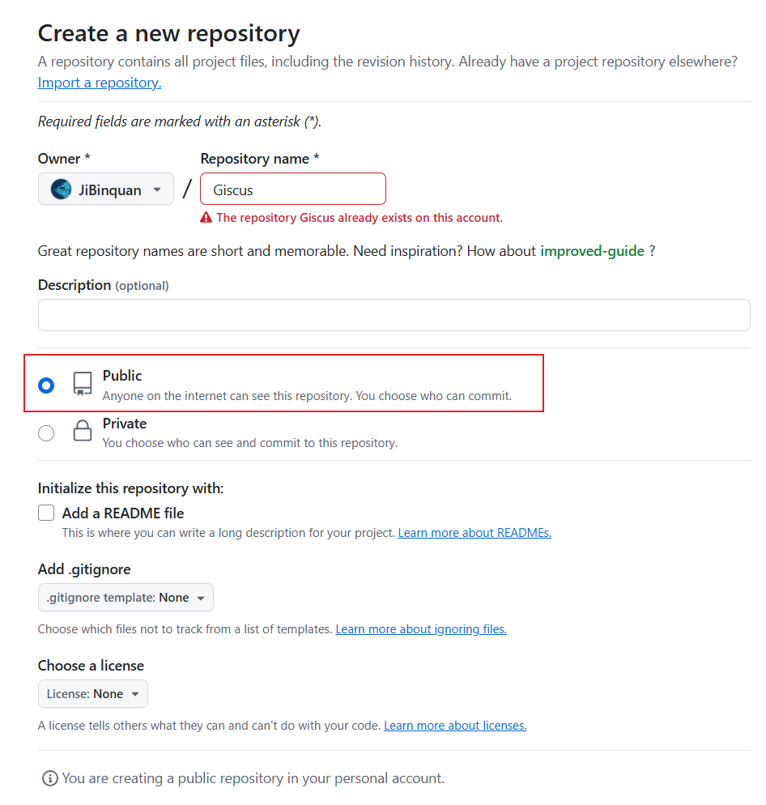
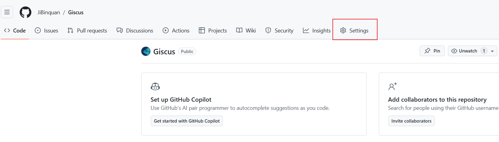
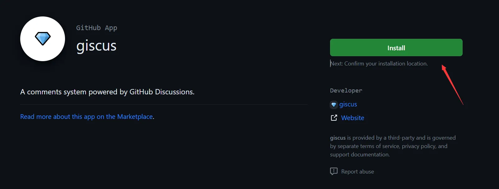
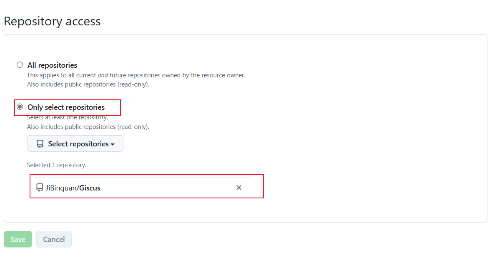
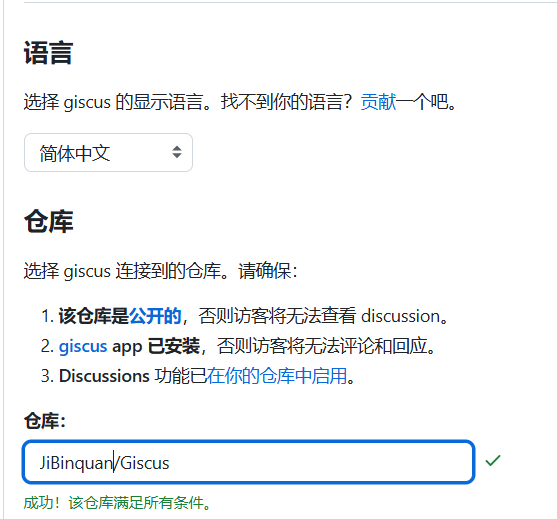
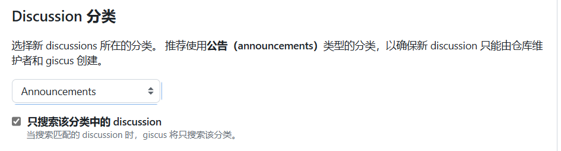
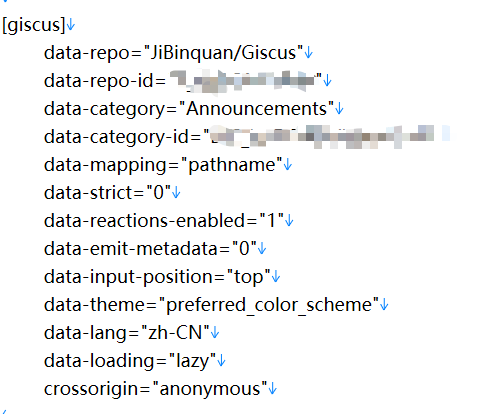
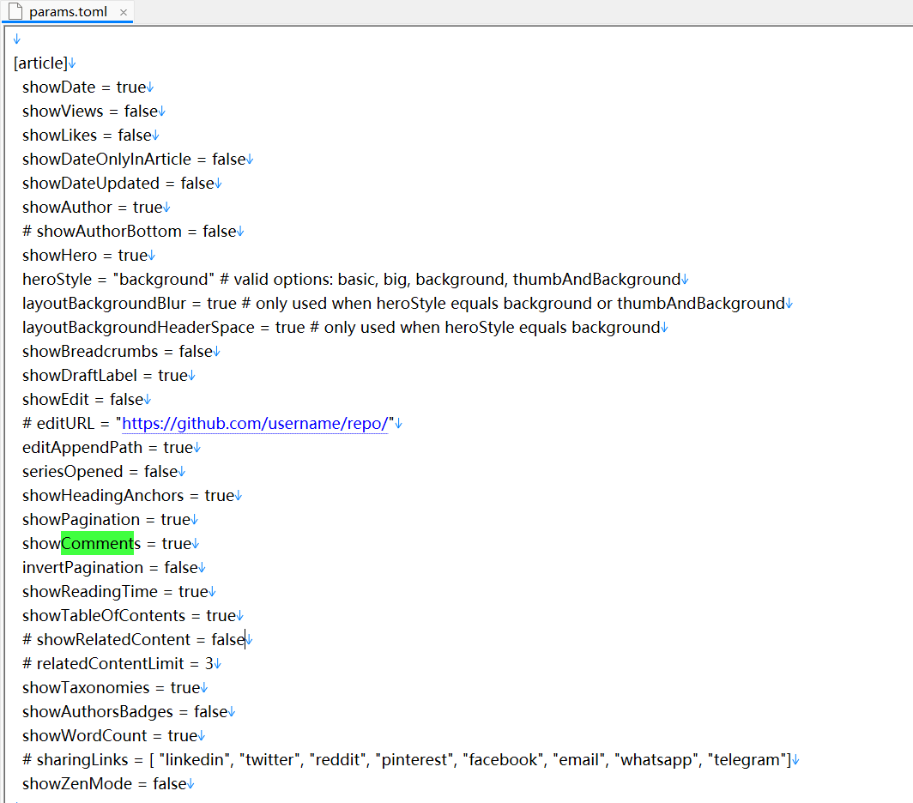
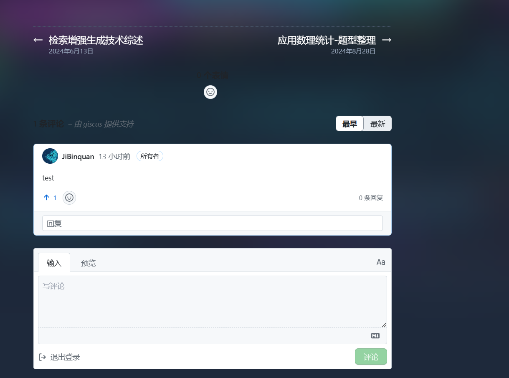

+++
title = '为hugo博客添加Gisus评论功能'
date = 2024-09-25T19:03:38+08:00
draft = false

tags=["技术","前端","建站"]

series = ["博客搭建"]
series_order=4

showSummary=true

Summary="总算是有评论功能了！"

+++

一个博客怎么能没有评论系统！Giscus是利用 [GitHub Discussions](https://docs.github.com/en/discussions) 实现的评论系统，让访客可以借助 GitHub 在网站上留下评论和反应。部署起来还是比较简单的，其具有一下特点（来自官网）：

- [开源](https://github.com/giscus/giscus)。🌏
- 无跟踪，无广告，永久免费。📡 🚫
- 无需数据库。所有数据均储存在 GitHub Discussions 中。
- 支持[自定义主题](https://github.com/giscus/giscus/blob/main/ADVANCED-USAGE.md#data-theme)！🌗
- 支持[多种语言](https://github.com/giscus/giscus/blob/main/CONTRIBUTING.md#adding-localizations)。🌐
- [高可配置性](https://github.com/giscus/giscus/blob/main/ADVANCED-USAGE.md)。🔧
- 自动从 GitHub 拉取新评论与编辑。🔃
- [可自建服务](https://github.com/giscus/giscus/blob/main/SELF-HOSTING.md)！🤳


## 1. 创建并配置Github仓库

Giscus需要依靠一个Github仓库来进行部署，仓库需要满足以下三个条件：

1. **该仓库是[公开的](https://docs.github.com/en/github/administering-a-repository/managing-repository-settings/setting-repository-visibility#making-a-repository-public)**，否则访客将无法查看 discussion。
2. **[giscus](https://github.com/apps/giscus) app 已安装**，否则访客将无法评论和回应。
3. **Discussions** 功能已[在你的仓库中启用](https://docs.github.com/en/github/administering-a-repository/managing-repository-settings/enabling-or-disabling-github-discussions-for-a-repository)。

### 1.1 创建一个公开的Github仓库

直接在`Your repositories` 下new一个就可以，记得需要选择`public`



### 1.2 为仓库启动Discussions功能

找到`Settings -> General -> Features` ，勾选`Discussions`




### 1.3 为仓库安装Giscus

进入这个网址：[GitHub Apps - giscus](https://github.com/apps/giscus)，点击安装



点击安装后，选择`Only select repositories`，选择刚才创建的仓库




## 2. 从官网获取配置信息

评论区的html代码与配置信息可以在官网进行自动配置获取，首先进入官网：[giscus](https://giscus.app/zh-CN)

### 2.1 填写仓库名

如图所示



其他配置先默认

### 2.2 配置Discussion 分类

选择 Announcements 类型即可



### 2.3 获取html代码与配置信息

在`启用giscus`栏中，即可看到相应代码。


要记下`data-repo`，`data-repo-id`，`data-category`，`data-category-id`，`data-mapping`这几个值。


## 3. hugo配置

> 这里使用的 Hugo 一定要是最新的版本，不然是不支持 Giscus 的

### 3.1 创建html文件

1. 在hugo项目下 `themes/<你的主题文件夹>/layouts/partials/`目录下新建 `comments.html` 文件，填入刚才在官网获取的script脚本代码内容。

   如果使用`blowfish`主题，具体路径应该是`\themes\blowfish\layouts\partials\`

2. 在hugo项目下`themes/<你的主题文件夹>/layouts/_default/single.html`文件下，加入`{{ partial "comments.html" . }}`

   ```html
   {{ partial "header.html" . }}
   
   {{ .Content }}
   
   <footer class="footline">
   	{{with .Params.LastModifierDisplayName}}
   	    <i class='fas fa-user'></i> <a href="mailto:{{ $.Params.LastModifierEmail }}">{{ . }}</a> {{with $.Date}} <i class='fas fa-calendar'></i> {{ .Format "02/01/2006" }}{{end}}
   	    </div>
   	{{end}}
   </footer>
   
   {{ partial "comments.html" . }}
   {{ partial "footer.html" . }}
   ```

   如果使用`blowfish`主题，则无需进行这项配置（原本文件中就有）

### 3.2 toml配置修改

进入`\config\_default\params.toml`，按照如下格式，填入在官网获取到的配置：

```tom
[giscus]
    data-repo="[自动生成]"
    data-repo-id="[自动生成]"
    data-category="[自动生成]"
    data-category-id="[自动生成]"
    data-mapping="pathname"
    data-strict="0"
    data-reactions-enabled="1"
    data-emit-metadata="0"
    data-input-position="top"
    data-theme="preferred_color_scheme"
    data-lang="zh-CN"
    data-loading="lazy"
    crossorigin="anonymous"
```

如图：



如果你是`blowfish`主题，还需要在`[article]`配置项中加入一行：`  showComments = true`



这样就可以显示评论啦




## 参考文献

[Hugo 添加 Giscus 评论 (stilig.me)](https://stilig.me/posts/hugo-adds-giscus/)

[在Hugo上配置giscus评论_hugo 评论 giscus-CSDN博客](https://blog.csdn.net/reallocing1/article/details/128577992)

[giscus](https://giscus.app/zh-CN)

[GitHub Apps - giscus](https://github.com/apps/giscus)

[配置 · Blowfish](https://blowfish.page/zh-cn/docs/configuration/#文章页)

[局部模板(Partials) · Blowfish](https://blowfish.page/zh-cn/docs/partials/#评论)

