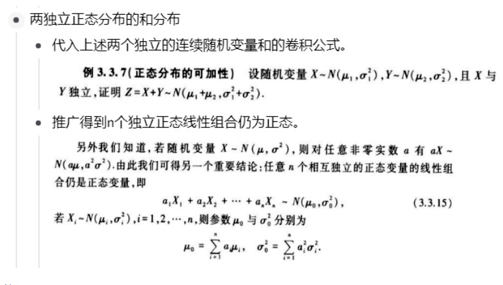

+++
title = '应用数理统计-题型整理'
date = 2024-08-28T18:42:57+08:00

tags=["数学","课程笔记"]

showSummary=true

Summary="统计学是一门伟大的学科，科学的统计揭示真理，更科学的统计掩盖事实。"

+++



## 专题一 概率基础 （第一题）

### 1. 1 理论

**标准手写希腊字母：**

在本文中，定义：

#### 1.1.1 统计量

#### 1.1.2 四大分布与抽样分布定理


==在考试时进行区间估计和假设检验时，使用的是上侧分位点！（但课本上的表大多是下侧的，记得换算）==


#### 1.1.3 正态运算性质

标准正态下侧分位点运算公式：
$$
\Phi(-x ) = 1–\Phi(x)
$$

#### 1.1.4 典型题目

##### 独立性判断和查表算数

##### 例题

###### 2018 一 

### 1.2.  题目汇总

#### 1.2.1. 独立性问题

###### 2019 一

#### 2. 查表凑数题

###### 2012 一

###### 2016 一

###### 2017 一

#### 3.其他

###### 2015 一（求样本容量）

###### 2020 一（核方法求条件分布）

## 专题二 贝叶斯估计（第二题）

### 2.1 理论

#### 2.1.1 贝叶斯估计基本方法

#### 2.1.2 核方法


==什么是“核”：一个分布密度函数去掉与主要变量无关的系数就是“核”==


#### 2.1.3 三种损失函数下的贝叶斯估计

#### 2.1.4 典型题目

##### （1）离散先验下点估计

###### 2020 二

##### （2）连续先验下点估计

###### 2015 二

###### 2012 二

###### 课本P101（习题二）32题改

### 2.2. 题目汇总

##### 2.2.1 离散先验下点估计

见2.1.4

##### 2.2.2 连续先验下点估计

###### 2016 二

###### 2017 二 / 2023 二（重难点）

2017 

###### 2018 二

###### 2019 二 难点（加权损失配凑分布计算）

###### 2021 六

##### 2.2.3. 连续先验下区间估计

课本79页

## 专题三 点估计（第三题）

### 3.1 理论

#### 3.1.1. 矩估计


  ==注意：矩估计一般使用原点矩（A）,且低阶矩优先于高阶矩。==


##### **均方误差MSE**

对于估计值为 $\hat\theta$ 的参数估计，其均方误差为：
$$
MSE = E(\hat{\theta} - \theta)^2
$$

==不难看出，对于无偏估计，其估计的均方误差就是估计量的方差==


##### 顺序统计量的联合分布

##### 常用计算技巧

#### 3.1.2. 极大似然估计

### 3.2. 题目汇总

###### 2012 三

###### 2015 三

###### 2017 三

###### 2018 三

###### 2019 三

###### 2019 四

###### 2020 三

###### 2021 七

## 专题四 区间估计（第四题）

### 4.1. 单一总体区间估计

#### 4.1.1 典型题目

###### 2012 四

###### 2015 四

#### 4.1.2 题目汇总

###### 2016 三

###### 2020 四

###### 2021 一

### 2. 混合总体区间估计

###### 2018 四


==对于多正态总体的区间估计，依然可以按照之前的计算方式，得出估计类型后，直接带入模板进行区间估计==


###### 2019 五

## 专题五 参数假设检验（第五题）

### 5.1. 单一总体假设检验

#### 5.1.1 典型题目

###### 2017 五

### 5.2. 混合总体假设检验

#### 5.2.1 典型题目

###### 2012 五

###### 2015 五

#### 5.2.2 题目汇总

###### 2016 四

###### 2020 五

###### 2021 八

### 5.3. 两类错误问题 

###### 2023


==由上题可知，功效函数是固定的，就是在计算第一类错误和第二类错误时的定义域不一样。（第一类错误取原假设的参数值/端点，第二类错误计算取备择假设的参数值/端点）==


## 专题六 非参数假设检验（第六题）

### 6.1. 皮尔逊卡方检验（拟合优度）

###### 组合数计算

###### 2015 六

### 6.2. 卡方独立性检验（列联表）

#### 6.2.1 典型题目

###### 2017 六

#### 6.2.2 题目汇总

###### 2016 五

###### 2018 六 

### 6.3. 秩和检验

#### 6.3.1 典型题目

##### 样本数量小于10

###### 2019 六


==当两组数据数量不同时，选少的那个算秩和==


##### 样本数量大于10

###### 2012 六

**算个结论吧，n>10的时候 $R_1$ 服从正态分布， 参数如上所示**

#### 6.3.2 题目汇总


==注意：课本上的秩和检验表有个4没印刷出来==


###### 2021 二

## 专题七 单因素方差分析（第七题）

### 7.1 典型题目

#### 7.1.1. 不给出样本均值方差

###### 2016 七

#### 7.1.2. 给出样本均值方差

###### 2019 七

### 7.2 题目汇总

#### 7.2.1. 不给出样本均值方差

###### 2015 七

#### 7.2.2. 给出样本均值方差

###### 2017 七

###### 2018 七

## 专题八 最小二乘估计（第八题）

### 8.1 基础理论

### 8.2. 由样本数据进行最小二乘估计

#### 8.2.1 典型题目

###### 2018 八

###### 2019 八

### 8.3. 给出样本分布进行估计

#### 8.3.1 典型题目

###### 2012 八

#### 8.3.2 题目汇总

###### 2015 八

###### 2017 八

### 8.4.由最小二乘求分布问题

#### 8.4.1 典型题目

###### 2016 八

###### 2020 八

#### 8.4.2 题目汇总

###### P238第17题（习题五17题）

###### 2021

### 写在最后

本资料为个人整理，难免存在错漏，欢迎联系我进行改正。资料仅供学习参考，禁止用作商业用途。

愿选到这课的人都不挂科🙏。