+++
title = '最优化方法与理论-课程笔记'
date = 2024-09-04T20:05:16+08:00

tags=["数学","课程笔记"]

showSummary=true

Summary="结合杨冬梅老师的教案梳理了知识点和一些题目，表白杨老师，讲得太好。"

+++



## 第一章：预备知识

### 1. 什么是最优化？

说白了：就是目前已知条件下的最优/最小/极值问题（如下例子）

###### 复习：**拉格朗日乘子法**

> 对于 $f(x_1,x_2,...)$，在等式$g(x_1,x_2,...) = 0$  的约束下，使用 $\lambda$ 转化为求拉格朗日函数的极值问题
>
> 即： 
> $$
> L = f(x_1,x_2,...)+ \lambda g(x_1,x_2,...)
> $$
> 分别对$x_1,x_2,...,和\lambda$ 求偏导数，得到方程组
> 
> 
> 
> 解出极值点即可

经典极值问题一般可以有以下分类：

在后面学习中，我们会认识到更多的最优化问题。具体来说，最优化问题可以有以下分类：

我们一般研究静态问题，指的是问题的条件不会随着问题的发展而变化的问题。

动态问题一般指问题的条件会随着问题的发展而变化的问题，即动态规划。

### 2. 最优化问题的基本概念

#### 2.1 最优化问题的向量表示法

在变量十分多的时候，无论是问题的抽象表示和运算都会变得十分麻烦。那么，我们就需要引入向量。

那么，原理一大串的函数就被简化为一个向量+一个实值函数的形式了。

##### 向量的序关系

在单纯的数值变量时，我们可以简单的直接比较两个值的大小。在引入向量后，我们需要定义向量之间的大小关系：

**（定义1.1）**对于m维实向量：

如果对应每一位，a都和b相等  $(a_i=b_i)$，则两向量相等。

如果对应每一位，a都小于等于b,  $(a_i \leq b_i)$，则向量a小于等于向量b。

如果对应每一位，a都严格小于b,  $(a_i<b_i)$，则向量a小于向量b。

对应位有大有小，无法比较

##### 向量值函数

当我们讨论函数时，通常有两种主要类型：向量值函数和数量值函数。它们之间的区别在于函数的输出类型。

1. 数量值函数（Scalar-Valued Function）：
   - 数量值函数是一种函数，其输出是一个标量或数量值，即单个数字。
   - 例如，如果你有一个函数 f(x)，其中 x 是一个实数（或者是一个实数向量），并且 f(x) 返回一个实数，那么这就是一个数量值函数。例如，f(x) = x^2 是一个数量值函数，因为它将实数 x 映射到一个实数。
2. 向量值函数（Vector-Valued Function）：
   - 向量值函数是一种函数，其输出是一个向量，即多个数字组成的有序集合。
   - 例如，如果你有一个函数 g(t)，其中 t 是一个实数，而 g(t) 返回一个包含两个分量的向量，例如 g(t) = [sin(t), cos(t)]，那么这就是一个向量值函数。在这个例子中，g(t) 输出一个包含两个实数（sin(t) 和 cos(t)）的向量。

总之，区分数量值函数和向量值函数的关键在于输出类型。数量值函数返回单个数字，而向量值函数返回一个向量，其中可以包含一个或多个数字。

#### 2.2 最优化问题的一般形式（考点：实际问题建模）

其中：

1. “s.t.”是subject to 的缩写，表示 “满足于”。
2. f(x) 称为<u>目标函数</u>，s(x)称为不等式约束，h(x)称为等式约束
3. 满足所以约束的向量称为 <u>容许解</u>或<u>容许点</u>。所有容许点的集合称为<u>容许集</u>

#### 2.3 最优化问题的求解

关于严格与非严格极小值，具体来说：

严格极小：附近的都比它大

非严格极小：附近的没有比它大的（但是可以有跟它一样小的）如下图：

### 3. 二维问题的图解法（考点）

##### 高维函数的等值面

### 4. 梯度与Hesse矩阵（重点）

#### 4.1 前置知识

###### 复习：向量内积

>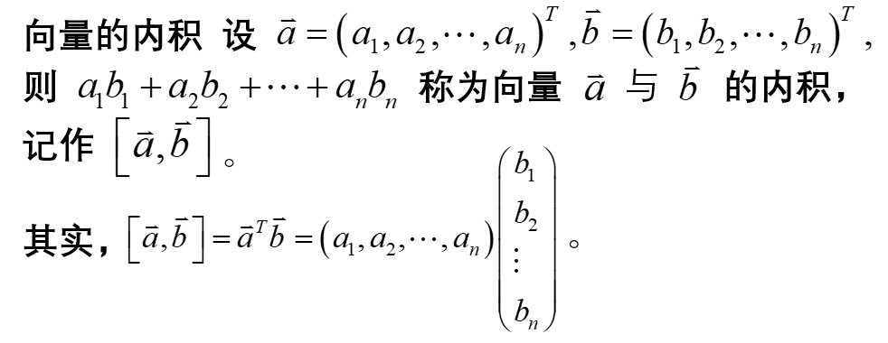
>
>**向量内积的性质：**
>
>

#### 4.2 多元函数的可微性

考虑一个向量值函数 F: ℝⁿ → ℝᵐ，其中 ℝⁿ 表示 n 维实数向量的空间，而 ℝᵐ 表示 m 维实数向量的空间。函数 F 在某一点 x₀ ∈ ℝⁿ 处可微，如果存在一个线性变换 A: ℝⁿ → ℝᵐ，使得对于该点附近的所有向量 Δx，以下极限成立：
$$
\lim\limits_{Δx→0} [F(x₀ + Δx) - F(x₀) - AΔx] = 0
$$
其中，Δx 是一个小的向量，Δx→0 表示Δx趋近于零向量，A 是一个从 ℝⁿ 到 ℝᵐ 的线性变换（通常表示为一个矩阵），F(x₀ + Δx) 表示函数 F 在点 x₀ + Δx 处的值，而 F(x₀) 表示函数 F 在点 x₀ 处的值。

简而言之，一个向量值函数在某一点可微，意味着在该点附近存在一个线性变换（矩阵 A），使得函数的改变与输入向量的改变之间的关系可以用该线性变换来近似描述。这类似于标量值函数可微的概念，但在这里我们处理的是向量而不是标量。

#### 4.3 梯度

即**各个分量的偏导数组成的向量**，也称为函数 $f(\vec{x})$ 关于 $\vec{x}$ 的一阶偏导数

##### 梯度的性质

当梯度$\nabla f(\vec{x})$ 连续时

1. $\textcolor{red}{函数在某点的梯度若不为零，则必与过该点的等值面''垂直''}$

   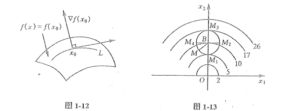

2. $\textcolor{red}{梯度方向是函数具有最大变化率的方向}$

   梯度方向是函数值上升最快的方向，负梯度方向是函数值下降最快的方向，垂直梯度方向在函数等值面上

   

以上两条分别说明了梯度的几何性质和数值性质

##### 方向导数

这个定义可以理解为，我们在点 $x_0$ 处开始，然后沿着方向 $\vec{e}$ 走一个微小的步长 $t$，然后观察函数值的变化。方向导数告诉我们，当我们沿着方向  $\vec{e}$ 移动时，函数值$ f(x)$ 的变化率是多少。

**函数值升降的快慢则是由方向导数绝对值的大小决定的**。绝对值越大，升或降的速度就越快；绝对值越小，升或降的速度就越慢。而**梯度方向是函数值变化最快的方向**

方向导数的意义在于：

1. **确定最速增加方向**：方向导数可以帮助找到函数在某一点上增加最快的方向。如果我们希望最大限度地增加函数值，我们可以沿着具有最大方向导数的方向前进。
2. **优化问题**：在优化问题中，方向导数对于确定梯度下降法中的步进方向很有用。梯度下降法是一种用于最小化函数的算法，它在每一步中选择梯度的负方向作为前进方向，以减小函数值。方向导数可以帮助确定更一般的前进方向。
3. **判断函数在某一点的增长趋势**：方向导数可以用于判断函数在某一点的增长或减小趋势。如果方向导数为正，说明函数在该点沿着所选方向增加；如果为负，说明函数在该点沿着所选方向减小。

##### 常用梯度公式

其中 $C$ 是常数，$Q$ 是对称方阵

#### 4.4 Hesse矩阵

前面说过，梯度$\nabla f(\vec{x})$ 是函数$ f(\vec{x})$ 关于$\vec{x}$ 的一阶导数，那么，$ f(\vec{x})$ 关于$\vec{x}$ 的**二阶导数**是什么？

由上文可知，梯度$\nabla f(\vec{x})$与变量 $\vec{x}$ 维度相同的向量，那么，向量值函数的导数是如何定义的？ 

由此可见，对于$\mathbb{R}^n->\mathbb{R}^m$的向量值方程$g(\vec{x})$ （即含有n个自变量，由m个方程输出m维向量的方程组），其一阶导数为一$n \times m$ 的矩阵，元素为每个方程组分别对自变量求偏导。

将对$\mathbb{R}^n->\mathbb{R}^1$的$f(\vec{x})$求梯度的的操作看作一向量值方程（将求偏导操作看作方程组的联立？）即可借助向量值函数导数的定义，得到对于n元函数 $f$  的二阶导数的定义：

具体来看，就是自变量两两组合 用 $f(\vec{x})$ 依次对齐求偏导。

 

求 Hesse矩阵步骤：

1. 对每个自变量求偏导，组成向量
2. 刚才求偏导组成的方程组，再对每个自变量求偏导，组成矩阵

##### 特殊函数导数公式

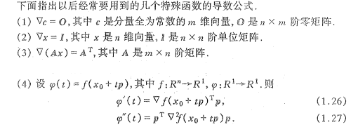

###### 复习：**单位矩阵**

>从左上角到右下角的对角线（称为主对角线）上的元素均为1。除此以外全都为0的方阵
>
>

（3）的例子：

### 5. 极值点判定定理（考点）

#### 5.1 基本概念

1. **邻域**：$x_0$内很小的一块区域

2. **局部极小点**：有个邻域内我是值最小的（别管邻域多小，只要有个邻域就行）【高数中的极值点】

   1. **严格局部极小点**：周围都比我大

   2. **非严格局部极小点**：周围都没有比我小的

      

      注意，邻域表示要在定义域内

      

3. **全局极小点**：在整个定义域内我值是最小的【高数中的最值点】

   1. **严格全局极小点**：我一定最小
   2. **非严格全局极小点**：我是最小之一

当然，也存在极大值定义，但是我们可以加负号转成求极小

4. **驻点**：可微情况下，梯度为零的点

#### 5.2 极值的条件

首先明确：$\textcolor{red}{普通极值判断没有充要条件！}$

（其实就是一维情况导数那一套的推广）

1. **一阶必要条件**：局部极值点一定是驻点<u>（反过来不一定）</u>
2. **二阶必要条件**：定义域内的局部极值点，其 Hesse 矩阵一定是半正定的

p.s.**驻点**：一阶梯度为零向量的点

###### 复习：正定矩阵

>1. 正定矩阵（Positive Definite Matrix）：
>
>  一个实对称矩阵 A 被称为正定矩阵，如果对于任意非零实向量 x，都有 x^T * A * x > 0，其中 x^T 表示 x 的转置。换句话说，一个正定矩阵的所有特征值都是正数。正定矩阵在优化、数值计算和统计学中具有重要应用，它们表示一个二次型函数的极小值点。
>
>2. 半正定矩阵（Positive Semidefinite Matrix）： 
>
> 一个实对称矩阵 A 被称为半正定矩阵，如果对于任意非零实向量 x，都有 x^T * A * x ≥ 0。半正定矩阵的特征值可以是非负数，但至少有一个特征值为零。半正定矩阵在最小化问题的约束条件、信号处理和统计学中有广泛应用。
>
>3. 负定矩阵（Negative Definite Matrix）： 
>
> 一个实对称矩阵 A 被称为负定矩阵，如果对于任意非零实向量 x，都有 x^T * A * x < 0。换句话说，负定矩阵的所有特征值都是负数。负定矩阵在一些特殊的数学问题中出现，但相对较少见。
>
>
>
>**正定矩阵的判断**
>
>要快速判断一个矩阵是否是正定、半正定或负定，可以使用以下方法：
>
>1. **对称性检查**： 首先，确保矩阵是对称矩阵，即 A = A^T，因为正定、半正定和负定的定义都是基于对称矩阵的。
>2. **特征值检查**： 正定矩阵的所有特征值都应为正数。 半正定矩阵的所有特征值都应为非负数（可以包括零）。 负定矩阵的所有特征值都应为负数。
>
>你可以使用计算工具或软件来计算矩阵的特征值，然后检查它们的符号。如果所有特征值都符合上述条件，那么你可以得出相应的结论。然而，这种方法在大型矩阵上可能会比较耗时。
>
>另一种更快速的方法是使用主元子矩阵的顺序主子式（leading principal minors）。对于一个 n x n 的对称矩阵 A，它的顺序 k 主子式是取前 k 行和前 k 列组成的子矩阵的行列式。根据顺序主子式的规律：
>
>- 如果所有的顺序主子式的行列式都大于零，则矩阵 A 是正定的。
>- 如果所有的顺序主子式的行列式都大于等于零，则矩阵 A 是半正定的。
>- 如果所有的顺序主子式的行列式交替符号（从正到负），则矩阵 A 是负定的。
>
>这种方法在判断矩阵性质时更高效，因为你只需要计算一系列小的子矩阵的行列式，而不需要计算全部特征值。
>
>**二阶矩阵正定快速判断**
>
>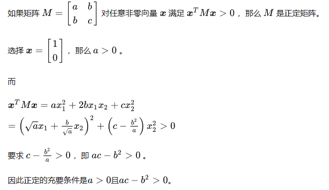

3. **二阶充分条件**：**①Hesse矩阵正定**的**②驻点**一定是严格局部极小点

4. **二阶充分条件**：当前点为**驻点**，且当前点的**邻域内，处处半正定**

   

**注意：$\textcolor{red}{在以后的大部分算法中，都是以局部极小点作为终止准则的}$ ** （甚至有可能终止到拐点，考试一般不会出）

例题（一）：

注：当Hesse矩阵只有2阶时，可以通过顺序主子式进行正定判断，再高就得求特征值判断

例题（二）：

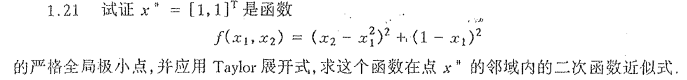

###### 复习：求特征值与特征向量

>**注意：$\textcolor{red}{对于对角阵，对角线上的元素就是其特征值}$**

>
>
>

### 6. 凸集与凸函数

#### 6.1 凸集

**（定义、性质不会考，但是要知道是啥）**

>想象你有一个透明的容器，里面装满了水。这个容器的外形是一个没有突起或凹陷的形状，就像一个圆球或一个凸透镜一样。现在，你在这个水里选择两个点，不论它们在哪里，你都可以在容器内找到一条线段，将这两个点连在一起，这条线段的每个点都在容器内部。
>
>这个水装满的透明容器就代表了一个凸集。无论你选择容器内的哪两个点，连接它们的线段都完全在容器内，不会突破容器的边界。这种性质使得凸集在数学、优化和几何学中非常有用，因为它们具有良好的结构和可预测的性质。

##### 凸组合

>当我们谈论凸组合时，可以将其理解为混合不同事物的方法，但有两个关键规则：
>
>1. 非负权重：每个事物都有一个权重，这个权重必须是非负的（大于等于零）。
>2. 权重总和为1：所有事物的权重加在一起必须等于1。
>
>举个例子，假设有两种水果，苹果和橙子，你想创建一种新的混合水果，这就是凸组合。如果你用0.7的权重来表示苹果（0.7表示70%的苹果）和0.3的权重来表示橙子（0.3表示30%的橙子），那么这个混合就是一个凸组合。这意味着混合水果的总量为1，且每种水果的权重都是非负的。

**实质：系数全为正且和为一的线性组合**

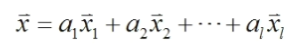

**人话**：$\textcolor{red}{对于凸集，如果在这个集合中任意取两点连成线段，那这线段一定还在集合内部（注意：空集也算凸集）}$（没有坑，没有洞的点集）

##### 凸集的性质

注意，$\textcolor{red}{''和集''与''并集''不是一个概念}$，显而易见，凸集的并集不是凸集

##### 超平面与半空间

######  **超平面**

> 在数学和几何学中，超平面（Hyperplane）是一个具有比空间维度低一维的平坦子空间。通俗地说，超平面是用于将空间划分为两个不相交部分的一个平面或子空间。
>
> 具体来说，超平面在n维空间中是一个n-1维的子空间。在三维空间中，一个超平面就是一个平面；在二维空间中，一个超平面就是一条直线。超平面通常可以表示为一个线性方程的解，其一般形式可以写成：$a^Tx=b$
>
> 其中，(a1, a2, ..., an) 是法向量（也称为法线），(x1, x2, ..., xn) 是超平面上的点，b 是常数。法向量确定了超平面的方向，而线性方程决定了它的位置。

###### **半空间**

>由一个超平面（hyperplane）将空间分成两个部分而产生的一个部分空间。
>
>具体来说，一个n维空间中的半空间是由一个(n-1)维的超平面划分的空间的一部分。
>
>比如，在二维空间中，一个半空间就是由一条直线将平面分成两个部分的区域；在三维空间中，一个半空间由一个平面将空间分成两个部分。在更高维度的空间中，半空间的定义也是类似的。

超平面和半空间都是凸集

与此相近的还有“超球”的概念，指的是在4维空间以上，与$x_0$的距离小于半径的点集。

（可以看出，“超XX”，一般指的是低维概念在高维空间的映射）

##### 极点

例子：

如图中所示，在第一个凸多边形中红圈圈起的顶点即是极点，它们可以作为线段的顶点表示凸集中其他的非极点，但是不能在凸集中任何其他点表示的线段中。

#### 6.2 凸函数

**几何意义：函数图形上连接任意两点的线段处处都在函数图形的上方**

​                                                                                                                                                                                                                                                    

##### 性质                                                                 

性质3的解释：对于凸函数，规定其小于某一值限制出的定义域还是凸集（还是连续的）（别忘了空集也是凸集）

其实可以看出：**对于凸函数的驻点，其一定是极小值点，且是全局极小值点**

##### 凸函数的判定条件

一阶要求任意性，根本用不了

**二阶条件**：

1. 凸函数的开凸集定义域内的 Hesse 矩阵处处半正定，反之亦然（充要条件）
2. 若 Hesse 矩阵正定，这其在定义域内为严格凸函数（充分条件）p
3. 

3之例：

可以证明，对称矩阵 Q 就是正定二次函数的 Hesse 矩阵

###### 复习：二次函数化二次型

>对于一个多元齐次多项式，其一定可以写成$\vec{x}^TQ\vec{x}$的二次型形式
>
>以三元二次函数为例
>
>有$f(\vec{x}) = a_{11}x_1^2 + a_{12}x_1x_2 + a_{13}x_1x_3 + a_{22}x_2^2 ++ a_{23}x_2x_3 + a_{33}x_3^3$
>
>其中，对称矩阵Q可以写成：
>
>
>
>不难看出，可以将对称矩阵Q的行列位置可以与多项式中的x项一一对应，对角线上是对应平方项的系数，其他位置则是对应系数的一般，如一行二列和二行一列都是$x_1x_2$项系数的一半。
>
>由此可以推出n元其次多项式的二次型形式

##### 凸函数极值

###### 凸规划问题

如果你求一个函数的极小值，这个函数正好是个**定义域是凸集的凸函数**，这就是凸规划（不考定义）

###### 凸函数极值的性质

1. 凸函数的局部极小点一定是全局极小点
2. 凸函数的驻点一定是全局极小点
3. 严格凸函数一定有且只有一个全局极小点

P.s.$\textcolor{blue}{在实际问题中，当算法遇到近似驻点停止时，如果可以证明目标函数是凸函数，就可以断定找到了极值}$

###### 特殊的凸规划

1. 

2. 

   为啥凹函数大于等于零就是能限制到凸集呢？因为两边加负号就变成了 $凸函数 \leq 0$ 就是“水平集” （参见前面凸函数的性质）

   而线性函数其实就是“超平面”，也可限制凸集，凸集的交集还是凸集。

3. 二次函数不考

### 7. 下降迭代算法

核心思想：每求一次迭代点，极值都要更小

#### 7.1 步骤

关键步骤：

3. 确定下降方向  ${\vec{p}}$

4. 确定步长因子 ${t_k}$

   注意，没说 $t_k$ 不能是负的

   考试的时候求驻点的方程不会太复杂

   

#### 7.2 直线搜索

##### 性质

示例：由图可知，函数在直线搜索到的最优点 ${\vec{z}}$ 上的梯度方向一定与搜索方向垂直 

##### 收敛速度

以后再说

##### 计算终止准则

终止误差设置需要结合实际情况

一般用这个，具体看考题要求

## 第二章：线性规划

### 1. 数学模型

#### 1.1 线性规划的标准型

单纯形法需要用到标准型

繁写形式是最常用的形式

化标准型，**$\textcolor{red}{第一步先把右边常数项先化成正的！}$**别忘了

#### 1.2 线性规划的典范形式

单纯形法需要将标准型进一步化成典范形式，即使系数矩阵 A 中有 m 个列向量构成 m 阶单位矩阵。

以m = 3 为例，形如：

但是不是说一定是前m个变量构成单位阵，只要能找出任意m个变量能构成单位阵即可

注意，典范形式跟变量顺序也没关系

以上皆是典范形式

#### 1.3 任意模型化标准型

1. 对于极大化目标函数，加负号转成求极小

   

2. 对于约束条件，首先如果右边常数项有负数，两边加负号转成正的

   

3. 检查是否存在不等式约束，添加附加变量

   

   ​	当左边小于右边，左边加一个非负变量，使得等式成立

   

   ​	当左边大于右边，左边减去一个非负变量，使得等式成立

4. 数数还有没有没有限制正负性的自由变量

​	两个正数做差可以构造任意数，引入两个变量表示自由变量

5. 若变量存在常数界限限制，使用换元的方法替换成无界限变量

​		

就是简单的移项+换元

**例**

注意

### 2. 线性规划解的性质

#### 2.1 基本概念

##### 容许解

##### 基

> 在 n 维向量空间中，n 个线性无关的向量组成的极大线性无关组称为这个向量空间的基

典范形式中的单位阵就是标准基

###### 复习：矩阵的秩

>矩阵的秩（Rank）是一个重要的线性代数概念，它用于衡量矩阵中的线性无关列（或行）的最大数量。矩阵的秩提供了关于矩阵的结构和性质的重要信息。
>
>以下是关于矩阵秩的基本概念和性质：
>
>1. 列秩（Column Rank）：矩阵的列秩是指矩阵中线性无关列的最大数量。它表示矩阵的列空间的维度。如果矩阵的列秩等于它的列数，那么它被称为“列满秩矩阵”。
>
>2. 行秩（Row Rank）：矩阵的行秩是指矩阵中线性无关行的最大数量。行秩等于列秩，因为对于任何矩阵，它的行秩和列秩相等。
>
>3. 矩阵秩：矩阵的秩是指它的列秩（或行秩）的最大值。矩阵的秩通常用符号 "rank(A)" 表示，其中 A 是矩阵。秩可以看作是矩阵所包含的最大线性无关列（或行）的数量。
>
>4. 基础变量和非基础变量：在线性方程组的上下文中，秩也可以用来确定系统的基础变量（basic variables）和非基础变量（non-basic variables）。基础变量是方程组中的变量，非基础变量是通过线性组合基础变量得到的变量。
>
>5. 零矩阵的秩：零矩阵的秩总是 0，因为它没有任何线性无关的列或行。
>
>  
>
>**求矩阵的秩（高斯消元法）**
>
>步骤 1：将矩阵化为行阶梯形矩阵（Row Echelon Form）或行最简形矩阵（Row Reduced Echelon Form），也称为行最简形（Reduced Row Echelon Form）。
>
>- 从第一行开始，找到第一个非零元素（主元素），并将该元素所在的行作为当前的主元行。
>- 使用行变换操作，将当前主元行的主元素变为 1，同时将该主元所在列的其他元素变为 0。这通常涉及到将当前主元行的所有元素除以主元素。
>- 将下一行的第一个非零元素作为新的主元素，继续上述操作。
>- 重复这个过程，直到所有的主元素都处理完毕，得到行阶梯形矩阵或行最简形矩阵。
>
>步骤 2：统计非零行的数量。这个数量就是矩阵的秩。

###### 复习：可逆矩阵

>可逆矩阵（Invertible Matrix）也被称为非奇异矩阵（Non-singular Matrix）或满秩矩阵（Full Rank Matrix），是指具有逆矩阵的方阵，也就是说，它可以通过矩阵乘法找到一个矩阵，使得原始矩阵与其逆矩阵相乘等于单位矩阵。具体来说，一个 n x n 的矩阵 A 是可逆的，如果存在一个 n x n 的矩阵 B，使得以下等式成立：
>
>A * B = B * A = I
>
>其中，I 是 n x n 的单位矩阵。矩阵 B 被称为 A 的逆矩阵，通常用 A^(-1) 表示。
>
>可逆矩阵的性质和重要特点包括：
>
>1. 存在唯一性：如果一个矩阵 A 是可逆的，那么它的逆矩阵 A^(-1) 存在且唯一。这意味着只有一个矩阵可以与 A 相乘得到单位矩阵。
>2. 可逆矩阵的行列式：一个矩阵 A 是可逆的，当且仅当它的行列式（det(A)）不等于零。如果 det(A) = 0，那么 A 不可逆。
>3. 逆矩阵的性质：如果 A 和 B 都是可逆矩阵，则它们的乘积 AB 也是可逆矩阵，且 (AB)^(-1) = B^(-1) * A^(-1)。
>4. 转置矩阵的逆：如果 A 是可逆矩阵，那么它的转置矩阵 A^T 也是可逆矩阵，并且 (A^T)^(-1) = (A^(-1))^T。
>5. 可逆矩阵的秩：一个 n x n 的矩阵 A 是可逆的，当且仅当它的秩（rank）等于 n。这意味着所有的列都是线性无关的，且行列式不为零。
>6. 可逆矩阵的逆：要找到矩阵 A 的逆矩阵 A^(-1)，可以使用各种方法，如高斯-约当消元法、伴随矩阵法等。

相关概念

##### 基本解（掌握）

**基本解**：令所有非基变量为 0，求出的满足约束（2）的解。

**基本容许解**：满足约束（3）的基本解。

**最优基本容许解**：满足约束（1）的基本容许解。

在上例子中，我们假设系数矩阵的前m个向量正好能够构成一个基 B （在一般情况下不一定是正好前几个按顺序就组成基了），

那么我们将剩下的 m+1 到 n 的变量全部设置成 0，只求解前 m 个变量，因为此时B是满秩的，所以此时前 m 个变量有唯一解 $B^{-1}b$，这个解加上后面那一堆 0 （m+1到n的变量）就被称为**基本解**。

但是你在算$B^{-1}b$时，没法保证这个算出来是大于0的，如果真都大于0，那么上述基本解就可以被称为**基本容许解**。

要是你这个基本容许解是所有基本容许解中使目标函数最小的，就称之为**最优基本容许解**

##### 容许基（一般不考）

**容许基**：若 B 是基，且存在关于 B 的基本容许解，称 B 是容许基。 若容许基 B 是单位矩阵称为标准容许基。

**退化的基本解**：在上例中，如果你解 $X_B$ 里面有 0 ，这样组成的基本解称为退化的基本解（**考试不会考，你算出来说明你做错了**）

#### 2.2 线性规划问题的基本定理

如果一个线性规划问题有最优解，那么**直接找它容许域上的极点**就一定能找到最优基本容许解

那么，我们就有了单纯性法的基本思路——沿着边找顶点，直到找到最优解：

 

### 3. 单纯形法

#### 3.1 步骤

1. 化典范形式，构造标准容许基

**何为人工变量**：

如果化标准型后基变量不够，我人为在某个约束方程上硬加一个变量，使其满足系数为一且不在其他方程中存在的条件，让它当基变量。（但是这样相当于改变了约束条件）

**$\textcolor{red}{注意：考试时化基变量最好不要对约束方程直接用乘除法}$**（只是因为老师不好改所以不给全分？做几道看看最后答案对不对）

在约束中引入人工变量 $x_6$ 后，还需要在目标函数中加入$x_6$，并配一个无穷大的系数 M

此时的系数矩阵：

注意：基变量和基B里面变量的顺序就按照实际构成基的顺序来写（比如如果$x_6$是$[1,0]^T$，那么$x_6$就要写在$x_1$前面）

**引入M的意义**：

只要人工变量>0，使前后约束条件不等价，但由于目标函数的修改，同时也使所求的目标函数最小值是一个很大的数，也是对“篡改”约束条件的一种惩罚，因此，M 叫做罚因子，大 M 法也叫做罚函数法。

如果想消除 M 的影响，就需要通过换基向量使得人工变量转为非基变量，这样人工变量变为 0 ，M的影响也就消除了，问题整体的求解也不受影响。

$\textcolor{blue}{一般来说，考试时会有三个约束，引入两个人工变量}$

#### 3.2 求解

##### 得出判别数

接上例，我们通过移项，用非基向量表示基向量，回代目标函数，并整理成 

$Z = Z_0 - \sigma_{m+1}x_{m+1} - \sigma_{m+2}x_{m+2} - ... - \sigma_{n}x_{n}$    的形式，称 $ \sigma $ 为判别数，即写为

$Z = 常数- \sum判别数 \times 非基向量$

 **(注:目标函数式(*)中,各非基变量的负系数称为该变量的判别数(或检验数)，规定各基变量的判别数为 0)。**

而我们可以通过公式推导，得到上述表达式快速计算公式

其中，$C_B$ 是基向量的价值系数，随基的改变而改变。

简单来说，即：

$常数项Z_0 = [基向量的在目标函数中的系数组成的向量]^T  \cdot约束的常数组成的向量b$

$非基变量项j的判别数 \sigma_j=Z_j-C_j = [基向量的在目标函数中的系数组成的向量]^T  \cdot当前非基向量x_j在约束中的系数组成的向量 - 当前非基变量x_j在目标函数的系数C_3$

例子：

可以看到，和通过移项的方法获得的常数和判别数一样。算的时候一定注意向量顺序。

##### 得到容许解

令非基向量皆为零，即可得到基向量的取值，组成一个**基本容许解**，其对应的目标函数的值就是当前基本容许解的值

#### 3.3 最优性检验

退出迭代的条件：**所有判别数都 $\leq$ 0** 

若**人工变量为零**，则有解，**非基变量判别数都小于0**，则为最优解，否则有无穷多解

若**人工变量为不为零**，则无解

#### 3.4 基变换

##### 基本容许解的改进定理

**找一个判别数大于零的非基变量，替代原基中的某一个基变量**，产生一个新的基本容许解，其值要比原来的要小。

在几何意义上：就是沿着边换一个顶点

##### 换入变量的确定

若有多个判别数大于零的非基变量，**选判别数最大的那个**（其实也不一定下降的更快，选哪个无所谓）

接上例，可以看到 $\sigma_3 = 2M-4$ 是唯一正数，选择$x_3$ 作为换入变量

##### 换出变量的确定——最小非负比值规则

接上例，在选择 $x_3$ 作为换入变量后，我们把约束的系数矩阵 A 拿过来，找到 $x_3$ 对应系数的那一行依次比较常数项与其系数的比值，选择最小的那一行，而那一行对应哪个基变量，就把哪个基变量换出，这里我们换出 $x_1$

**$\textcolor{red}{注意换出哪个坑，换入变量放到哪个坑里！别调顺序！}$**

（你换出变量是第一个基变量，换入的变量也就是新基的第一个基变量）

#### 3.5 单纯性法的矩阵描述

以上例题为例，有：

经过一波运算，有：

#### 3.6 单纯形解极大化和极小化问题的区别

### 4. 单纯形法的表格形式

### 5. 单纯形的两阶段法

两阶段法的思路：当人工变量离基后，消除人工变量的影响，简化计算

#### 5.1 第一阶段——判断原线性规划问题是否有容许解

即只保留目标函数中的人工变量，约束条件不变，用单纯形法求解

##### 第一阶段最优解判别定理

对于某个基本容许解，**所有判别数 $\sigma_j \leq 0$**，则该基本容许解是第一阶段线性规划的最优解。

此时

#### 5.2 第二阶段——求原线性规划问题的最优解

以第一阶段的最终单纯形表为基础，**去掉其中的人工变量列，把目标函数换成原问题的目标函数**，于是得到第二阶段的初始单纯形表，继续迭代下去，得到最优解即为原问题的最优解。

##### 第二阶段最优解判别定理

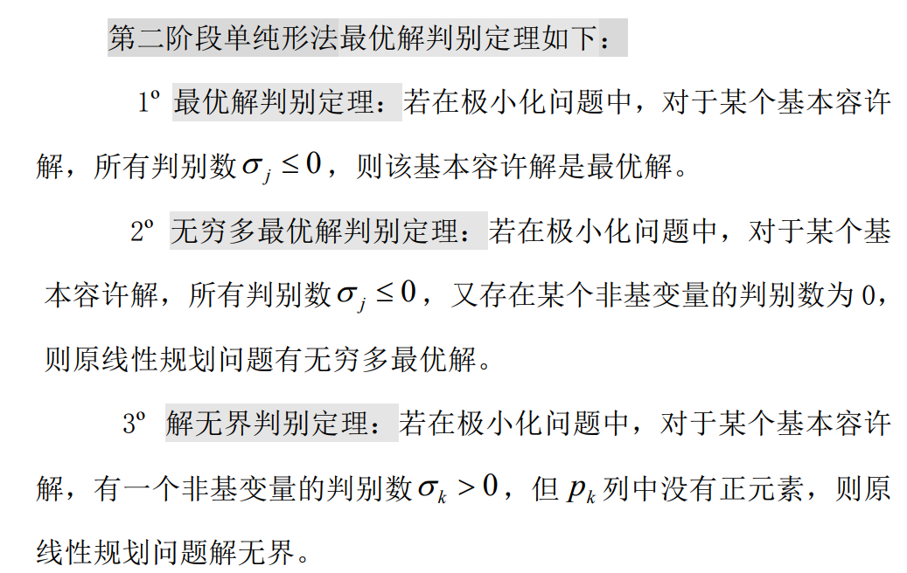

#### 例题

1. 接上例

2. 

## 第三章 无约束最优化方法

目标函数没有约束

**方法——迭代法：**

**直接法**（只用到目标函数的值，迭代速度慢，计算量较大）：步长加速法（考点）， 方向加速法，单纯形替换法

**解析法**（借助目标函数的解析性质[即导数]，速度较快，但是要求导数）:最速下降法， 牛顿法，共轭梯度法， 拟牛顿法

**搜索方式**：直线搜索
$$
min \phi(t) = f(\vec{x}_k+t\vec{p}_k)
$$
但是你对非线性函数直接求驻点可能求不出来，采用特殊的直线搜索方法

**直线搜索方法**：黄金分割法（重点，但是也没咋考过），抛物线插值法（计算量太大不适合考），平分法（），牛顿法

### 1. 直线搜索的直接方法

#### 1.1 单谷函数

由此可见，单谷函数有唯一极小值点

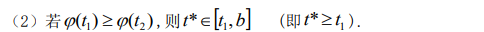

**总结**：谁大谁可以当端点（ ）

那么，搜索区间 [a,b] 如何确定？

##### 外推内插法

核心思想：找到三个值，使得 $ 左边 > 中间 < 右边 $

但是一个h一个h找的太慢了，使用**步长加速法**——每一次的跨度都比上次大（每次步长倍增）

例：

#### 1.2 黄金分割法

**分割原则：短比长等于长比总长**

为啥要用这个比例？：因为黄金分割点有两个（正着一个倒着一个），每次迭代都要求这俩点，而用黄金分割点可以让计算效率最大化

由图可知，对于第一次迭代中 $ [a_1，b_1]$ 的黄金分割点 $t_1,t_1'$ ，如果 $t_1$ 成为下次迭代的新端点，$t_1'$ 在新的搜索区间里面依然是黄金分割点。$t_1'$当新端点时同理。

==新端点的选取：按照单谷函数的性质，谁大谁当端点==

##### 步骤

###### 初始化

###### 迭代

比较  $\phi(t_k)~与~\phi(t_k') $ ，谁的函数值大，谁当端点，另外一个作为下一次迭代的新黄金分割点（或对称点）。

计算下一次迭代的黄金分割点（你留了一个，算另外一个）：

或

###### 终止

##### 例题

中间自己补

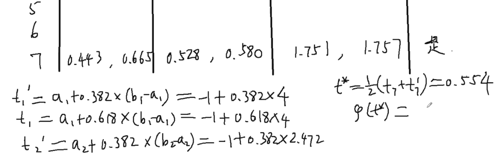

#### 1.3 抛物线插值法（以前从来没考过）

同样只要求函数连续即可，同样是，先找到三个点，使得其值 $ 左边 > 中间 < 右边 $

然后，==找到一个过这三点的抛物线==，作为对目标函数的一个拟合

然后我们可以求出这个抛物线的极值点，根据极值点在x轴上的坐标 $t_4$ ，我们可以求出这个坐标下在目标函数上的值 $ \phi(t_4) $ ，然后在已知的这四个点中取其函数值最小的点，加上它最近的左边和右边的点，构成新的三个点，有其值 $ 左边 > 中间 < 右边 $

**终止准则**

**例题**

### 2. 最速下降法（也基本没考过）

#### 2.1 基本思想

对于 $t_k$ 的求解，可以使用上面讲到的直线搜索方法（但是算起来太麻烦了，下面有快速计算法）

#### 2.2 算法步骤

其中，$ \vec{g}() $ 代表求梯度的操作，$||\vec{g_k}||$ 代表求梯度的范数（模）

#### 2.3 最佳步长因子 $t_k$ 的近似公式

==而对于二次函数，其二阶泰勒展开已经是精确值，故上述公式求出的即是其 $t_k$ 的精确值==

#### 2.4 例题

**注意**：

1. 在实际应用中，方向向量可能很大或很小，可能需要单位化
2. 每次搜索前后两次搜索方向和梯度是正交的，故有**锯齿现象**

#### 2.5 锯齿现象（考画图）

最速下降法的迭代点在向极小点靠近的过程中，走的是曲折的路 线：后一次搜索方向 $\vec p_{k+1}$  与前一次搜索方向 $\vec p_k$  总是相互垂直的，称它为锯齿现象。除极特殊的目标函数（如等值面为球面的函数）和极特殊的初始点外，这种现象一般都要发生。

所以你会发现：对于“非正圆形”的目标函数，最速下降法是“**越靠近收敛越慢**”的（最慢下降法实锤了）

### 3. 牛顿法（考点）

#### 3.1 基本思想

对于二次函数，我们不想只按照梯度逐次迭代，希望一次迭代就能达到最优解，那么就需要引入二阶梯度。

当我们将方向向量定于以下形式时，即可一次迭代达到最优点。

于是，我们借助泰勒展开，将上述方法推广到一般非线性函数，即有：

那么，我们有牛顿法的迭代公式：

#### 3.2 步骤

#### 3.3 主要结论

判断下降方向就得用这个法

#### 3.4 例题

###### 复习：矩阵逆的求法

>1. 初等变换法
>
> 
>
> 
>
>
>
>2. 待定系数法
>
> 
>
>3. 行列式 + 伴随矩阵
>
>  
>
> 
>
> 
>
>4. 分块对角.反三角.上三角的逆
>
> 

### 4. 修正牛顿法

#### 4.1 传统牛顿法的问题

1. 步长因子 $t$ 固定为1，你按照下降方向走可能得到的点更大了
2. 你算出的下降方向 $\vec p$  可能并不下降（跟梯度同向或正交），甚至你有可能压根解不出 $\vec p$

#### 4.2 对牛顿法的修正

1. **下降方向点更大**：在下降方向上改做直线搜索
2. **算不出 $\vec p$ 或 $\vec p$ 与梯度正交**：本次迭代直接用负梯度做最速下降搜索
3. **算出来 $\vec p$ 是上升方向**：对 $\vec p$ 加负号改反向进行搜索
4. **正常情况继续算就行**

#### 4.3 例题

### 5. 共轭方向法和共轭梯度法

#### 5.1.  共轭方向法

##### （1）共轭

**推广**：如果在一个向量组中任意两个向量两两 Q 共轭，那么称这个向量组中Q共轭

==**特殊：**当 $Q= I$ （单位矩阵），Q 共轭即为正交==

##### （2）共轭的性质

**定理1**：Q 共轭的向量组线性无关

推论：（其实都是线性无关的性质 ）

> 在n维向量中，n个线性无关的向量构成一个极大线性无关组（再多肯定有线性相关的了），也能构成n维向量空间的一组基

推论3没啥用

##### （3）共轭方向法的特点

##### （4）步骤

在下降迭代法的步骤的基础上，要求每次下降方向都得与之前的的搜索方向 Q 共轭

迭代思想：

##### （5）二次终止性

我们知道 n 维向量 Q 共轭的数量最多有 n 个，也就是说共轭方向法最多能迭代 n 次，而**二次函数**在这 n 次之内一定能达到极小值点 

(1)第k+1点的梯度和之前的搜索方向都正交

##### （6）共轭方向形成

初始方向选择梯度负方向，在直线搜索之后，按照红框公式计算下一步方向，可以满足 i) 、ii) 、iii)、 iv) 四条性质

i) 的证明可以通过判断 $\vec{p}_k$ 与 $\vec{g}_k$  的内积是否为正来判断

iv) 的证明可由 iii)的结论 + 上图框式实现。

#### 5.2 共轭梯度法（送分题必会）

##### （1）系数 $\alpha_k$ 的其他形式

因为正定阵Q只在二次函数中出现，对于其他函数，我们借助式子：

得到

 

##### （2）二次函数的最佳步长因子

同样由a式，得到二次函数的最佳步长因子

==最速下降法、共轭梯度法、逆牛顿法，都能用这个公式==

**$\textcolor{red}{非二次函数，求导求驻点}$**

##### （3）步骤

首先，初始方向使用负梯度方向

Loop:

1. 直线搜索，找到$x_{k+1}$
2. 终止判断，如果没有达到终止条件，且迭代次数小于 n 次，继续迭代。大于等于 n 次，计数归零，重新使用当前点负梯度方向进行共轭迭代
3. 计算下一次迭代共轭方向，计算$p_{k+1}$

特殊情况判断：共轭方向因为误差累积不是下降方向了：计数归零，重新迭代（考试时不会考）

#### 5.3 例题

==注意：考试的时候，这块计算中间步骤需要保留分数！！不然会损失精度==

> 解题思路：
>
> 1. 初始方向是逆梯度方向，作个垂线
> 2. 二元二次函数，顶多迭代两次，直接连到最优点，结束

### 6. 拟牛顿法（变尺度法）

#### 6.1 基本思想

牛顿法需要求二阶导的Hesse矩阵$G(\vec{x}_k)$，太麻烦了，我们换个简单的矩阵进行替换

#### 6.2 DFP算法（必考）

##### （1）校正矩阵

修正矩阵有多种取法，以下是比较简单的一种取法：

考试时这个公式会给

##### （2）步骤

1. DFP法考试时一般就迭代一次（肯定是算$H_k$的才算一次），计算量太大了

2. DFP法也是一种共轭方向法，所以也存在二次终止性（所以步骤其实和共轭梯度法一样，但是搜索方向的计算方式不同）

##### （4）性质

==DFP法也是一种共轭方向法，所以也存在二次终止性==

#### 6.3 例题

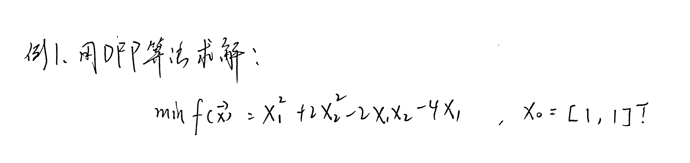

+

### 7. 步长加速法（考点，应该能拿分）

又称为模式法或模矢法，是只用到函数值的直接方法

#### 7.1. 基本思想

#### 7.2 步骤

**注意**：

正常考试只考二维，就是先探测 X 轴正、负方向有个横轴方向，再探测 Y 轴正、负方向有个纵轴方向，探测4次，找到比原来点优的点，采用该方向。

一般来说，考试时不会出现探测失败的情况（缩减步长计算量太大）

> 步长加速：按照 $b_{k+1}-b_k$ 跨度会越来越长

注意看11 的获取，因为采取步长加速的策略，11 得到的方向不是 8-6 的方向，是 8-5 的方向。

直接搜索：判断成功与否只与值是否比搜索前的小有关

#### 7.3. 例题

上图标号不一定对，考试时只标基点顺序即可

==注意画图的时候，睁大狗眼看看到底哪个点离中心的等值线更近，实在看不出来拿尺子量！==

### 8. 最小二乘法

最小二乘问题是对变量参数的拟合，我们将已知的现有样本点自变量的值带入估计的函数，希望得到能够使得估计函数的函数值更接近实际因变量值的参数。即：

其中，t即是自变量，x即待定参数，具体可见下【线性最小二乘模型】例子。

#### 8.1.  线性最小二乘模型（考点）

什么是线性最小二乘模型？

直接看例题：

由例子可以看出：

线性最小二乘的定义可以看成

##### （1）线性最小二乘模型的解

注意，上述证明会用到第一章提到的梯度计算的性质，考试也是\'有可能\'考的

故，有线性最小二乘模型的解：

==注意：这里的最小二乘解不一定是原线性方程组的解，将解回带到最小二乘模型（\*\*）中，如果得到模型的值为0，那么说明是原线性方程组的解，但是如果值大于0，原线性方程组无解==

##### （2）例题

·

#### 8.2 非线性最小二乘模型（了解）

## 第四章 约束最优化方法

##### ==**$\textcolor{red}{记得先化标准型！！！}$**==

### 1. 最优性条件

#### 1.1 等式约束问题的最优性条件

##### （1）等式约束问题

##### （2）最优性条件

其实就是通过 $\lambda $ 把约束式加入到方程组中去

上面是 (*) 式，下面就是原来那些约束直接写上去

要是半正定，就是必要条件

其中$\nabla h(\vec{x}^*)$ 表示约束方程组的梯度带入 $\vec{x}^*$ 得到的矩阵，也就是说，切子空间是对与每个约束方程，其在点 $\vec{x}^*$ 处的切空间（三维方程就是切平面嘛）的交集（三维就是切平面的交集）。在这上面的向量如果满足$\vec{v}^T\nabla^2_{xx}L(\vec{x},\vec{\lambda})\vec{v}>0$ ,则说明点 $\vec{x}^*$ 是严格局部极小值点。

#### 1.2 只含不等式约束问题的最优性条件

##### （1）不等式约束问题

##### （2）几何最优性条件

###### 【1】容许方向

 很简单，到边上的才算约束住了嘛

没啥用，下一个

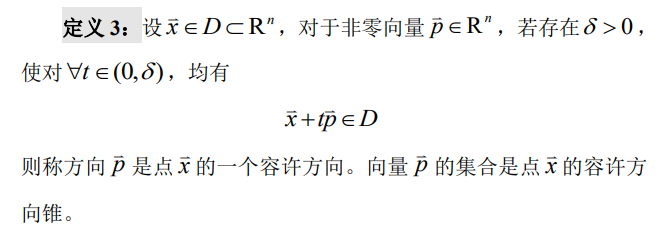

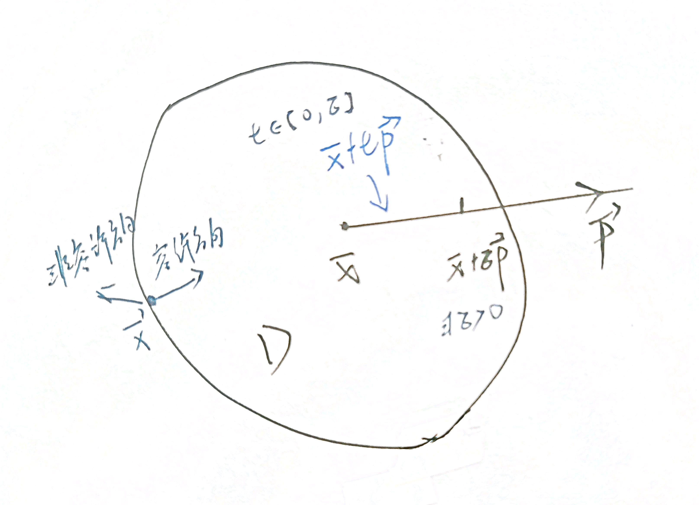

由上图可知，容许域内的点任何方向都是容许方向，边界上的点有一部分非容许方向

所以你能看出：==梯度方向总是指向容许集内部方向==，即：

###### 【2】下降方向

若方向 $\vec{p}$ 既是点 $\bar{x}$ 的容许方向，又是下降方向，则称它 是 $\bar{x}$ 的容许下降方向

###### 【3】几何最优性条件

###### 【4】例题

##### （4）库恩-塔克条件（Kuhn-Tucker条件/K-T条件 考点）

由此可以看出，K-T条件是一阶必要条件。

**$\textcolor{blue}{在做题的时候不用判断线性无关}$**

红线紫线是约束，黑线是等值线

结论1：单个约束上的最优点，就没有容许下降方向（容许就没法下降，下降就没法容许）

结论2：两个约束上的最优点：其上目标函数梯度方向一定在两个约束梯度方向夹角之内（都容许就没法下降，下降就没法都容许）

###### 例题

 

#### 1.3 一般约束问题的最优性条件

就是把前面两部分的理论合一起

##### 例题

#### 1.4 凸规划问题的最优性条件

 

==在一般约束条件的问题求最优解问题中，在得出K-T点后，一般需要判断原问题是为凸规划问题，==即：

1. 目标函数是凸函数
2. 不等式约束是凹函数
3. 等式约束是线性函数

满足以上三点，原问题是凸规划问题，则得出的K-T点即全局极小点，即最优点。

##### 例题

### 2. Zoutendijk 容许方向法（Z-容许方向法）

一种选择容许下降方向的方法，就有一种容许方向法，但都是 选方向——直线搜索——迭代 的套路

**这里只讲线性约束的情形**

#### 2.1. 下降容许方向的确定

##### （1） 容许方向的确定

在线性约束这边，大于等于零即可作为充分条件

##### （2） 容许下降方向的确定

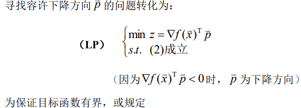

以上规定是为了限制方向向量的长度，都无穷大就没法比了

i) ii) iii) iv)四种限制选一种对方向向量进行限制，这里使用 $\vec{e}$ 对其进行限制

要是按照这个方法找不到合法的方向向量，那说明目前来到了K-T点，进入迭代终止判断

#### 2.2 直线搜索

按照容许下降方向的性质，起作用约束对于上面的要求恒成立，所以：

这里是把移项，化为 $\vec{u}+t\vec{v}\geq0$ 的形式，那么，按照 $\vec{v} $的正负性 ，对 t 就有上述约束。

#### 2.3. 迭代终止准则

无约束：驻点 、有约束：K-T点

#### 2.4. 算法

这里，上一撇的是起作用约束，上两撇指的是不起作用约束

#### 2.5 例题

==易错点：二维图解画图，务必把方向看明白咯==

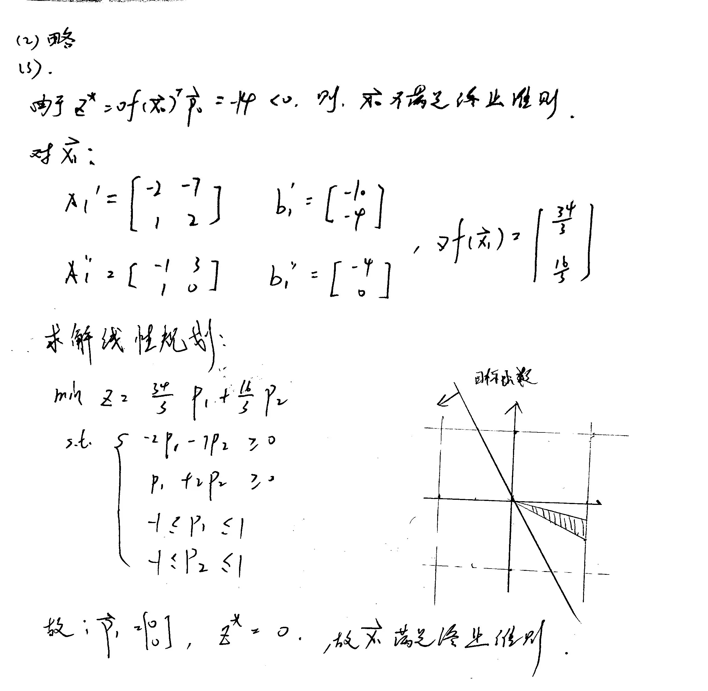

### 3. 外部罚函数法

罚函数法是解决约束优化问题的一般方法。它的基本思想是将约束问题转化为一系列无约束极值问题处理，因此又称为序列无约束极小化技术(简记为 SUMT)。罚函数法可分为两类：外部罚函数法(又称外点法)与内部罚函数法(又称内点法或围墙函数法)。外部罚函数法 适用于一般的约束优化问题，内部罚函数法只适用于不等式约束优化问题。

#### 3.1 问题描述

#### 3.2 罚函数的形式与性质

#### 3.3 收敛性

增广目标函数是越迭代越大的，罚函数是越迭代越小的

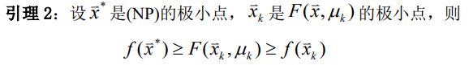

但是一定在原来目标函数的最优值之内

对于$\vec{x}_k是F(\vec{x},\mu_k)$的极小点，$\vec{x}_k$ 在$\bar x$ 固定时是关于 $\mu_k$ 的函数，当 $\mu_k$ 趋向无穷大时，$\vec{x}_k$ 趋向$\bar x$，即（NP) 的极小点

迭代算法的理论依据，每迭代一次，看看是不是容许点，第一个找到的就是原问题的极小点

#### 3.4 步骤

#### 3.5 优缺点

#### 3.6 例题

### 4. 乘子法

乘子法是针对外部罚函数法的一种改进方法。Hesternes 和 Powell 于 1969 年各自独立地提出了乘子法，即在约束极值问题的 Lagrange 函数中加入相应的惩罚，使得在求解系列无约束极值问题时，罚因子 不必趋于无穷大，就能求到约束极值问题的最优解，保证了数值计算的稳定性。

区别：

外部罚函数法：只在目标函数上加惩罚

乘子法：在拉格朗日函数上也加惩罚项

#### 4.1. 等式约束情形

##### （1）Hesternes 乘子法（H乘子法）

###### 性质

二阶充分条件：在切子空间正定

######  H乘子法（背）

多了第（4）步，使用 $\theta$ 人为规定收敛速度，在收敛速度满意时，不增大罚因子（限制罚因子不会无限增大）

考试时候还是取极限

###### P乘子法（考试不考看看就行）

#### 4.2 只含不等式约束情形

**1. 乘子迭代公式**

考试一般只考一个不等式的形式

#### 4.3 一般约束问题

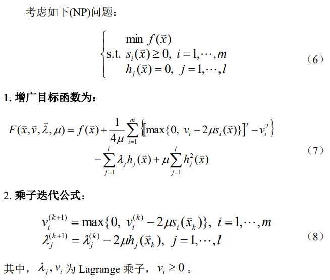

##### H乘子法

####  4.4 例题

## **考点统计**

### 公式部分

### 理论部分

#### 1. 建模问题

物理问题不考

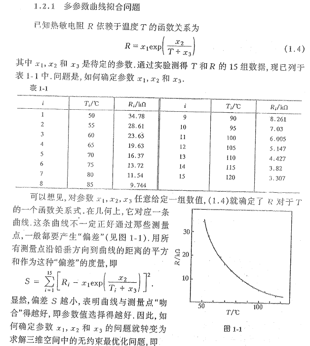

#### 2.画等值线

#### 3.等值面的性质

#### 4. 梯度

梯度公式一定会背

#### 5. 泰勒展开

#### 6.凸集

#### 7. 凸函数和凸规划

#### 8.极小点判断

#### 9.迭代方法

#### 10.容许集的性质

#### 11.基本解和基本容许解

极点就是基本容许解

#### 12.单纯形法的基本思想

#### 13. 两阶段单纯形法

#### 14.锯齿现象

#### 15.对于正定二次函数，牛顿法只需迭代一次

#### 16.二次终止性

#### 17.最优步长因子

对于所有直线搜索，你 t 90% 应该是正的

非二次函数，求导求驻点

#### 18. F-R共轭梯度法-画图

初始方向是负梯度方向

记得二次终止性

#### 19 DFP

#### 20 步长加速的基本思想

#### 21 最优性条件

#### 22 起作用约束

不等式约束关于容许集的任意内点（例如图4—2中的点P）都是不起作用约束.因此，只有容许集的边界点才能使某个或某些不等式约束变为起作用约束.

按照定义，任一等式约束关于任意容许点都是起作用约束.

#### 23 容许方向向量

#### 24 梯度方向

#### 25 K-T 条件的梯度方向

#### 26 KT条件

#### 27 Z容许下降方向的判定

#### 28 Z容许方向法终止准则

#### 29 外部罚函数法的基本思想

#### 30 乘子法基本思想

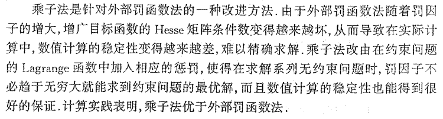

#### 31 $\lambda$ 计算

### 试卷统计

### 写在最后

本资料为个人整理，难免存在错漏，欢迎联系我进行改正。资料仅供学习参考，禁止用作商业用途。

愿选到这课的人都不挂科🙏。