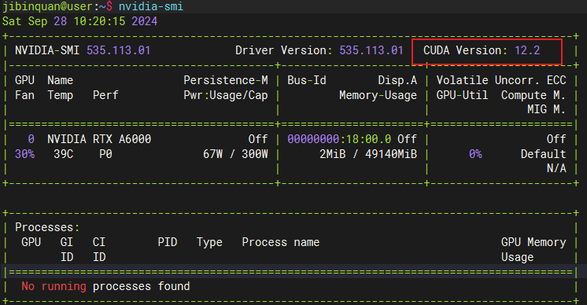

+++
title = '某nlp模型训练实验环境配置（Pytorch安装）'
date = 2023-01-04T15:12:58+08:00
tags=["补档","技术","环境配置"]

showSummary=true

Summary="尝试训练某古早nlp相关模型，在pytorch下需要Allen-nlp0.8.4版本的环境，踩了好多坑才配置成功（主要是pytorch安装太离谱了）于是记录一下。"

+++

尝试训练某古早nlp相关模型，在pytorch下需要Allen-nlp0.8.4版本的环境，踩了好多坑才配置成功（主要是pytorch安装太离谱了）于是记录一下


## conda 创建虚拟环境

参考：https://zhuanlan.zhihu.com/p/376030379


ubuntu下，进入conda base 环境

```bash
source activate
```

windows下，打开 Anaconda Prompt 也可


创建环境 

声明名称为 my_env_name  版本为py3.8

```bash
conda create -n my_env_name python=3.8
```

激活环境

```bash
conda activate my_env_name
```


回到base环境

```bash
conda deactivate
```

删除环境

```bash
conda remove -n my_env_name --all
```

查看现有虚拟环境

```bash
conda info -e
```


##  安装Pytorch

需要手动下载文件，本地安装！！！

需要手动下载文件，本地安装！！！

需要手动下载文件，本地安装！！！


直接使用 conda 或 pip 下载安装的后果：①下载到CPU版本、②安装后检测不到显卡、③安装后执行训练段错误……

（大部分是由于 Pytorch 和 CUDA 版本不匹配造成的）


官网地址：https://pytorch.org/get-started/locally/

直接进这个也行：[download.pytorch.org/whl/torch/](https://download.pytorch.org/whl/torch/)


输入 

```bash
nvcc -V
```

查看CUDA版本


可以看到本地CUDA版本为 11.6

下载老版本的pytorch可以进入官网下载界面-选择pip下载-复制命令最后的链接


选择torch进入历史版本的下载页面

Ctrl+F 搜索输入你的CUDA版本，如 CUDA11.6 就查找cu116， CUDA11.3 就查找cu113，可以看到该版本下可以下载的pytorch版本


选择对应的pytorch和操作系统下载 .whl 文件


使用pip安装，进入下载路径，执行：

```bash
pip install 下载的文件名.whl
```


测试torcgh是否能够正常运行

命令行输入

```bash
python
```

进入python环境后，逐行运行

```python
import torch
print(torch.__version__)
print(torch.cuda.is_available())
print(torch.cuda.device_count())
print(torch.zeros(1).cuda())
```


（这里torch版本是+cu113是因为换了台机器）
print(torch.cuda.is_available()) 显示为True , 最后对torch的操作可以正常执行就一般没问题

参考：https://blog.csdn.net/weixin_41529093/article/details/109399393


### 24/09/28 补充：


后来在实际操作中发现，其实可以直接参考 `nvidia-smi` 中的最高支持CUDA版本进行torch安装，即：


1. 命令行运行`nvidia-smi`，找到最高支持CUDA版本

   

2. 再去下载官网找安装包时，只要低于`cu122`的，满足系统和python版本的torch安装包都可以下载进行安装，安装步骤同上。因为linux系统会自动按照安装包要求在虚拟环境中自动下载安装相应的cuda工具包。

   

   


## 安装allen-nlp

```bash
pip install allennlp -i http://pypi.douban.com/simple/ --trusted-host pypi.douban.com
```

指定版本

```bash
pip install allennlp==0.8.4
```


## 训练时问题
代码年代久远，训练时使用的函数可能新版本不再支持，可能会报以下错误，将相应工具包降回老版本即可


ArrayField.empty_field: return type `None` is not a `allennlp.data.fields.field.Field`.

```bash
pip install overrides==4.1.2
```

ModuleNotFoundError: No module named 'sklearn.utils.linear_assignment_'

```bash
pip3 install scikit-learn==0.19.2
```
