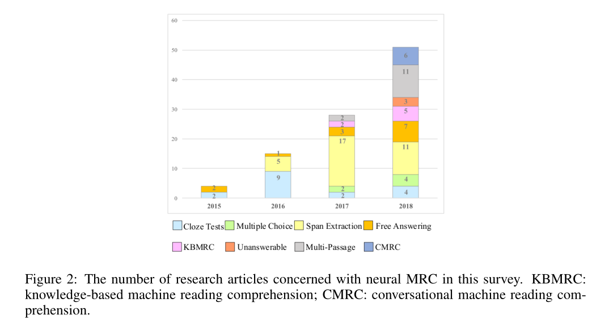
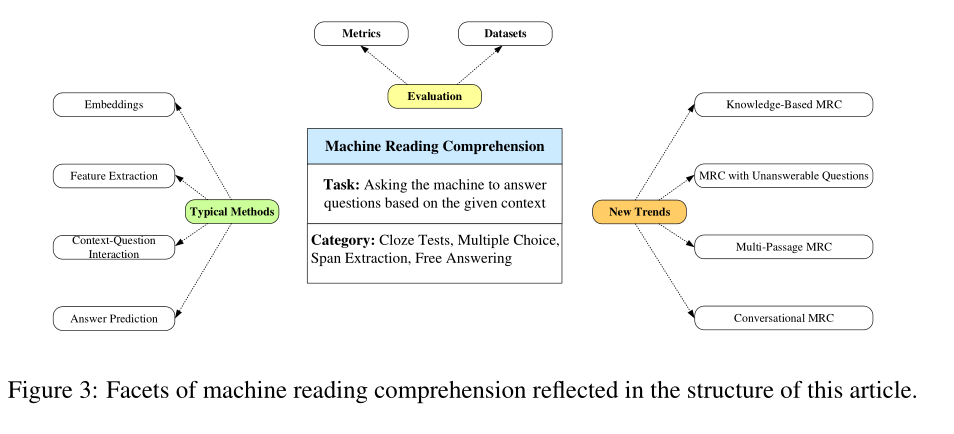
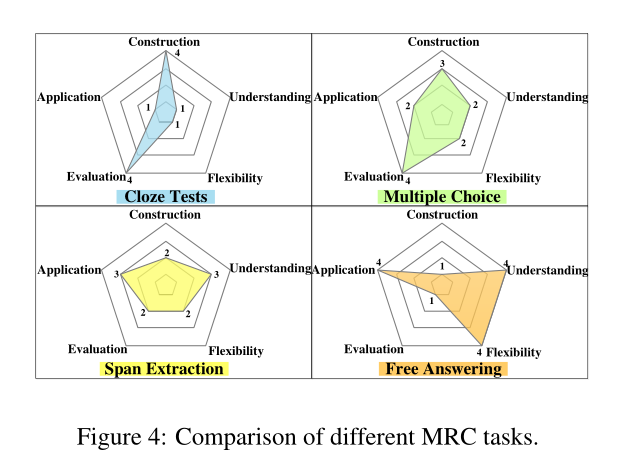

+++
title = 'Neural Machine Reading Comprehension: Methods and Trends 阅读笔记（一）'
date = 2022-11-07T15:38:55+08:00
draft = false

tags=["补档","研究","自然语言基础"]

+++



# Neural Machine Reading Comprehension: Methods and Trends

**神经机器阅读理解：方法与趋势**

## 0.摘要

机器阅读理解（MRC）需要机器根据给定的上下文回答问题，在过去几年中，随着各种深度学习技术的结合，它越来越受到关注。本文是对现有方法和最新趋势的全面调查（2019）。

本文以以下三个方面来对MRC进行阐述：

* （1）典型的MRC任务：它们的定义、差异和代表性数据集；

* （2） 神经MRC的一般架构：每个模块的主要模块和常用方法；

* （3）新趋势：神经MRC的一些新兴领域以及相应的挑战。

## 1. 介绍

1. 早期的MRC系统可以追溯到20世纪70年代。然而，由于其规模小、领域特殊，该系统无法得到广泛应用。
2. 1999年起，MRC任务的方法主要是基于规则或基于机器学习的，但是具有以下缺点。
   1. 它们主要基于手工制作的规则或特征，需要大量人力。
   2. 这些系统无法进行泛化，并且由于大量文章的大规模数据集，它们的性能可能会下降。
   3. 一些传统方法不仅忽略了长期依赖，而且无法提取上下文信息。
3. 2015年以来，基于深度学习的MRC，也称为神经机器阅读理解出现，在捕获上下文信息方面显示出其优越性，并显著优于传统系统。并且各种大型基准数据集的出现，如CNN/Daily Mail、（SQuAD）和MS MARCO，使得用深度神经架构解决MRC任务成为可能，并为广泛评估MRC系统的性能提供了试验台。

2015-2018年的研究方向和发文趋势

本文结构：				

1. 首先，将常见的MRC任务分为四种类型：完形填空、多项选择、跨度提取和自由回答。我们进一步扩展了这一分类，为每种类型提供了一个正式的定义，并在不同的维度上对这些任务进行了比较（第2节）。
2. 其次，介绍了神经MRC系统的总体架构，包括四个模块：嵌入，特征提取、上下文-问题交互和答案预测。每个模块中使用的流行深度学习技术也有详细说明（第3节）。
3. 第三，根据不同的任务描述了一些有代表性的数据集和评估指标（第4节）。
4. 第四，一些新的趋势，如基于知识的MRC、带有无法回答的问题的MRC，多通道MRC和会话式MRC，通过找出它们的挑战并描述现有的方法和局限性来揭示（第5节）。
5. 最后，讨论了几个开放的问题，希望能为未来可能的研究方向提供启示（第6节）。

## 2.任务

### MRC定义

机器阅读理解（MRC）是文本问答（QA）的一项基本任务，在该任务中，每个问题都被赋予了相关的上下文，从中可以推断出答案。MRC的目标是从给定的上下文中提取正确的答案，甚至根据上下文生成更复杂的答案。
	
**形式化定义**：

给定上下文C和问题Q，机器阅读理解任务要求模型通过学习函数F来给出问题Q的正确答案A，使得 $$ A=F（C，Q）。$$

### 2.1 完形填空

在完形填空测试中，通过从文章中删除一些单词或实体来生成问题。为了回答问题，要求机器在空白处填写缺失的项目。有些任务提供候选答案，但这是可选的。完形填空测试增加了阅读障碍，需要理解上下文和词汇使用，对机器阅读理解具有挑战性。

完形填空的**特征**：

（i） 答案A是给定上下文C中的单词或实体；

（ii）通过从给定上下文C中移除单词或实体来生成问题Q，使得Q＝C− A

**形式化定义**：

给定上下文C，单词或实体 $A(A∈C)$ 完形填空测试要求模型通过学习函数F，用正确的单词或实体A填空，使 $$ A=F(C− \{A\} )$$。

**数据集**：

CNN/Daily Mail、CBT、LAMNADA……

### 2.2 多项选择

要求根据所提供的上下文从候选选项中选择问题的正确答案。与完形填空测试相比，选择题的答案不限于上下文中的单词或实体，因此答案形式更灵活，但这项任务需要提供候选答案。

选择题的**特点**是给出了一个候选答案列表 $ A=\{A_1，A_2，···，A_n\} $，可以作为预测答案的辅助信息。

**形式化定义**：

多项选择给定上下文C、问题Q和候选答案列表 $A=\{A_1，A_2，··，A_n\}$，多项选择任务是从a（Ai∈ A） 通过学习函数F，使得 $A_i＝F(C，Q，A)$

**数据集**：

MCTest、RACE……

### 2.3 区间提取

跨度提取任务可以克服单个实体无法完全回答问题以及缺少候选答案的问题。给定上下文和问题，此任务要求机器从相应上下文中提取一段文本作为答案。

跨度提取的**特点**是答案A需要是给定上下文C的连续子序列。

**形式化定义**：

给定由n个标记组成的上下文C，即 $C=\{t_1，t_2，···，t_n\}$和问题Q，跨度提取任务需要提取连续子序列 $A=\{t_i，t_{i+1}，··，t_{i+k}\}(1≤ i≤ i+k≤ n)$ 通过学习函数F使得 $A＝F(C，Q)$。

**数据集**：

SQuAD、News QA、Trivia QA、DuoRC……

### 2.4 自由作答

机器需要对多段文本进行推理并总结证据。在这四项任务中是最复杂的，因为它的答题形式没有限制，而且更适合实际应用场景。

**特点**：侧重于使用自由形式的自然语言来更好地回答问题

**形式化定义**：

给定上下文C和问题Q，答案可能并不来源于原文本，即$A⊆ C ~~or~~A \not⊆ C$ ，该任务要求通过学习函数F来预测正确答案A，使得$  A＝F(C，Q) $。

**数据集**：

bAbl、MS MARC、search QA、Narrative QA……

### 2.5 不同任务之间的比较

使用construction、understanding、 flexibility、evaluation 和 application五个维度描述不同任务的优越性和局限性：

- **construction**：这个维度衡量任务构造数据集是否容易。越容易，分数越高。

- **understanding**：这个维度评估任务对机器理解能力的测试程度。如果一项任务需要更多的理解和推理，分数就更高。

- **flexibility**：答案形式的灵活性可以衡量任务的质量。答案越灵活，灵活性得分越高。

- **evaluation**：评估是MRC任务的必要组成部分。一项任务是否容易评估也决定了它的质量。容易评估的任务在这个维度上得分很高。

- **application**：一个好的任务应该接近真实的应用。因此，如果一项任务能够很容易地应用于现实世界，那么这一维度的得分就很高。

如图所示：

**对于完形填空**：构建数据集和评估完形填空是最容易的。然而，由于答案形式在原始上下文中仅限于单个单词或名称实体，完形填空无法很好地测试机器理解能力，也不符合实际应用。

**对于多项选择**：其对每个问题提供候选答案，这样即使答案在原始上下文中不受限制，也可以很容易地进行评估。为这项任务构建数据集并不困难，因为语言考试中的多项选择题可以很容易地使用。然而，候选答案的设置会导致合成数据集与实际应用之间的差距。

**对于区间抽取**：可以很容易地构建和评估数据集。此外，它们可以有效测试机器对文本的理解。所有这些优点都有助于对这些任务进行大量研究。跨度提取的缺点是答案被限制在原始上下文的子序列中，这与真实世界仍然有点距离。

**对于自由作答**：自由回答任务在理解力、灵活性和应用性方面表现出优势，这些方面最接近实际应用。然而由于答案形式的灵活性，构建数据集有些困难，如何有效评估这些任务的性能仍然是一个挑战。
