+++
title = '（补档）MySQL8.1版本安装'
date = 2023-08-14T15:06:17+08:00

tags=["补档","技术","环境配置"]

+++

主要参考：[MySQL详细安装教程，关于msi版和zip版详解，Windows - 知乎 (zhihu.com)](https://zhuanlan.zhihu.com/p/404519626)


## 1. MySQL 下载

进入MySQL官方下载：[MySQL :: Download MySQL Community Server](https://dev.mysql.com/downloads/mysql/)

可以看到下载页面提供了不同版本、不同系统和不同种类安装包的选择。

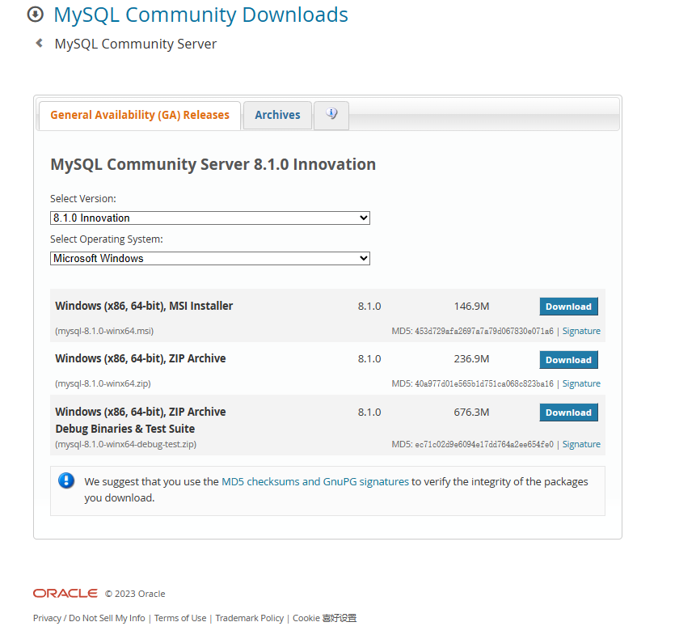

对于MySQL的版本，大概分两种：

**5.x**：版本更老，更稳定，比较主流

**8.x**：版本更新

安装包也提供了三种：

**MSI**：微软格式的安装包，傻瓜式安装，缺点是安装过程都是默认设计的，无法直接进行个性化设计、微调，没法专项安装数据库，重新调整需要安装完成后，进入配置文件，或者使用一些mysql命令在命令界面更改。

**ZIP**：直接解压，”免安装“，需要手动配置一些参数。

**Debug**：通常称为调试版本，它包含调试信息，并且不作任何优化，所以容量比Release大很多。（优化会使调试复杂化，因为源代码和生成的指令间关系会在优化过程中变得更复杂），不优化便于程序员进行代码调试等操作。**Debug模式下生成两个文件，除了.exe或.dll文件外，还有一个.pdb文件，该文件记录了代码中断点等调试信息**


本次使用的是ZIP的Release版本安装包，选择版本和系统就可以下载。


## 2.解压压缩包，设置配置文件

把压缩包解压到一个合适的路径（自己的目标安装路径，最好不要有中文），然后新建一个 **my.ini**  配置文件。（可以新建一个文本文件**my.txt**，配置好后将后缀改为**.ini**）

my.ini是MySQL安装时候回去配置信息的配置文件。主要记录用户信息、系统信息、数据库参数设置等

可以先配置以下参数，其他先默认：

```sql
[client]
port = 3306
 
[mysqld]
#设置3306端口（默认3306，若被占用，换其他的）
port = 3306
# 设置mysql的安装目录
basedir=D:\\MySQL\\mysql-8.1.0-winx64
# 设置mysql数据库的数据的存放目录 
datadir=D:\\MySQL\\mysql-8.1.0-winx64\\data
# 允许最大连接数
max_connections=200
# 服务端使用的字符集默认为8比特编码的latin1字符集
character-set-server=utf8
# 创建新表时将使用的默认存储引擎
default-storage-engine=INNODB
#这个需要注意一下，不然报错
# 其原因是从 5.6开始，timestamp 的默认行为已经是 deprecated 了。
explicit_defaults_for_timestamp=true
 
[mysql]
# 设置mysql客户端默认字符集
default-character-set=utf8
```

写完保存关闭文件。

另外，运行MySQL需要相应的DirectX和VC++库，不然可能运行报错（经常打游戏的应该都安装的差不多了…我也没遇到这个问题…）


## 3.初始化 MySQL

**以管理员身份运行**命令提示符

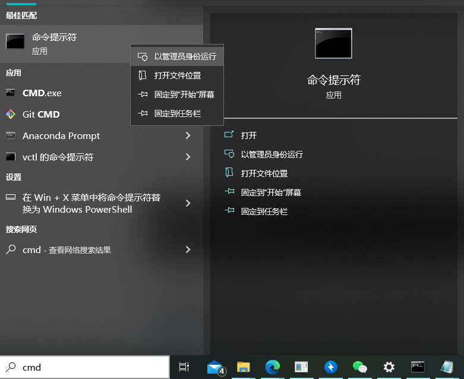

cd指令切换到安装路径下的bin文件夹，便于后续操作

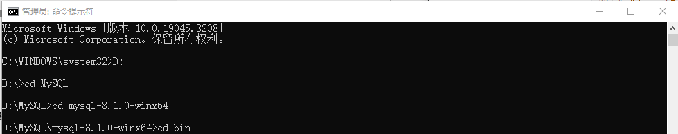

进入后，输入

```shell
mysqld --initialize --user=mysql --console
```

初始化mysql数据库

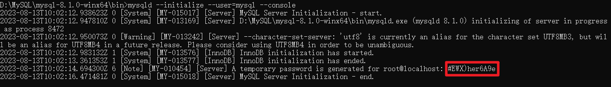

初始化结果会给你一个随机的MySQL数据库密码（上图红框部分），**切记要复制下来这个临时密码，复制临时密码、复制临时密码、复制临时密码**


## 4.建立 MySQL 服务

输入安装命令：

```shell
mysqld --install  mysql81
```

mysql81是服务名字，可以把名字设为mysql+版本号，或者别的啥


安装成功后使用临时密码进入mysql数据库   :   

```shell 
mysql -uroot  -p
```

然后就报错了：

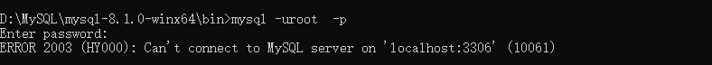

参考：[MySQL错误提示：“ERROR 2003 (HY000): Can't connect to MySQL server on 'localhost' (10061)”解决办法_小C博客的博客-CSDN博客](https://blog.csdn.net/lws123253/article/details/81629755)

如果不是端口被占用的情况的话，可能是因为MySQL服务没有启动，使用使用：net start 启动服务（注意后面跟的是刚才install的服务名）

```shell
net start mysql81
```

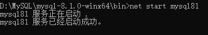

之后即可正常进入数据库

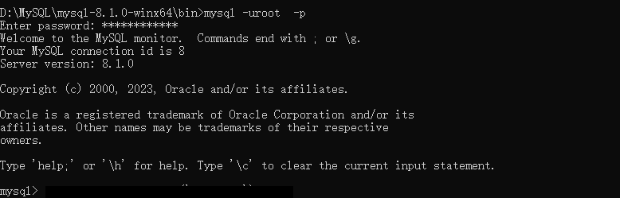

更改一个密码，随机密码记不住：

注意8.x版本的修改密码语句与5.x的不同，使用网上一般教程提供的

```sql
set password=password('123456'); 
```

会报语法错，参考某问答模型回答可以使用以下语句


```sql
SET PASSWORD FOR root@localhost = '123456';
```

123456就是密码，当然自己随便设置

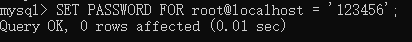


## 5. 将MySQL添加至环境变量

为了方便操作，将MySQL添加到环境变量中。

右键此电脑 -> 属性 ->高级系统设置 ->环境变量

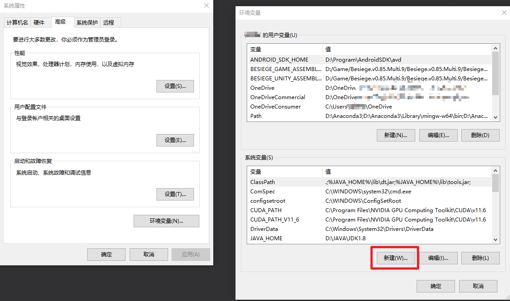

```text
添加:
    变量名:MYSQL_HOME
    变量值:D:\MySQL\mysql-8.1.0-winx64 #这里是你自己的安装路径
```

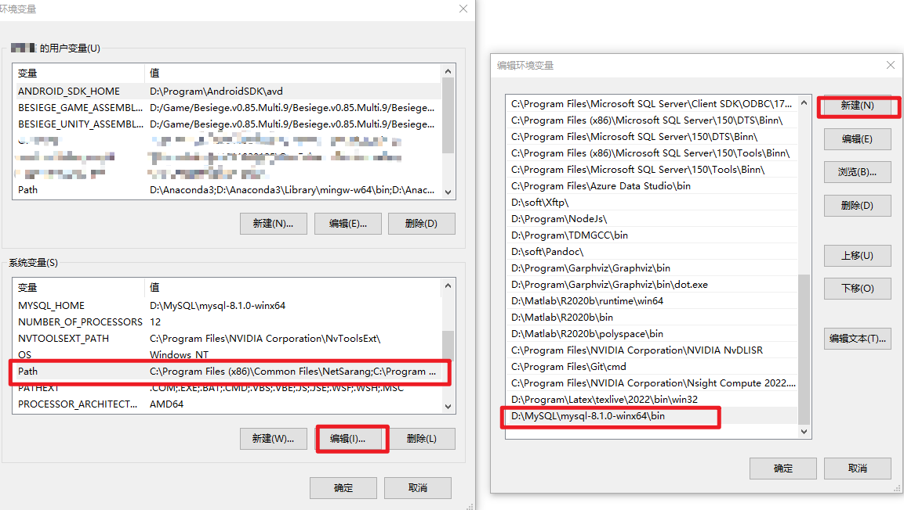

```text
编辑:
    变量名:path

    最后添加上:D:\MySQL\mysql-8.1.0-winx64\bin
```


## 6.简单的SQL指令

看看能不能用了

连接数据库

```shell
mysql -h 127.0.0.1 -P 3306 -u root -p
```

-h：后跟数据库服务器ip地址，本机就127.0.0.1

-P：端口

-u：用户

在本机3306端口下，可以简写为

```shell
mysql -uroot  -p
```

**查看当前数据库**

```sql
show databases;
```

![在这里插入图片描述](https://img-blog.csdnimg.cn/97412ae835904771b4f8f8a99c0c14e0.png

**退出数据库**

```sql
exit;
```

能用说明安装完成

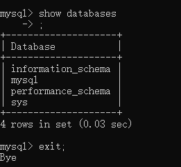
