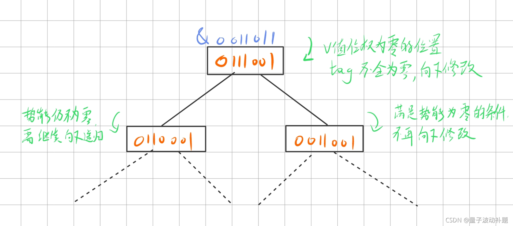

+++
title = '（补档）势能线段树（吉司机线段树）专题'
date = 2021-10-03T15:29:40+08:00
tags=["补档","技术","算法","数据结构"]

+++



# 势能线段树（吉司机线段树）专题

势能线段树在近期训练时遇到了好几次，但是由于本人太懒一直没补完，结果ICPC网络赛还真就出了一道势能线段树Orz……结果当然是没做出来……痛定思痛，这回把之前欠的一块儿补了。

## 简要介绍

​		我们知道，传统的支持区间修改的线段树是通过lazy标记来规避掉频繁大规模的单点修改来实现对时间开销的节省的。那么对于一种区间操作，其能使用lazy标记需要满足两个条件：

1. **区间节点的值可以通过对当前结点lazy标记的计算来更新**
2. **多次不同的lazy标记可以实现就地的快速合并**

​		比如经典的区间加和区间乘修改，区间求和查询，当前结点的值可以通过加上lazy乘区间长度和乘上lazy的值来进行轻易的修改，lazy标记的值也可以通过简单的相加或相乘来更新。

​		但是对于像区间开根号、区间位运算这样的区间操作来说，其**对每个结点的修改量是在一定程度上是由叶结点本身现有的值来决定的**，那么就很难实现lazy的合并和对区间值的直接更新，好像只有对所有叶结点进行单点修改这一种办法，而这种方法在时间开销上是绝对不允许的。

​		但是再仔细观察这其中的某些操作，区间开根号，每个点顶多被开log次，当结点的值被开到1时，以后的操作就都不会对结点的值产生影响了。区间与值运算也是同理，与运算不会使结点值中二进制1的个数增加，而当结点的值变为0时，与值操作也就不能对值产生影响了。我们发现这些操作对每个结点的操作次数都是有一个隐含的“上限”的，就像有一个固定的“势能“，只要超过了这个上限值，相应的操作便会“退化”失效，也就是势能为0的情况。而当势能为0的结点连成区间时，我们便可以一口气规避掉在这个区间上的所有操作。而一般这种势能的下降还是非常迅速的，这也是势能线段树节省时间的原因。

​	所以，我们可以这样构建和操作这个线段树：

1. 在每个线段树结点加入一个”势能函数“，来记录和维护当前区间结点的势能情况。
2. 对于每次的区间修改，若当前区间内所有结点的势能皆已为零，直接退出递归不再修改
3. 若当前区间内还存在势能不为零的结点，则继续向下递归，暴力修改要求区间内每一个势能不为零的结点

​	至于具体的时间复杂度…据说每次修改不会超过**O(log<sup>2</sup>n)**……具体的证明嘛……


## 题目归纳

### 2021CCPC 黑龙江省赛 A And RMQ （[Gym - 103107A](https://vjudge.net/problem/Gym-103107A)）

#### 题目大意

给定一组序列，定义三种操作：

**AND l r v** ：将从l到r的区间所有的结点和v进行与运算

**UPD x v**：单点修改，将x位置的值修改为v

**QUE l r**：询问区间l到r的区间最大值

进行最大400000次操作。

#### 解题思路

几乎是势能线段树的模板题，可以看出，如果在区间所与的v的值位权为0的位置上，待修改区间所有值在这些位置的位权皆为0，那么区间与值操作对于该区间就是无效的。那么可以使用或运算计算区间值位权为0的交集作为势能值的记录，每次区间操作先查询v值位权为0的位置在相应区间上是否存在1，若存在，接着向下修改，若不存在，直接退出修改。




#### AC代码

```cpp
#include <iostream>
#include <fstream>
#include <cstdio>
#include <cmath>
#include <algorithm>
#include <cstring>
#include <queue>
#include <stack>
#include <vector>
#include <map>
#include <set>
#include<bitset>
#pragma warning(disable:4996)
#pragma GCC optimize (2)
#pragma G++ optimize (2)
#define inr register int
#define ios ios::sync_with_stdio(false);cin.tie(0);cout.tie(0);
#define debug(a) cout << #a << " " << a << endl
using namespace std;
typedef long long long long;
const double pi = acos(-1.0);
const double eps = 1e-8;
const int inf = 0x3f3f3f3f;
const int 1000007 = 400007;//1e5+7 

int read()
{
	int res = 0, ch, flag = 0;
	if ((ch = getchar()) == '-')
		flag = 1;
	else if (ch >= '0' && ch <= '9')
		res = ch - '0';
	while ((ch = getchar()) >= '0' && ch <= '9')
		res = res * 10 + ch - '0';
	return flag ? -res : res;
}


#define lson (o<<1)
#define rson (o<<1|1)

int arr[1000007];

struct node {
	int mx;
	int tag;
}tree[1000007 << 2];


inline void pushup(int o)
{
	tree[o].mx = max(tree[lson].mx, tree[rson].mx);
	tree[o].tag = tree[lson].tag | tree[rson].tag;//收集区间内所有位权1，作为势能函数
}

void build(int o, int l, int r)
{
	if (l == r) {
		tree[o] = { arr[l] , arr[l] };
		return;
	}
	int mid = (l + r) >> 1;
	build(lson, l, mid);
	build(rson, mid + 1, r);
	pushup(o);
}

void modify(int o, int l, int r, int ml, int mr, int x)
{
	if (!((~x) & tree[o].tag)) {
		return;
	}
	if (l == r) {
		tree[o].mx &= x;
		tree[o].tag &= x;
		return;
	}
	int mid = (l + r) >> 1;
	if (ml <= mid) {
		modify(lson, l, mid, ml, mr, x);
	}
	if (mid + 1 <= mr) {
		modify(rson, mid + 1, r, ml, mr, x);
	}
	pushup(o);
}

void update(int o, int l, int r, int p, int x)
{
	if (l == r) {
		tree[o] = { x,x };
		return;
	}
	int mid = (l + r) >> 1;
	if (p <= mid) {
		update(lson, l, mid, p, x);
	}
	else {
		update(rson, mid + 1, r, p, x);
	}
	pushup(o);
}

int query(int o, int l, int r, int ql, int qr)
{
	if (ql <= l && r <= qr) {
		return tree[o].mx;
	}
	int mid = (l + r) >> 1, res = 0;
	if (ql <= mid) {
		res = max(res, query(lson, l, mid, ql, qr));
	}
	if (mid + 1 <= qr) {
		res = max(res, query(rson, mid + 1, r, ql, qr));
	}
	return res;
}

char st[17];

int main()
{
	int n = read(), m = read();
	for (int i = 1; i <= n; i++) {
		arr[i] = read();
	}
	build(1, 1, n);
	int opl, opr, opx;
	while (m--) {
		scanf("%s%d", st, &opl);
		if (st[0] == 'A') {
			opr = read(); opx = read();
			modify(1, 1, n, opl, opr, opx);
		}
		else if (st[0] == 'U') {
			opx = read();
			update(1, 1, n, opl, opx);
		}
		else {
			opr = read();
			printf("%d\n", query(1, 1, n, opl, opr));
		}
	}
	return 0;
}
```


### 2021杭电中超（8）D Counting Stars （[HDU 7059](https://vjudge.net/problem/HDU-7059)）

#### 题目大意

同样是求区间和，给定两种区间修改操作

1. 询问区间和
2. 区间l到r所有值加上其highbit
3. 区间l到r所有值减去其lowbit

#### 解题思路

​		与黑龙江省赛大同小异，可以看出对于每个值其位权1的个数是一定的，而每进行一次操作3其数量会减一，操作2不会增加其数量。于是使用cnt来记录当前区间最多的位权1数量，若cnt为0，则不需要再修改。注意将每个数的hibit和剩下值分开存储，这样操作2就变成纯粹的区间乘操作，更好维护。

#### AC代码

```cpp
#include <iostream>
#include <fstream>
#include <cstdio>
#include <cmath>
#include <algorithm>
#include <cstring>
#include <queue>
#include <stack>
#include <vector>
#include <map>
#include <set>
#pragma GCC optimize(2)
#pragma GCC optimize("Ofast","inline","-ffast-math")
#pragma GCC optimize(3)
#pragma GCC optimize(3,"Ofast","inline")
#pragma G++ optimize(2)
#pragma G++ optimize("Ofast","inline","-ffast-math")
#pragma G++ optimize(3)
#pragma G++ optimize(3,"Ofast","inline")
#pragma warning(disable:4996)
#define inr register int
#define ios ios::sync_with_stdio(false);cin.tie(0);cout.tie(0);
#define debug(a) cout << #a << " " << a << endl
using namespace std;
typedef long long ll;
const double pi = acos(-1.0);
const double eps = 1e-8;
const int inf = 0x3f3f3f3f;
const int maxn = 1000007;//1e5+7 
const ll mod = 998244353;//1e9+7

#define lson (o<<1)
#define rson (o<<1|1)

ll arr[maxn];
ll m2[maxn];

inline ll lowbit(ll x)
{
    return x & (-x);
}

inline ll hbit(ll x)
{
    for (inr i = 30; i >= 0; i--) {
        if (x >> i & 1) {
            return 1 << i;
        }
    }
}

inline void init()
{
    m2[0] = 1;
    for (inr i = 1; i < maxn; i++) {
        m2[i] = (m2[i - 1] * 2) % mod;
    }
}

struct node {
    ll hb, lb, cnt, lazy;
}tree[maxn << 2];

inline void pushup(int o)
{
    tree[o].lb = (tree[lson].lb + tree[rson].lb) % mod;
    tree[o].hb = (tree[lson].hb + tree[rson].hb) % mod;
    tree[o].cnt = max(tree[lson].cnt, tree[rson].cnt);
}

inline void pushdown(int o)
{
    if (tree[o].lazy) {
        tree[lson].lazy += tree[o].lazy;
        tree[rson].lazy += tree[o].lazy;
        tree[lson].hb = (tree[lson].hb * m2[tree[o].lazy]) % mod;
        tree[rson].hb = (tree[rson].hb * m2[tree[o].lazy]) % mod;//hb??lb 
        tree[o].lazy = 0;
    }
}

inline void build(int o, int l, int r)
{
    tree[o] = { 0,0,0,0 };//??????? 
    if (l == r) {
        tree[o].hb = hbit(arr[l]);
        tree[o].lb = arr[l] - tree[o].hb;
        tree[o].cnt = __builtin_popcount(arr[l]);
        return;
    }
    int mid = (l + r) >> 1;
    build(lson, l, mid);
    build(rson, mid + 1, r);
    pushup(o);
}

inline void modify(int o, int l, int r, int ml, int mr)
{
    if (!tree[o].cnt) {
        return;
    }
    if (l == r) {
        if (tree[o].cnt > 1) {
            tree[o].lb -= lowbit(tree[o].lb);
            tree[o].cnt--;;
        }
        else {
            tree[o].hb = tree[o].cnt = 0;
        }
        return;
    }
    pushdown(o);
    int mid = (l + r) >> 1;
    if (ml <= mid) {
        modify(lson, l, mid, ml, mr);
    }
    if (mid + 1 <= mr) {
        modify(rson, mid + 1, r, ml, mr);
    }
    pushup(o);
}

inline void update(int o, int l, int r, int ul, int ur)
{
    if (!tree[o].cnt) {
        return;
    }
    if (ul <= l && r <= ur) {
        tree[o].hb = tree[o].hb * 2 % mod;
        tree[o].lazy += 1;
        return;
    }
    pushdown(o);
    int mid = (l + r) >> 1;
    if (ul <= mid) {
        update(lson, l, mid, ul, ur);
    }
    if (mid + 1 <= ur) {
        update(rson, mid + 1, r, ul, ur);
    }
    pushup(o);
}

inline ll query(int o, int l, int r, int ql, int qr)
{
    if (!tree[o].cnt) {
        return 0ll;
    }
    if (ql <= l && r <= qr) {
        return tree[o].hb + tree[o].lb;
    }
    pushdown(o);
    int mid = (l + r) >> 1;
    ll res = 0;
    if (ql <= mid) {
        res = (res + query(lson, l, mid, ql, qr)) % mod;
    }
    if (mid + 1 <= qr) {//qr??r 
        res = (res + query(rson, mid + 1, r, ql, qr)) % mod;
    }
    return res;
}

int main()
{
    int T, n, m;
    init();
    scanf("%d", &T);
    while (T--) {
        scanf("%d", &n);
        for (int i = 1; i <= n; i++) {
            scanf("%lld", arr + i);
        }
        scanf("%d", &m);
        build(1, 1, n);
        int opt, opl, opr;
        while (m--) {
            scanf("%d%d%d", &opt, &opl, &opr);
            if (opt == 1) {
                printf("%lld\n", query(1, 1, n, opl, opr));
            }
            else if (opt == 2) {
                modify(1, 1, n, opl, opr);
            }
            else {
                update(1, 1, n, opl, opr);
            }
        }

    }
    return 0;
}
```


### 2021 ICPC 网络赛 第二场 L Euler Function

#### 题目大意

给定序列，定义两种操作

**0 l r w** ：区间l到r的值都乘以w

**1 l r** ：查询区间l到r的欧拉函数值的和 mod 998244353

注意序列初始值和w值皆不大于100

#### 解题思路

注意欧拉函数的性质： **若i mod p=0,其中p为质数,则 $φ(i * p) = p * φ( i )$ 否则 $φ( i * p ) = ( p - 1)  * φ( i )$ 。**

因为x和w的值都不大于100，所以其实其都能分解为100以内的质数，根据上面描述的性质，我们将一次区间乘w的更新分解为对其质因数的分别更新，这样，如果某质数为该区间内共同的因数，则对当前区间欧拉函数的修改就变为简单的区间乘问题（直接乘p就行）。否则，继续向下递归修改。100以内的素数只有不到30个，可以使用bitset进行状态压缩处理，这样通过二进制位上的运算就可以很好的反应结点势能情况。

#### AC代码

```cpp
#include <iostream>
#include <fstream>
#include <cstdio>
#include <cmath>
#include <algorithm>
#include <cstring>
#include <queue>
#include <stack>
#include <vector>
#include <bitset>
#include <map>
#include <set>
#pragma warning(disable:4996)
#define inr register int
#define ios ios::sync_with_stdio(false);cin.tie(0);cout.tie(0);
#define debug(a) cout << #a << " " << a << endl
#define lson (o<<1)
#define rson (o<<1|1)
using namespace std;
typedef long long ll;
const double pi = acos(-1.0);
const double eps = 1e-8;
const int inf = 0x3f3f3f3f;
const int maxn = 100007;//1e5+7
const int maxm = 107;
const ll mod = 998244353;//1e9+7

//势能线段树的核心思想：虽然有些操作看起来不能区间修改，但是其实修改的操作是有上界的
//即某些操作在执行了一定次数后便会退化，比如开根、取最小值等操作。
//那么思路就是在线段树中记录这种势能的变化，当操作退化时将单点操作转为区间操作，即可大大节省时间


int phi[maxm], prime[maxm];//前一百个数的欧拉函数，前一百中的素数
bool del[maxm];//判断素数
int cnt[maxm][30];
bitset<30>st[maxm];

ll ksm(ll x, ll y)
{
	ll ans = 1;
	x = x % mod;
	while (y > 0)
	{
		if (y & 1) ans = (ans * x) % mod;
		y >>= 1;
		x = (x * x) % mod;
	}
	return ans;
}

void euler()//欧拉筛，同时求欧拉函数
{
	for (int i = 2; i < maxm; i++) {
		if (!del[i]) {
			prime[++prime[0]] = i;
			phi[i] = i - 1;
		}
		for (int j = 1; j <= prime[0] && ll(prime[j]) * i < maxm; j++) {
			int tp = prime[j] * i;
			del[tp] = 1;
			if (i % prime[j] == 0) {
				phi[tp] = phi[i] * prime[j];
				break;
			}
			phi[tp] = phi[i] * (prime[j] - 1);
		}
	}
	phi[1] = 1;
}

ll w[maxn];
struct node {
	ll sum, lazy;//求和值，区间乘lazy
	bitset<30>tag;//可以看作一种势能的记录？
}tree[maxn << 2];

void pushup(int o)
{
	tree[o].sum = (tree[lson].sum + tree[rson].sum) % mod;//朴素的计算
	tree[o].tag = tree[lson].tag & tree[rson].tag;//代表区间全部覆盖的质因数
}

void pushdown(int o)//区间乘正常操作
{
	tree[lson].lazy = tree[lson].lazy * tree[o].lazy % mod;
	tree[rson].lazy = tree[rson].lazy * tree[o].lazy % mod;
	tree[lson].sum = tree[lson].sum * tree[o].lazy % mod;
	tree[rson].sum = tree[rson].sum * tree[o].lazy % mod;
	tree[o].lazy = 1;
}

void build(int o, int l, int r)
{
	if (l == r) {
		tree[o] = { phi[w[l]],1,st[w[l]] };//存入对应的欧拉函数、质因数状态，lazy初始化
		return;
	}
	tree[o] = { 0,1 };//非叶节点的tag等待pushup
	int mid = (l + r) >> 1;
	build(lson, l, mid);
	build(rson, mid + 1, r);
	pushup(o);
}

void modify(int o, int l, int r, int ml, int mr, pair<int, int>d)//对数的修改一定是以素数的幂次进行的
{
	if (ml <= l && r <= mr && tree[o].tag[d.first]) {//如果当前节点在修改区间内，该素数是该区间共有的因数
		tree[o].lazy = tree[o].lazy * ksm(prime[d.first], d.second) % mod;//那么就是区间乘，直接乘就行
		tree[o].sum = tree[o].sum * ksm(prime[d.first], d.second) % mod;
	}
	else if (l == r) { //如果来到叶节点
		if (tree[o].tag[d.first]) {//若叶节点包含该素数
			tree[o].sum = tree[o].sum * ksm(prime[d.first], d.second) % mod;//直接乘上去
		}
		else {//若不包含
			tree[o].tag[d.first] = 1;//更新tag
			tree[o].sum = tree[o].sum * (prime[d.first] - 1) % mod;//更新欧拉函数的值（根据上面的性质）
			tree[o].sum = tree[o].sum * ksm(prime[d.first], d.second - 1) % mod;
		}
	}
	else {//若区间不全包含该素数，向下遍历更新，可知该操作的势能一定是不断减小的
		if (tree[o].lazy != 1) {
			pushdown(o);
		}
		int mid = (l + r) >> 1;
		if (ml <= mid) {
			modify(lson, l, mid, ml, mr, d);
		}
		if (mid + 1 <= mr) {
			modify(rson, mid + 1, r, ml, mr, d);
		}
		pushup(o);
	}
}
ll query(int o, int l, int r, int ql, int qr)
{
	if (ql <= l && r <= qr) {
		return tree[o].sum;
	}
	pushdown(o);
	int mid = (l + r) >> 1;
	ll res = 0;
	if (ql <= mid) {
		res = (res + query(lson, l, mid, ql, qr)) % mod;
	}
	if (mid + 1 <= qr) {
		res = (res + query(rson, mid + 1, r, ql, qr)) % mod;
	}
	return res;
}

ll ans[maxn];

int main()
{
	ios;
	euler();
	for (int i = 1, x; i < maxm; i++) {//分解质因数
		for (int j = 1; j <= prime[0]; j++) {
			x = i;
			while (x % prime[j] == 0) {
				cnt[i][j]++;
				x /= prime[j];
			}
			st[i][j] = cnt[i][j];//状态压缩，01表示是否含有质因数
		}
	}
	int n, m;
	cin >> n >> m;
	for (int i = 1; i <= n; i++) {
		cin >> w[i];
	}
	build(1, 1, n);
	int op, opl, opr, x;
	while (m--) {
		cin >> op >> opl >> opr;
		if (op) {
			ans[++ans[0]] = query(1, 1, n, opl, opr);
		}
		else {
			cin >> x;
			for (int i = 1; i <= prime[0]; i++) {//每次修改的是该数对应的所有质因数及其次数
				if (cnt[x][i]) {
					modify(1, 1, n, opl, opr, { i,cnt[x][i] });
				}
			}
		}
	}
	for (int i = 1; i < ans[0]; i++) {
		cout << ans[i] << endl;
	}
	if (ans[0]) {
		cout << ans[ans[0]];
	}
	return 0;
}

```


## 简单练习

本来只是准备了上面三道题的，在整理的过程中发现自己以前做过的题中还有一道也运用了势能线段树的思想，而且比上面三道题都要简单，有兴趣的同学可以去看一下 

题目来源：2021东北四省赛 D Lowbit（[HDU7116](https://vjudge.net/problem/HDU-7116)）

## 参考文献

https://blog.csdn.net/Daniel__d/article/details/105104831

https://blog.csdn.net/qq_33969563/article/details/120497762
